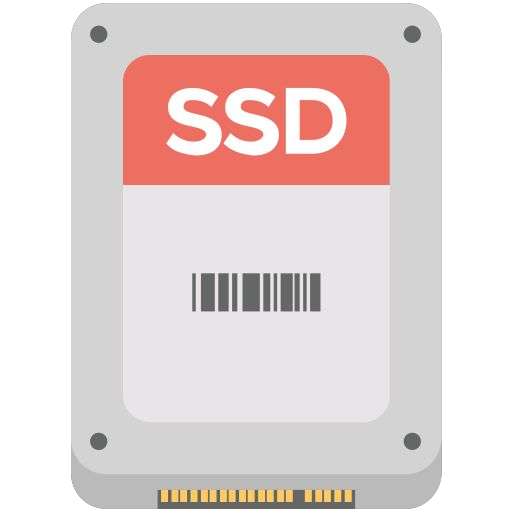
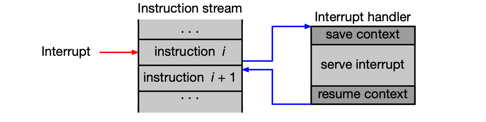
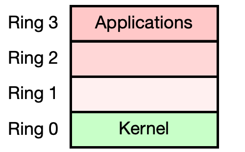

# Úvod do operačních systémů

Tato kapitola pokládá základy pro celý předmět BI-OSY. Nejprve si popíšeme, z čeho se fyzicky skládá výpočetní systém — CPU, paměti, periferní zařízení a sběrnice. Poté si na dvou motivačních příkladech ukážeme rozdíl mezi programováním *bez* operačního systému a *s* ním. Nakonec definujeme, co operační systém vlastně je, jak je organizováno jeho jádro a jakým způsobem s ním aplikace komunikují prostřednictvím **systémových volání** (system calls).

---

??? abstract "Obsah stránky"

    [TOC]

## Hardware: Model výpočetního systému

Moderní počítač není monolitické zařízení — jde o souhrn specializovaných komponent propojených **základní deskou** (motherboard). Ta kromě fyzického propojení obsahuje jižní můstek (south bridge / chipset) a pomocné obvody pro komunikaci s periferiemi, správu napájení a čip s firmwarem BIOS/UEFI.




### CPU

**Central processing unit (CPU)** je primární procesor počítače. Implementuje konkrétní **architekturu souboru instrukcí** (Instruction Set Architecture, ISA), která definuje:

- množinu instrukcí a adresní režimy,
- množinu registrů, organizaci paměti a organizaci vstupu/výstupu.

!!! example "Příklad: různé systémy, různé ISA"
    | Systém | CPU | Výrobce | ISA | OS |
    |--------|-----|---------|-----|----|
    | A | AMD Ryzen 3 2200G | AMD | x86-64 | Linux |
    | B | Intel Core i5-8400 | Intel | x86-64 | Windows 10 |
    | C | Intel Xeon E3-1225 v6 | Intel | x86-64 | Linux |
    | D | Ultra SPARC T2 | Oracle | SPARC V9 | Solaris |

    CPU od různých výrobců mohou implementovat **stejnou ISA** — proto binární program ze systému A poběží i na systému C (stejná ISA i OS). Program ze systému B naproti tomu na ostatních systémech fungovat nebude, protože se liší buď ISA, nebo OS. Pokud kód nezávisí na konkrétní ISA ani OS, lze ho přeložit pro cílovou platformu a spustit.

#### Přerušení a výjimky



**Přerušení** (interrupts) a **výjimky** (exceptions) jsou mechanismy, které umožňují CPU reagovat na události mimo normální tok instrukcí. Normální zpracování instrukčního proudu je dočasně přerušeno a spustí se **obslužná rutina přerušení** (Interrupt Service Routine, ISR). Celý mechanismus je definován ISA.

**Vnější přerušení** (external interrupts) jsou *asynchronní* — přicházejí z okolí CPU:

- řadič zařízení signalizuje dokončení I/O operace (např. disk dokončil čtení),
- přetečení systémového časovače (OS pak může naplánovat jiný proces),
- hardwarová chyba (např. chyba na sběrnici).

**Výjimky** (vnitřní přerušení) jsou *synchronní* — vznikají přímo při zpracování instrukce:

- vykonání instrukce systémového volání (na x86-64 to je instrukce `syscall`),
- softwarová chyba — dělení nulou, přetečení, výpadek stránky (page fault) apod.

!!! tip "U zkoušky"
    Rozlišení **synchronní výjimky** vs. **asynchronního přerušení** je základní pojmová dvojice. Systémové volání je *synchronní výjimka* — aplikace ji záměrně vyvolá instrukcí `syscall`.

#### Privilegované módy CPU



ISA definuje **privilegované módy** (privilege levels / rings) běhu CPU. Software běžící v daném módu smí:

- používat pouze instrukce povolené v tomto módu,
- modifikovat pouze povolené registry a oblasti paměti.

Pro operační systémy jsou klíčové dva základní módy:

- **Kernel mód** (ring 0 / EL1 / S-mode): vše je povoleno — jádro OS,
- **User mód** (ring 3 / EL0 / U-mode): omezený přístup — uživatelské procesy nemohou přímo manipulovat s I/O zařízeními, měnit tabulku stránek ani registrovat obslužné rutiny přerušení.

Srovnání privilegovaných módů napříč architekturami:

| Úroveň | x86-64 | RISC-V | ARM (AArch64) | Popis |
|--------|--------|--------|---------------|-------|
| Nejvyšší (firmware) | Ring 0 | Machine mode (M-mode) | EL3 (Secure Monitor) | Přímý přístup k HW, firmware |
| Operační systém | Ring 0 | Supervisor mode (S-mode) | EL1 (Kernel/OS) | Správa paměti, procesů, privilegované operace |
| Uživatelské aplikace | Ring 3 | User mode (U-mode) | EL0 (User Space) | Omezený přístup k prostředkům |

!!! note "Poznámka k x86-64"
    Procesory Intel/AMD definují rings 0–3, ale **ring 1 a ring 2 se v praxi nepoužívají**. OS běží v ring 0, aplikace v ring 3.

#### Stav CPU po resetu

Po resetu je CPU vždy ve stavu s nejvyššími oprávněními. Nepoužívá stránkování ani virtuální paměť — adresy jsou fyzické. Vykonávání začíná od předem definované **reset vektoru**:

| Architektura | Reset vector | Komentář |
|--------------|-------------|----------|
| x86-64 | `0xFFFFFFFF0` | Adresa je zrcadlena do `0xFFFF0` |
| RISC-V | `0x200` (obvykle) | Libovolná adresa dle implementace |
| ARM (AArch64) | `0x0` nebo `0xFFFF0000` | Závisí na implementaci |

!!! info "Specifika x86-64: cesta k 64-bitovému režimu"
    Procesor x86-64 po resetu startuje v **16-bitovém reálném režimu** s 20-bitovým fyzickým adresním prostorem (díky segmentaci). Teprve poté firmware přepíná CPU do **32-bitového chráněného režimu** (protected mode), kde jsou dostupné privilegované módy a stránkování. Nakonec se procesor přepíná do **64-bitového long mode**, kde je k dispozici plnohodnotná 64-bitová adresace.

### Paměť

Výpočetní systém pracuje s několika typy paměti:

| Typ | Zkratka | Typická velikost | Vlastnosti |
|-----|---------|-----------------|-----------|
| **Hlavní paměť** | RAM | 16–128 GB | Přímý přístup, volatile (ztrácí obsah po odpojení napájení), nachází se zde jádro OS a běžící procesy |
| **Skrytá paměť** (cache) | L1/L2/L3 cache | 16–64 MB | Umístěna uvnitř CPU, programátorovi „neviditelná", maskuje latenci hlavní paměti |
| **Paměť pro firmware** | NVRAM / Flash | 10–50 MB | Non-volatile, obsahuje firmware (BIOS, UEFI) a konfigurační proměnné HW |

### Periferní zařízení a sběrnice

**Periferní zařízení** rozšiřují základní výpočetní schopnosti systému:

- **Datová úložiště** — sekundární paměť (HDD, SSD, RAID) pro trvalé uchování dat,
- síťové karty, grafické karty, monitory, klávesnice, myš, napájecí zdroje.

**Sběrnice** (bus) zajišťuje přenos dat a řídicích povelů mezi jednotlivými částmi výpočetního systému. Příklady: PCI-Express, Fibre Channel, SCSI, SATA.

### Paměťový a I/O prostor

CPU přistupuje k zařízením dvěma různými způsoby:

**Paměťový prostor** (memory space): přístupný pomocí standardních paměťových instrukcí (`mov` na x86-64, `lw`/`sw` na RISC-V, `ldr`/`str` na ARM). Zahrnuje hlavní paměť **i** paměťově mapovaná I/O zařízení (memory-mapped I/O).

**I/O prostor** (I/O space): přístupný pouze speciálními I/O instrukcemi (`in`, `out` na x86-64). Zahrnuje zařízení mapovaná do I/O prostoru.

!!! example "Příklad: výpis paměťového prostoru na Linuxu"
    ```text
    sudo cat /proc/iomem

    00000000-00000fff : Reserved
    00001000-000907ff : System RAM
    000a0000-000bffff : PCI Bus 0000:00
    b0000000-efffffff : PCI Bus 0000:00
      d0000000-dfffffff : 0000:00:02.0    // Onboard IGD
    100000000-44dffffff : System RAM
      241a00000-2428018c1 : Kernel code
      242a00000-2432dafff : Kernel rodata
    ```
    Vypsané adresy jsou fyzické. Délka adresy je odvozena od velikosti instalované RAM. OS může při startu přiřadit I/O zařízením nové adresy.

!!! example "Příklad: výpis I/O prostoru na Linuxu"
    ```text
    sudo cat /proc/ioports

    0000-001f : dma1
    0020-0021 : pic1
    0040-0043 : timer0
    0060-0060 : keyboard
    0070-0077 : rtc0
    ```
    Čísla portů pro tradiční zařízení (klávesnice, časovač, řadič přerušení) jsou **pevně daná standardy** a OS je při startu nemění.

Každé PCI/PCIe zařízení obsahuje **BARs** (Base Address Registers), které umožňují dynamickou konfiguraci — přiřazení paměťových adres nebo čísel portů. Zobrazit je lze příkazem `sudo lspci -v`.

---

## Motivační příklad č. 1: Počítač bez OS

Abychom pochopili, co nám operační systém vlastně přináší, zkusme si nejprve naprogramovat jednoduchý program *bez* OS. Úkolem je na x86-64 PC bez OS vytisknout znak na monitor a poté číst znaky z klávesnice — bez jakýchkoli služeb BIOS nebo UEFI.

### Jak spustit program na počítači bez OS?

Procesor po resetu běží v **16-bitovém reálném režimu** a začíná vykonávat kód na adrese `0xFFFF0`. Řadič paměti přesměruje čtení z této adresy do ROM/Flash, kde leží BIOS nebo UEFI.

BIOS/UEFI provede POST (Power-On Self Test), detekuje periferie a zahájí **bootování**:

- **BIOS** načte bootovací kód (Bootstrap code) z prvního sektoru bootovacího zařízení — tzv. **boot sektor** = Master Boot Record (MBR) — do paměti na adresu `0x07C00`.
- **UEFI** hledá soubor EFI v oddíle typu EFI System Partition (ESP); pokud to selže a je povolen Legacy boot, kontroluje MBR.

V obou případech je binární kód z disku nahrán do paměti a spuštěn. **To je naše příležitost, jak spustit vlastní program bez OS.**

### Jak tisknout znaky na monitor bez OS?

V reálném režimu (16-bitová adresace) je adresa `0xB8000` **textový VGA framebuffer** grafické karty. Zápis na tuto adresu je automaticky přesměrován čipsetem na grafickou kartu. Každý znak je uložen jako 2 bajty: bajt 0 = ASCII kód znaku, bajt 1 = barva textu a pozadí.

### Jak číst znaky z klávesnice bez OS?

Klávesnice **není** namapována do paměťového prostoru — přistupujeme k ní přes **I/O porty** pomocí instrukcí `in` a `out`. Konkrétně:

- data se čtou z portu `0x60` instrukcí `inb`,
- vrácená hodnota je **scancode** — kód reprezentující stisk nebo uvolnění klávesy, nikoliv ASCII znak,
- pro stisk klávesy platí, že hodnota scancodu je menší než `0x80` (bit 7 = 0 znamená stisk, bit 7 = 1 znamená uvolnění).

### Kód motivačního příkladu č. 1

```c
#define VIDEO_MEM       0xB8000
#define KEYBOARD_DATA   0x60
#define KEYBOARD_STATUS 0x64
#define SCREEN_COLS 80
#define SCREEN_ROWS 25

static inline void putchar(int row, int col, char c);
static inline char getchar();
static inline char inb(unsigned short port);

__attribute__((naked)) void _start() {
    char v;
    int r=0, c=0;
    putchar(r, c++, 'x');     // Vytiskni 'x' na pozici (0,0)
    while (1) {               // Nekonečná smyčka — OS neexistuje!
        v = getchar();        // Přečti scancode
        putchar(r, c++, v);   // Vypiš scancode jako znak
        if ( c > SCREEN_COLS ) { c=0; r++; }
        if ( r > SCREEN_ROWS ) r=0;
    }
}
```

```c
static inline void putchar(int row, int col, char c) {
    volatile short *video_mem = (short *)VIDEO_MEM;
    volatile int offset = row * SCREEN_COLS + col;
    video_mem[offset] = (0x02 << 8) | c;
    // Bajt 1: barva textu a pozadí (zelená na černé); Bajt 0: znak
}

static inline char getchar() {
    unsigned char scancode;
    while (1) {
        if (inb(KEYBOARD_STATUS) & 0x01){
            scancode = inb(KEYBOARD_DATA);
            if (scancode < 0x80) return scancode;
        }
    }
}

static inline char inb(unsigned short port) {
    char result;
    asm volatile ("inb %1, %0" : "=a"(result) : "Nd"(port));
    return result;
}
```

!!! note "Poznámky ke kódu"
    - Neexistuje funkce `main()`. První definovaná funkce musí být `void _start()`. Atribut `naked` zabrání kompilátoru vkládat prolog/epilog pro zásobník.
    - Všechny funkce jsou `inline`, protože **zásobník nebyl inicializován** (registry `ss` a `sp` nebyly nastaveny) a nelze ho použít pro předávání parametrů.
    - Komunikace s klávesnicí vyžaduje inline assembler (`asm volatile`).

### Kompilace a spuštění

```text
# Kompilace do 16-bitového binárního kódu bez knihoven
gcc -m16 -ffreestanding -nostdlib -fno-stack-protector -fno-builtin \
    -fno-asynchronous-unwind-tables -fno-exceptions -fno-pic \
    -fomit-frame-pointer -O1 program.c -o boot.bin -Wl,--oformat=binary

# Rozšíření na 510 bajtů (sektor má 512 B)
dd if=/dev/zero bs=1 count=$((510-$(stat -c%s boot.bin))) >> boot.bin

# Přidání bootovací signatury 0xAA55
echo -ne '\x55\xAA' >> boot.bin

# Test v emulátoru
qemu-system-x86_64 -drive format=raw,file=boot.bin
```

!!! info "Bootovací signatura"
    BIOS rozpozná boot sektor tak, že na offsetech 510–511 (poslední 2 bajty sektoru) najde hodnoty `0x55 0xAA`. Proto musíme výsledný binární soubor na přesně 512 bajtů doplnit nulami a signaturu přidat.

!!! warning "UEFI bez CSM"
    Na moderních systémech s UEFI **bez** režimu kompatibility s BIOSem (CSM) nemusí být textový VGA framebuffer na adrese `0xB8000` dostupný. V takovém případě je nutné najít adresu framebufferu z BARs grafické karty (obvykle zařízení `00:02.0` na PCIe) nebo využít UEFI Graphics Output Protocol (GOP).

### Sumarizace motivačního příkladu č. 1

Bez OS musí programátor řešit vše sám:

- Pracuje přímo s fyzickou pamětí, zná konkrétní adresy VGA bufferu i čísla I/O portů.
- Musí znát interpretaci dat na daných adresách (formát VGA záznamu, formát scancodu).
- Kód **není přenositelný** — závisí na konkrétní architektuře (x86-64) a hardwarových konvencích.
- Chybí převod scancodu na ASCII, rolování obrazovky a jakákoli abstrakce HW.

---

## Motivační příklad č. 2: Počítač s OS

Stejný úkol — ale nyní se zavedeným OS a standardní knihovnou jazyka C:

```c
#include <stdio.h>

int main() {
    char c;
    putchar('x');          // Vytiskni 'x'

    while (1) {            // Nekonečná smyčka
        c = getchar();     // Přečti ASCII znak
        putchar(c);        // Vytiskni ASCII znak
    }
    return 0;
}
```

Program je **přenositelný** — funguje na libovolné architektuře se zavedeným OS a standardní knihovnou C. Programátor neví nic o fyzických adresách VGA paměti, I/O portech ani scancodeech. Veškerou komunikaci s hardwarem za něj zajistí OS prostřednictvím **systémových volání**.

---

## Software: Model výpočetního systému

Softwarové vrstvy moderního výpočetního systému lze znázornit takto (od nejnižší po nejvyšší):

| Vrstva | Komponenty |
|--------|-----------|
| **Hardware** | CPU, NVRAM, RAM, sběrnice, HDD, SSD, GPU, NIC, … |
| **Firmware** | BIOS/UEFI, SMC, … |
| **OS — jádro** | Kernel (vč. ISR) + moduly |
| **Knihovny** | libc, pthreads, … |
| **Aplikace** | GNU nástroje, GNOME, jiné aplikace |
| **Uživatelé** | root, sys, user1, … |

Klíčová rozhraní:

- **ISA** (Instruction Set Architecture) — rozhraní mezi HW a SW (dělí se na System ISA pro jádro a User ISA pro aplikace).
- **ABI** (Application Binary Interface) — rozhraní mezi aplikacemi a jádrem OS, implementováno systémovými voláními.
- **API** (Application Programming Interface) — rozhraní mezi aplikacemi a knihovnami (volání knihovních funkcí).

!!! tip "U zkoušky"
    Pamatujte si, že **ABI = systémová volání** a **API = knihovní funkce**. Aplikace volají knihovní funkce (API), které interně volají jádro OS přes ABI (systémová volání).

---

## Operační systém

### Definice a úkoly

**Operační systém** (OS) je základní software fungující jako prostředník mezi hardwarem a aplikacemi/uživateli.

Hlavní úkoly OS:

1. **Správa a sdílení výpočetních prostředků:**
    - fyzických: procesor, paměť, disky, …
    - logických: uživatelská konta, procesy, soubory, přístupová práva, …
2. **Poskytuje rozhraní** (abstrakce složitosti HW):
    - aplikacím: Win32 API, Win64 API, systémová volání Unixu, …
    - uživatelům: CLI (příkazová řádka) a GUI (grafické prostředí)

!!! note "Zaměření předmětu BI-OSY"
    Předmět se zaměřuje na **principy univerzálních OS**: MS Windows, OS unixového typu (Linux, Solaris, MacOS, BSD,...), VMS a další. Konkrétně na problematiku správy procesů a vláken, synchronizace, meziprocesové komunikace, správy paměti, správy datových úložišť a systémů souborů.

### Jádro OS a jeho součásti

OS jako celek tvoří dvě skupiny:

**Jádro OS** (kernel) implementuje:

1. Správu I/O (přerušení, ovladače, …)
2. Správu procesů a vláken (vytváření, plánování, …)
3. Správu prostředků pro synchronizaci a meziprocesovou komunikaci
4. Správu paměti (alokace/dealokace, překlad adres, …)
5. Správu datových úložišť (RAID, HDD, SSD, USB flash, …)
6. Správu systému souborů
7. Správu síťové infrastruktury (síťová rozhraní, IP stack, …)

**Aplikace součástí OS** (běží v user módu) implementují:

- CLI (např. GNU nástroje, PowerShell)
- GUI (např. X11, GNOME, KDE)
- správu SW (instalace aplikací)
- správu uživatelů
- **démony** (daemons) — služby běžící na pozadí, reagující na události (např. připojení USB) nebo požadavky jiných procesů, komunikující s jádrem přes systémová volání.

### Architektura jádra OS

Jádro OS se typicky skládá z těchto subsystémů:

```text
           User applications / libraries
                        |
              System call interface
    ┌───────────────────┼──────────────────┐
    │  Process mgmt  Memory mgmt  I/O subsystem │
    │  - tvorba/ukončení  - virtual memory   - VFS │
    │  - plánování    - page replacement  - FS │
    │  - IPC/signály  - kernel alloc   - device drivers │
    │                                            │
    │       Interrupt service routines (ISR)     │
    └────────────────────────────────────────────┘
                        |
                   Hardware
```

### Vlastnosti moderních OS

| Vlastnost | Popis |
|-----------|-------|
| **Multitasking** (víceúlohový) | Běh více procesů se sdílením času CPU, ochrana paměti |
| **Multithreading** (vícevláknový) | Proces se skládá z vláken; OS plánuje vlákna, ne jen procesy |
| **Multi-user** (víceuživatelský) | Současná práce více uživatelů, vzájemná ochrana a identifikace |
| **SMP** (symetrický multiprocesor) | Vlákna jádra i aplikací lze plánovat na různá jádra CPU |
| **Přenositelnost** | ~90 % jádra napsáno v jazyce C, přenositelné mezi platformami |
| **Licencování** | Různé podmínky (open source, proprietární, copyleft, …) |

### OS a různé typy výpočetních systémů

| Typ zařízení | Typické OS |
|-------------|-----------|
| Vestavěná zařízení | Linux, proprietární OS |
| Chytrá zařízení | Android, iOS, watchOS, tvOS |
| Stolní počítače, notebooky | MS Windows, macOS, Linux, ChromeOS |
| Servery | Linux, Solaris, HP-UX, AIX, MS Windows |
| Superpočítače | Linux, proprietární OS |

!!! info "Tržní podíly OS (2024)"
    | Kategorie | 1. místo | 2. místo | 3. místo |
    |-----------|----------|----------|----------|
    | Desktop PC | MS Windows (73 %) | macOS (14 %) | Linux (4 %) |
    | Smartphone | Android (74 %) | iOS (26 %) | ostatní |
    | Smart TV | Tizen (13 %) | VIDAA (8 %) | WebOS (7 %) |

### Uživatelé výpočetního systému

Z hlediska způsobu používání rozlišujeme tři kategorie uživatelů:

- **Uživatel** — běžný (přístup přes GUI, minimální znalosti OS) nebo pokročilý (CLI, skripty, API).
- **Správce** — systémový (instalace, konfigurace HW a OS) nebo aplikační (správa konkrétních aplikací).
- **Vývojář** — systémový (vyvíjí jádro, ovladače) nebo aplikační (vyvíjí aplikace).

---

## OS z pohledu programátora: Systémová volání

### Co OS programátorům nabízí?

OS poskytuje programátorům **ABI** (Application Binary Interface) implementované prostřednictvím **systémových volání** (syscalls). Pro Linux na x86-64 platí tato konvence:

- Číslo systémového volání se uloží do registru `rax`.
- Argumenty se předávají v registrech `rdi`, `rsi`, `rdx`, `r10`, `r8`, `r9`.
- Systémové volání se vyvolá instrukcí `syscall`.

!!! example "Výběr systémových volání Linux x86-64"
    | rax | Syscall | Arg1 (rdi) | Arg2 (rsi) | Arg3 (rdx) |
    |-----|---------|-----------|-----------|-----------|
    | 0 | `read` | fd | buf | count |
    | 1 | `write` | fd | buf | count |
    | 2 | `open` | pathname | flags | mode |
    | 3 | `close` | fd | — | — |
    | 9 | `mmap` | addr | length | prot |
    | 57 | `fork` | — | — | — |
    | 60 | `exit` | status | — | — |
    | 62 | `kill` | pid | sig | — |

    K dispozici jsou stovky systémových volání. Nad nimi jsou postaveny knihovní funkce.

!!! tip "U zkoušky"
    OS **neposkytuje** funkce jako `printf` — ty jsou součástí *knihovny* (libc). OS poskytuje pouze systémová volání, jako je `write`. Knihovní funkce jsou tenká nadstavba nad systémovými voláními.

### Příklad: nepřímé volání systémového volání (přes knihovní funkce)

Tři ekvivalentní způsoby, jak vypsat řetězec v Linuxu:

```c
#include <stdio.h>
#include <unistd.h>
#include <sys/syscall.h>

char msg[14] = "Hello world!\n";

int main(){
    printf("%s", msg);                           // 1. Knihovní funkce (formátovaný výstup)
    write(STDOUT_FILENO, msg, 13);               // 2. Přímá obálka systémového volání
    syscall(__NR_write, STDOUT_FILENO, msg, 13); // 3. Explicitní volání přes syscall()
    return 0;
}
```

Porovnání přístupů:

- `printf()` — sama sestaví výstupní řetězec a spočítá délku; nabízí formátovaný výstup.
- `write()` — délku musíme zadat ručně; konstanta `STDOUT_FILENO` (hodnota 1) označuje standardní výstup (definováno standardem POSIX).
- `syscall(__NR_write, ...)` — ukázka, jak volat systémové volání, pokud neexistuje odpovídající knihovní funkce; `__NR_write` má pro Linux x86-64 hodnotu 1.

!!! note "Pojmenování"
    Většina systémových volání má svůj ekvivalent v podobě knihovní funkce se **stejným názvem** (např. `write`, `read`, `open`). To může být matoucí — jde o dvě různé věci: funkce v libc a samotné systémové volání jádra.

### Příklad: přímé volání systémového volání (assembler)

```asm
section .rodata
  msg: db "Hello world!", 10

global _start
section .text
_start:
  mov rax, 1          ; číslo syscall: write (__NR_write)
  mov rdi, 1          ; STDOUT_FILENO
  mov rsi, msg        ; ukazatel na zprávu
  mov rdx, 13         ; délka zprávy (13 znaků)
  syscall             ; <- volání OS, přechod do kernel módu

  mov rax, 60         ; číslo syscall: exit (__NR_exit)
  mov rdi, 0          ; EXIT_SUCCESS
  syscall             ; <- volání OS
```

Sestavení a linkování:

```text
nasm -f elf64 hello_world.s -o program.o
ld program.o -o program
```

Co se stane při vykonání instrukce `syscall`:

1. CPU přepne do **kernel módu** (ring 0).
2. Spustí se obslužná rutina v jádře OS.
3. OS z registru `rax` pozná číslo požadované služby.
4. OS ověří oprávnění a vykoná požadovanou operaci (nebo ji zamítne a ukončí proces).

### Shrnutí mechanismu systémového volání

!!! tip "U zkoušky"
    Toto je nejdůležitější část přednášky. Systémové volání je **jediný způsob**, jak uživatelský proces může legálně komunikovat s jádrem OS.

Aplikace:

- běží v **user módu** CPU — nemůže přímo přistupovat k prostředkům systému,
- pokud chce využít prostředek (soubor, síť, paměť, …), musí požádat jádro OS systémovým voláním.

Mechanismus (na příkladu `write`):

1. Aplikace zavolá knihovní funkci `write(fd, buf, N)`.
2. Funkce uloží parametry do registrů dle ABI konvence (rax = číslo syscall, rdi = fd, rsi = buf, rdx = N).
3. Vyvolá výjimku instrukcí `syscall` → CPU přepne do **kernel módu** a spustí obsluhu v jádře.
4. Jádro OS ověří přístupová práva a pokusí se zapsat N bajtů.
5. Vrátí výsledek a CPU se přepne zpět do **user módu**.

### Kvíz: kdy jádro OS běží?

Na základě všeho výše popsaného platí správná odpověď:

!!! tip "U zkoušky"
    Jádro OS běží **při spuštění počítače** (inicializace) a poté **pouze při obsluze přerušení** — tedy výhradně tehdy, kdy nastane:
    - systémové volání (synchronní výjimka instrukcí `syscall`),
    - přetečení časovače (vnější přerušení — viz plánování vláken),
    - výpadek stránky (výjimka — viz virtuální paměť),
    - jiné přerušení od periferie nebo HW/SW chyba.

    Jádro OS **neběží** nepřetržitě na pozadí a **aktivně nemonitoruje** procesy. Nespouští se ani po každém volání knihovní funkce — většina knihovních funkcí systémové volání nevyvolá.

Po inicializaci (vytvoření stránkovacích tabulek, nastavení přerušení, připojení kořenového FS) OS přepne do user módu a spustí první proces — v Linuxu je to `systemd` (process init). Od té chvíle OS zasahuje výhradně jako reakce na přerušení.

---

## Shrnutí

- Výpočetní systém tvoří CPU (s ISA a privilegovanými módy), RAM, NVRAM a periferní zařízení propojená základní deskou.
- CPU definuje dva klíčové privilegované módy: **kernel mód** (vše povoleno) a **user mód** (omezený přístup).
- **Vnější přerušení** jsou asynchronní (od HW); **výjimky** jsou synchronní (vznikají při vykonávání instrukce).
- Bez OS musí programátor znát fyzické adresy VGA bufferu, I/O porty a formáty dat — kód není přenositelný.
- S OS programátor pracuje přes abstrakce (soubory, procesy, sockety); přenositelnost zajistí standardní ABI.
- **Operační systém** je prostředník mezi HW a aplikacemi — spravuje prostředky a poskytuje rozhraní.
- **Systémové volání** je jediný způsob, jak user mód může požádat jádro OS o privilegovanou operaci.
- Na x86-64/Linux se syscall vyvolá instrukcí `syscall`; číslo služby je v `rax`, argumenty v `rdi`, `rsi`, `rdx`, …
- Jádro OS **neběží** nepřetržitě — spouští se pouze při přerušeních (syscall, časovač, výpadek stránky, HW přerušení).
- Moderní OS jsou multitaskingové, víceuživatelské, vícevláknové a přenositelné (~90 % v jazyce C).

---

## Klíčové pojmy

- **CPU** (Central Processing Unit) — primární procesor počítače, implementuje ISA.
- **ISA** (Instruction Set Architecture) — architektura souboru instrukcí definující instrukce, registry a organizaci paměti/I/O.
- **Kernel mód** — privilegovaný režim CPU, v němž běží jádro OS; vše je povoleno.
- **User mód** — omezený režim CPU pro uživatelské procesy; přímý přístup k I/O ani ke správě paměti není povolen.
- **Ring 0** — nejvyšší privilegovaný stupeň v x86-64 (= kernel mód).
- **Ring 3** — nejnižší privilegovaný stupeň v x86-64 (= user mód pro aplikace).
- **Přerušení** (interrupt) — asynchronní reakce CPU na vnější událost (I/O dokončení, přetečení časovače, HW chyba).
- **Výjimka** (exception) — synchronní přerušení vzniklé při zpracování instrukce (syscall, dělení nulou, výpadek stránky).
- **Reset vector** — předem definovaná fyzická adresa, od níž CPU po resetu začíná vykonávat kód.
- **Real mode** (reálný 16-bitový režim) — počáteční režim x86-64 po resetu; 20-bitový fyzický adresní prostor.
- **Protected mode** (chráněný 32-bitový režim) — umožňuje privilegované módy, stránkování a virtuální paměť.
- **Long mode** (64-bitový režim) — plnohodnotný 64-bitový mód procesoru x86-64.
- **RAM** (Random-Access Memory) — hlavní operační paměť; volatile, obsahuje jádro OS a běžící procesy.
- **Cache** — skrytá paměť uvnitř CPU (L1/L2/L3); maskuje latenci hlavní paměti.
- **NVRAM / Flash** — non-volatile paměť pro firmware (BIOS, UEFI) a konfiguraci HW.
- **BIOS** (Basic Input-Output System) — firmware pro inicializaci HW a bootování; starší standard.
- **UEFI** (Unified Extensible Firmware Interface) — moderní náhrada BIOSu s rozšířenými možnostmi.
- **Boot sektor** (MBR) — první sektor bootovacího zařízení (512 B); obsahuje bootstrap kód a podpisový bajt `0xAA55`.
- **Bootovací signatura** — hodnoty `0x55 0xAA` na offsetech 510–511 boot sektoru, podle nichž BIOS rozpozná bootovatelné médium.
- **Sběrnice** (bus) — přenosové médium pro data a řídicí povely mezi částmi systému (PCIe, SATA, USB).
- **Memory-mapped I/O** — přístup k I/O zařízením přes paměťový adresní prostor (instrukce `mov`, `ldr`, …).
- **I/O prostor** (port-mapped I/O) — přístup k I/O zařízením přes speciální instrukce (`in`, `out` na x86-64).
- **BARs** (Base Address Registers) — registry PCI/PCIe zařízení umožňující dynamické přiřazení adres a portů.
- **Scancode** — kód vrácený klávesnicí (port `0x60`), reprezentující stisk nebo uvolnění klávesy; není to ASCII.
- **VGA framebuffer** — textový video buffer grafické karty dostupný na adrese `0xB8000` v reálném režimu.
- **Operační systém** (OS) — základní software, prostředník mezi HW a aplikacemi; spravuje prostředky a poskytuje rozhraní.
- **Jádro OS** (kernel) — část OS běžící v kernel módu; implementuje správu I/O, procesů, paměti, FS a sítě.
- **Démon** (daemon) — systémová služba běžící v user módu na pozadí, komunikující s jádrem přes syscalls.
- **ISA (SW)** — rozhraní mezi HW a SW; dělí se na System ISA (pro kernel) a User ISA (pro aplikace).
- **ABI** (Application Binary Interface) — binární rozhraní mezi aplikacemi a jádrem OS; implementováno syscalls.
- **API** (Application Programming Interface) — rozhraní mezi aplikacemi a knihovnami; volání knihovních funkcí.
- **CLI** (Command Line Interface) — textové uživatelské rozhraní (příkazová řádka).
- **GUI** (Graphical User Interface) — grafické uživatelské rozhraní.
- **Systémové volání** (syscall) — mechanismus, jímž uživatelský proces žádá jádro OS o privilegovanou operaci; na x86-64 instrukce `syscall`, číslo služby v `rax`.
- **libc** (glibc) — standardní knihovna jazyka C; obsahuje obálky systémových volání (`write`, `read`, …) i vyšší funkce (`printf`, `malloc`, …).
- **POSIX** — standard definující přenositelné rozhraní unixových OS (čísla file descriptorů, názvy syscalls, …).
- **Multitasking** — schopnost OS spouštět více procesů zdánlivě současně prostřednictvím sdílení času CPU.
- **Multithreading** — schopnost procesu obsahovat více souběžně plánovaných vláken.
- **SMP** (Symmetric Multi-Processing) — podpora více CPU jader, na nichž OS plánuje vlákna paralelně.
- **ISR** (Interrupt Service Routine) — obslužná rutina přerušení/výjimky vykonávaná jádrem OS v kernel módu.
- **Výpadek stránky** (page fault) — výjimka vzniklá přístupem na virtuální adresu, k níž není namapována fyzická stránka; řeší ji správa paměti v jádře.
- **strace** — linuxový nástroj pro sledování systémových volání volaných z procesu (`strace date`).
- **truss** — solarisový ekvivalent `strace`.
