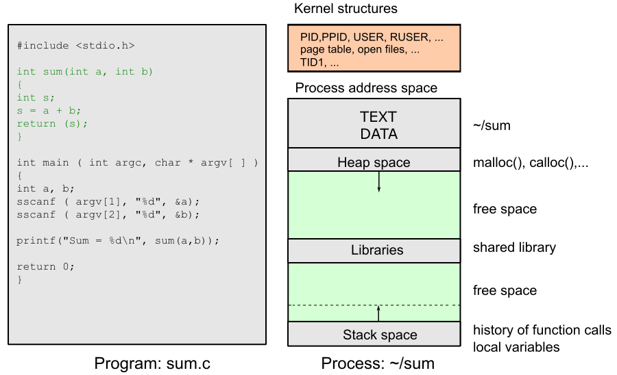
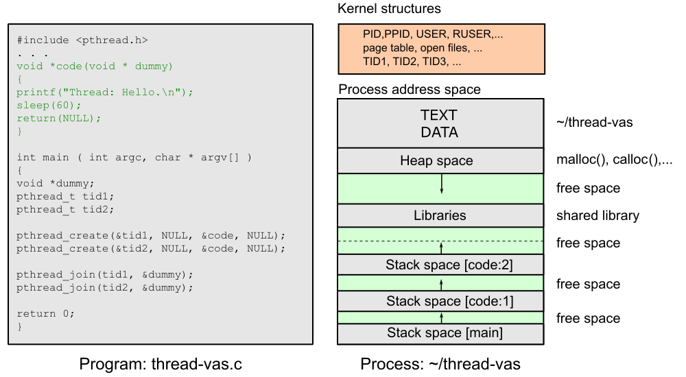
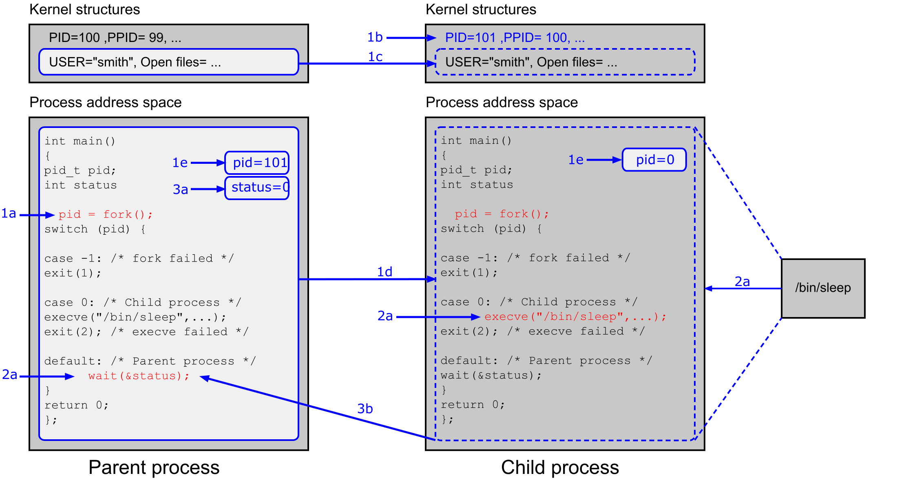
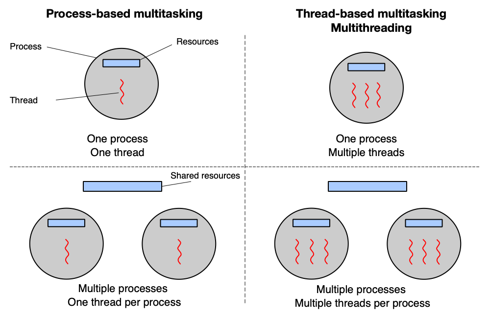
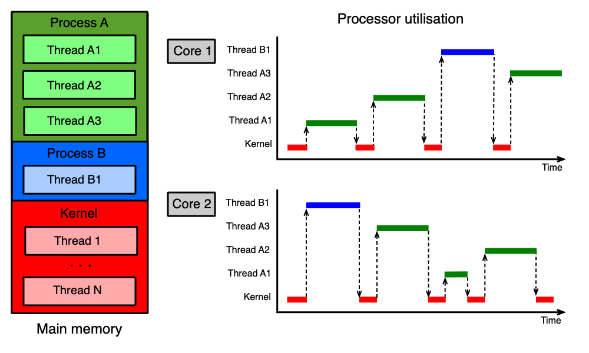
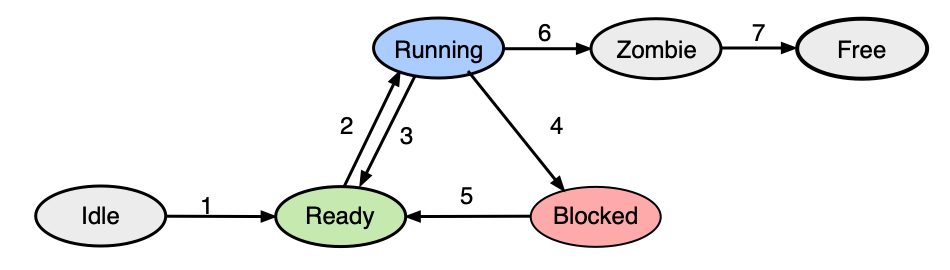
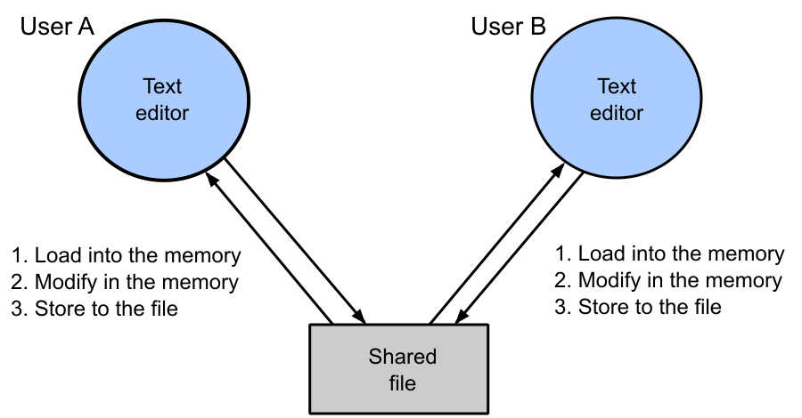
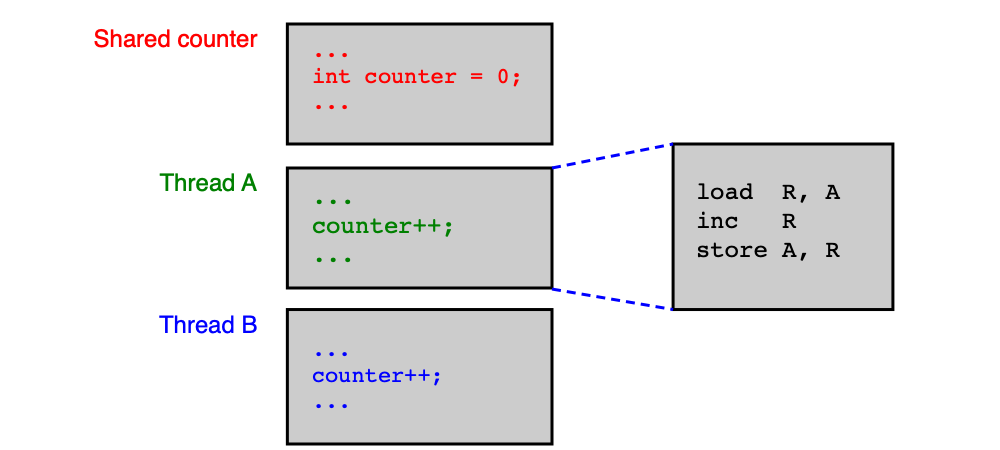

# Procesy a vlákna

Tato kapitola vysvětluje základní stavební kameny každého moderního operačního systému: co je program, proces a vlákno, jak se procesy vytvářejí a zanikají, jak se vlákna střídají na jádrech CPU a proč paralelní programy mohou obsahovat zákeřné, těžko odhalitelné chyby. Na závěr jsou definovány podmínky, které musí každý korektní paralelní program splňovat.

---

??? abstract "Obsah stránky"

    [TOC]

## Program

**Program** (nebo aplikace) je z pohledu OS spustitelný binární soubor uložený v sekundární paměti (typicky na disku). Aby mohl OS soubor spustit, musí rozumět jeho formátu. Formát je závislý na cílovém OS:

| Formát | Použití |
|---|---|
| **ELF** (Executable and Linkable Format) | GNU/Linux, BSD a obecně unixové systémy |
| **PE / PE32+** (Portable Executable) | MS Windows |

Spustitelný soubor obsahuje minimálně tyto části:

- **TEXT** — přeložený binární kód (instrukce procesoru),
- **DATA** — inicializované globální a statické proměnné,
- informace o sdílených knihovnách a další metadata.

!!! example "Zjištění formátu a závislostí v Linuxu"
    Příkaz `file` identifikuje formát souboru, `ldd` vypíše sdílené knihovny, na kterých program závisí:

    ```text
    linux:~> file /usr/bin/date
    /usr/bin/date: ELF 64-bit LSB shared object, x86-64, dynamically linked, stripped

    linux:~> ldd /usr/bin/date
            linux-vdso.so.1 (0x00007ffd66fc3000)
            libc.so.6 => /lib64/libc.so.6 (0x00007f6e3c5b1000)
            /lib64/ld-linux-x86-64.so.2 (0x00007f6e3cb84000)
    ```

---

## Proces

### Definice procesu

**Proces** je instance spuštěného programu — tedy program "oživený" v paměti a právě vykonávaný. Je to také základní entita, v jejímž rámci OS alokuje a spravuje prostředky: paměť, vlákna, otevřené soubory, zámky, semafory, sokety a další.

Každý proces má implicitně jedno výpočetní **"main" vlákno**, které začne provádět funkci `main()`.

Jádro OS si pro každý proces udržuje sadu datových struktur, které slouží k:

- **identifikaci** — číslo procesu (`PID`), číslo rodičovského procesu (`PPID`),
- **bezpečnosti** — identita procesu (`USER`, `RUSER`),
- **správě paměti** — tabulka stránek pro překlad virtuálních adres (`page table`),
- **správě souborového systému** — tabulka deskriptorů otevřených souborů.

!!! info "Datová struktura procesu v Linuxu"
    Linux interně nerozlišuje ostře mezi procesem a vláknem — obojí je reprezentováno strukturou `task_struct`. Pole `pid` identifikuje konkrétní úlohu, `tgid` (Thread Group ID) identifikuje skupinu vláken patřících jednomu procesu. Pro nový proces se `tgid = pid`; pro nové vlákno se `pid` přiřadí nová hodnota, ale `tgid` se zkopíruje od tvůrce.

    ```c
    struct task_struct {
      pid_t                pid;           // Process ID
      pid_t                tgid;          // Thread group ID
      struct files_struct *files;         // Open file information
      struct mm_struct     *mm;           // Memory descriptor
      struct signal_struct *signal;       // Signal handling
      u64                  utime;         // User time
      u64                  stime;         // System time
      ...
      int                  exit_state;    // Active, zombie, dead
      int                  exit_code;     // Return code
      int                  exit_signal;   // SIGCHLD, SIGKILL,...
      ...
      struct list_head     tasks;         // Doubly linked circular list
      struct task_struct   *real_parent;  // Real parent
      struct task_struct   *parent;       // Recipient of return code
      struct list_head     children;      // Children
      struct list_head     sibling;       // Siblings
      struct task_struct   *group_leader; // Main thread
      struct list_head     thread_node;   // Thread group list node
      ...
    }
    ```

Při vzniku nového procesu část datových struktur zdědí hodnoty od rodiče (například tabulka deskriptorů souborů), zatímco část dostane zcela nové hodnoty (například `pid`).

### Vztahy mezi procesy v Linuxu

Procesy v Linuxu tvoří stromovou hierarchii. Každý proces zná svého rodiče a své potomky. Díky tomu mohou vzájemně komunikovat. Všechny `task_struct` jsou zároveň propojeny do **obousměrně zřetězeného kruhového seznamu** všech úloh v systému (pole `tasks`), takže jádro může efektivně procházet veškeré procesy a vlákna.

!!! note "Jak Linux rozlišuje procesy a vlákna"
    Vlákna vytvořená procesem PID 9 (například PID 10 a PID 11) mají stejné `tgid` jako PID 9, ale různé `pid`. Rodičem PID 10 a PID 11 je z pohledu OS rodič procesu PID 9 (například PID 6) — přesto PID 6 nemá PID 10 a PID 11 ve svém seznamu potomků. Vlákna jsou navíc propojena přes `signal->thread_head`.

### Adresový prostor procesu

Každý proces má svůj **virtuální adresový prostor**, který je od sebe navzájem izolovaný. Skládá se z několika segmentů: kód (`TEXT`), data (`DATA`), halda (`heap`), zásobník (`stack`) a mapované sdílené knihovny.



!!! example "Zobrazení adresového prostoru v Unixu"
    Příkaz `pmap -x <PID>` zobrazí detailní mapu paměti procesu včetně přístupových práv a mapovaných souborů:

    ```text
    solaris:~> pmap -x 5652
    5652:   -bash
             Address     Kbytes  RSS  Anon  Locked  Mode    Mapped File
    0000000100000000       1000  1000     -       - r-x---- bash
    00000001001FA000         48    48    16       - rwx---- bash
    000000CC71630000        256   256   192       - rw-----   [ heap ]
    ...
    FFFFFD6DA3C10000         56    56     8       - rw-----   [ stack ]
    ```

    Na výpisu jsou patrné segmenty kódu (`r-x`), dat (`rwx`), haldy a zásobníku, ale také mapované sdílené knihovny (např. `libc.so.1`).

---

## Vlákno

### Definice vlákna

**Vlákno** (historicky označované jako *light-weight process*, lwp) je výpočetní entita — proud instrukcí — které OS přiděluje jádro CPU. Zatímco proces definuje prostředí a zdroje, vlákno definuje konkrétní výpočet, který se v daném prostředí provádí.

Vlákna vytvořená v rámci jednoho procesu **sdílí většinu jeho prostředků**: tabulku deskriptorů souborů (`files_struct`), paměťový deskriptor (`mm_struct`), zpracování signálů (`signal_struct`) a další.

!!! note "Co je specifické pro každé vlákno"
    Přestože vlákna sdílí `mm_struct`, každé vlákno má **vlastní zásobník** (stack). Ten je vláknu vytvořen ještě před spuštěním pomocí systémového volání `mmap()` a odkaz na něj je předán do `clone()`.

Jádro OS si pro každé vlákno udržuje:

- **identifikaci** — číslo vlákna `TID` (v Linuxu je to `pid` v `task_struct`),
- **zásobník** — lokální proměnné a historie volání funkcí,
- **kontext přepínání** — čítač instrukcí, aktuální hodnoty registrů,
- **informace pro plánování** — priorita, čas strávený na CPU.

### Proces s více vlákny

Když proces vytvoří více vláken, všechna vlákna sdílí jeden virtuální adresový prostor (tedy stejný kód, globální data, haldu a mapované soubory), ale každé má vlastní zásobník. To umožňuje paralelní výpočet v rámci jediného procesu.



### Vytvoření a ukončení vlákna

Každý proces se vytváří s jediným "main" vláknem. Chceme-li spustit více vláken paralelně, máme několik možností:

| Přístup | Příklady |
|---|---|
| Proprietární OS API | Microsoft Windows API, Solaris thread library |
| **POSIX Thread Library (pthreads)** | GNU/Linux, FreeBSD, MS Windows |
| OpenMP | GNU/Linux, MS Windows, FreeBSD, Solaris |
| Jazyková podpora | C++ (od C++11), Java |

#### Vytvoření vlákna pomocí POSIX pthreads

```c
#include <pthread.h>

void *start_routine(void *dummy) {
    printf("Thread: Hello.\n");
    sleep(60);
    return NULL;
}

int main(int argc, char *argv[]) {
    void *dummy;
    pthread_t tid1, tid2;

    /* Vytvoření dvou vláken */
    pthread_create(&tid1, NULL, &start_routine, NULL);
    pthread_create(&tid2, NULL, &start_routine, NULL);

    /* Čekání na dokončení vláken */
    pthread_join(tid1, &dummy);
    pthread_join(tid2, &dummy);

    return 0;
}
```

Klíčové funkce:

- **`pthread_create(pthread_t *tid, ..., void *(*start_routine)(void *), ...)`** — vytvoří nové vlákno, které začne vykonávat funkci `start_routine()`. Číslo nového vlákna uloží na adresu `tid`.
- **`pthread_join(pthread_t tid, ...)`** — aktuální vlákno se zablokuje a čeká, dokud vlákno s identifikátorem `tid` neskončí. Analogie `wait()` pro vlákna.

Více informací: `man pthread_create`, `man pthread_join`.

#### Ukončení vlákna

Vlákno skončí, jakmile se vrátí z funkce, kterou vykonává. Existují také explicitní způsoby ukončení:

| Způsob | Popis |
|---|---|
| `return` z funkce vlákna | Normální ukončení daného vlákna |
| `return 0` z `main()` | Ukončí hlavní vlákno a s ním i všechna ostatní vlákna se stejným `tgid` |
| `pthread_exit()` | Ukončí pouze volající vlákno; sdílené struktury zůstanou (pokud nejde o poslední vlákno skupiny) |
| `exit()` | Ukončí všechna vlákna se stejným `tgid` okamžitě |

!!! note "Uvolňování sdílených struktur"
    Po zavolání `pthread_exit()` se uvolní pouze zásobník daného vlákna (pomocí `munmap()`). Sdílené struktury (`files_struct`, `mm_struct`, `signal_struct`) zůstanou zachovány, dokud neskončí poslední vlákno skupiny. Zda je vlákno poslední lze zjistit z čítače `signal->live`.

---

## Vytvoření a ukončení procesu

### Vytvoření procesu — fork, execve, wait

!!! tip "U zkoušky"
    Trojice `fork()` / `execve()` / `wait()` je jádrem každé otázky na tvorbu procesů v Unixu. Musíte přesně vědět, co každá funkce vrací a co se stane s adresovým prostorem.

V unixových systémech se nový proces vytváří pomocí systémových volání `fork(2)` a `execve(2)`. V MS Windows k tomu slouží `CreateProcessA()`.

**Nový proces může být:**

1. **Klon rodiče** (po samotném `fork()`) — jádro alokuje nové datové struktury, adresový prostor rodiče se zkopíruje do potomka, čítač instrukcí ukazuje na instrukci následující za `fork()`.
2. **Úplně nový proces** (po `fork()` + `execve()`) — adresový prostor se přepíše obsahem nového programu, zásobník a halda jsou prázdné, čítač instrukcí ukazuje na první instrukci nového programu.

#### Popis funkcí

**`fork()`**

Vytvoří nový proces, který je kopií volajícího. Vrací:
- v **rodičovském** procesu: PID potomka (při chybě -1),
- v **potomkovi**: vždy hodnotu `0`.

Po návratu z `fork()` oba procesy běží nezávisle od následující instrukce.

**`execve(const char *filename, ...)`**

Adresový prostor procesu, ve kterém je volána, je zcela přepsán obsahem spustitelného souboru `filename`. Výpočet začíná od začátku nového programu. Původní kód procesu přestane existovat.

**`wait(int *status)`**

Zablokuje rodičovský proces, dokud se některý jeho potomek neukončí. Varianta `waitpid(2)` umožňuje čekat na konkrétního potomka. Návratový kód potomka je uložen na adresu `status`.

Více informací: `man 2 fork`, `man 2 execve`, `man 2 wait`.

#### Ukázkový kód

```c
int main() {
    pid_t pid;
    int status;

    pid = fork();

    switch (pid) {
    case -1: /* Chyba */
        exit(1);

    case 0: /* Potomek */
        char *argv[] = { "sleep", "30", NULL };
        char *envp[] = { NULL };
        execve("/bin/sleep", argv, envp);
        exit(0);

    default: /* Rodič */
        wait(&status);
    }
    return 0;
}
```

#### Průběh fork/exec/wait krok za krokem



Postup je následující:

1. **1a** Volání `fork()` v rodiči způsobí alokování datových struktur v jádře a paměti pro nový proces.
2. **1b** Část datových struktur nového procesu dostane nové hodnoty (např. nové `pid`).
3. **1c** Část datových struktur se zkopíruje od rodiče (např. tabulka deskriptorů souborů).
4. **1d** Obsah adresového prostoru rodiče se "zkopíruje" do adresového prostoru potomka.
5. **1e** Z `fork()` se vrátí — rodiči se uloží PID potomka, potomkovi hodnota `0`. Oba pokračují dál.
6. **2a** Rodič zavolá `wait()` a uspí se. Potomek zavolá `execve()` a načte nový program.
7. **3a** Potomek se ukončí (`exit()` nebo `return`). Návratový kód je uložen v `status`.
8. **3b** Rodič se probudí z `wait()` a pokračuje dál.

### Ukončení procesu

Jádro OS při ukončení procesu:
- pokusí se předat **návratový kód** rodiči,
- ukončí všechna vlákna patřící procesu,
- uvolní adresový prostor a příslušné datové struktury v jádře.

Způsoby ukončení:

- **Proces se ukončí sám** — dosažením konce `main()` (`return`) nebo explicitním voláním `exit(3)` / `TerminateProcess()`.
- **Proces je ukončen jádrem** — fatální chyba (dělení nulou, chybná manipulace s pamětí), přijatý signál apod.

#### Implementační detaily v Linuxu

Volání `exit()` nebo `return` z "main" vlákna spustí systémové volání `exit`, které v `task_struct`:

1. zapíše návratovou hodnotu do `exit_code`,
2. nastaví `exit_state` na **zombie**,
3. nastaví `exit_signal` (defaultně `SIGCHLD`),
4. notifikuje rodiče signálem,
5. vzdá se procesoru — od nynějška nebude plánován.

**Rodič** poté:
- pokud již čekal v `wait()`, probudí se, přečte návratový kód a uvolní `task_struct` potomka,
- pokud teprve zavolá `wait()`, OS zkontroluje, zda existují **zombie** potomci; pokud ano, převezme kód a uvolní strukturu, pokud ne, rodič se uspí.

!!! warning "Adopce sirotků"
    Pokud rodič skončí dříve než jeho potomci, OS přenastaví ukazatel `*parent` u všech potomků na proces `init` (PID 1). Init tyto "sirotky" adoptuje a po jejich skončení správně převezme návratový kód.

??? note "Příklad: Kolik procesů vznikne?"
    Kolik celkem procesů vznikne a kdy skončí poslední z nich?

    ```c
    int main() {
        pid_t pid;
        int i;

        for (i = 0; i < 3; i++) {
            pid = fork();
            if (pid == 0) {
                sleep(10);
            }
        }
        return 0;
    }
    ```

    Každá iterace zdvojnásobí počet procesů (každý existující proces zavolá `fork()`). Po první iteraci jsou 2 procesy, po druhé 4, po třetí 8. Celkem vznikne tedy **8 procesů** (včetně původního). Potomci, kteří jsou v podmínce `pid == 0`, volají `sleep(10)` a pak skončí. Nicméně potomci vytvořeni v pozdějších iteracích jsou také původní i nově vzniklé procesy — je třeba pečlivě sledovat větve.

---

## Multitasking a multithreading



**Multitasking** (nebo **multithreading**) je schopnost OS zdánlivě vykonávat více úloh souběžně. Na systému s jediným jádrem CPU to OS zajišťuje rychlým střídáním vláken — každé vlákno dostane krátký časový úsek (kvantum) a pak je vystřídáno jiným. Na vícejádrovém systému mohou vlákna běžet skutečně paralelně, každé na svém jádře.

---

## Plánování vláken a přepínání kontextu

### Plánování vláken

Jádro OS a vlákna aplikací sdílejí omezený počet "logických" jader CPU. Jedno jádro může v jednom okamžiku zpracovávat právě jedno vlákno. Aby se vlákna spravedlivě podělila o dostupná jádra, používá OS **preemptivní plánování**.

**Preemptivní plánování** funguje takto:

1. OS vybere vlákno na základě plánovacích kritérií (priorita, čas čekání, ...).
2. Přidělí mu volné jádro CPU a **časové kvantum** — po tuto dobu vlákno běží.
3. Jádro CPU je vláknu odebráno, pokud:
    - uplyne časové kvantum (přerušení od časovače),
    - vlákno provede systémové volání (např. V/V operaci),
    - nastane přerušení (např. dokončení V/V operace).

### Přepínání kontextu

**Přepínání kontextu** (context switch) je mechanismus, při kterém se vlákna vystřídají v používání jádra CPU. **Kontext** vlákna jsou všechny informace potřebné k tomu, aby bylo vlákno možné obnovit přesně od místa, kde bylo přerušeno — zejména čítač instrukcí (`PC`) a obsah všech registrů procesoru.

Přepnutí kontextu probíhá ve třech krocích:

1. Uložení kontextu přerušeného vlákna.
2. Výběr dalšího vlákna plánovačem OS.
3. Obnovení (nastavení) kontextu nového vlákna.

Vlákna sama o sobě "neví", že jsou přerušována — žijí v iluzi nepřetržitého běhu od začátku do konce.



### Stavy vláken

!!! tip "U zkoušky"
    Stavy vláken a přechody mezi nimi jsou standardní zkouškovou otázkou. Naučte se nejen názvy stavů, ale také jaká událost způsobí přechod mezi nimi.

Stav vlákna popisuje, co se s ním právě děje. Základní stavy jsou:



| Stav | Popis |
|---|---|
| **Idle** | Vlákno právě vzniklo |
| **Ready** | Vlákno čeká, až mu bude přiděleno jádro CPU |
| **Running** | Vlákno je právě zpracováváno jádrem CPU |
| **Blocked** | Vlákno čeká na událost (dokončení V/V operace, příchod signálu, ...) |
| **Zombie** | Vlákno se ukončuje, ale ještě nebylo vše dokončeno |
| **Free** | Vlákno bylo kompletně zrušeno (pouze teoretický stav) |

---

## Časově závislé chyby a kritické sekce

### Deterministický algoritmus a časově závislé chyby

**Deterministický algoritmus** vždy ze stejných vstupních podmínek vytvoří stejné výsledky — bez ohledu na to, kdy a jak rychle běží.

**Časově závislé chyby** (race conditions) jsou situace, kdy dvě nebo více vláken přistupuje ke společným sdíleným prostředkům (sdílené proměnné, sdílené soubory, ...) a výsledek deterministického algoritmu závisí na rychlosti a pořadí, v jakém tato vlákna tyto prostředky používají.

!!! warning "Zákeřnost časově závislých chyb"
    Časově závislé chyby vykazují **náhodný výskyt** — projevují se jen za určitých okolností (konkrétní pořadí přepnutí vláken) a jsou proto velmi obtížně odhalitelné a reprodukovatelné. Při hledání může pomoci nástroj jako **Valgrind**, ale nelze se na něj stoprocentně spoléhat. Nejlepší obranou je správný návrh paralelního algoritmu.

!!! tip "U zkoušky"
    Časově závislé chyby a kritické sekce jsou intenzivně zkoušeny. Musíte být schopni identifikovat race condition v ukázkovém kódu, popsat, proč k ní dojde, a navrhnout opravu.

### Příklad: Editace souboru dvěma uživateli



Dva uživatelé (nebo dvě vlákna) čtou soubor, každý provede úpravu a zapíše zpět. Pokud oba přečtou soubor ve stejnou chvíli (ještě před zápisem druhého), zápis toho druhého přepíše změny prvního. Výsledný soubor bude obsahovat změny jen jednoho z nich, ačkoliv oba zapsali.

### Příklad: Inkrementace sdíleného čítače



Dvě vlákna inkrementují společný čítač uložený v paměti na adrese `A`. Procesor provádí inkrementaci ve třech krocích:

```asm
load  R, [A]   ; načti hodnotu z paměti do registru R
inc   R        ; inkrementuj registr R
store [A], R   ; ulož hodnotu z registru zpět do paměti
```

Pokud dojde k přepnutí kontextu mezi instrukcí `load` a `store`, může nastat tento scénář:

```text
Vlákno 1: load  R1, [A]   → R1 = 5
Vlákno 2: load  R2, [A]   → R2 = 5   (přečte starou hodnotu!)
Vlákno 1: inc   R1        → R1 = 6
Vlákno 1: store [A], R1   → A = 6
Vlákno 2: inc   R2        → R2 = 6
Vlákno 2: store [A], R2   → A = 6    (přepíše výsledek vlákna 1!)
```

Ačkoliv obě vlákna provedla inkrementaci, výsledek je `6` místo správného `7`. Jedna inkrementace byla ztracena.

### Kritické sekce

**Kritická sekce** (critical section) je část programu, ve které vlákno používá sdílené prostředky (sdílená proměnná, sdílený soubor, ...).

**Sdružené kritické sekce** jsou kritické sekce dvou nebo více vláken, které se týkají téhož sdíleného prostředku.

**Vzájemné vyloučení** (mutual exclusion) je pravidlo, že vláknům není dovoleno nacházet se ve sdružené kritické sekci současně. Jinými slovy: přístup ke sdílenému prostředku musí být výlučný — v daném okamžiku ho smí používat nejvýše jedno vlákno.

!!! note "Správné pořadí pojmů"
    Problém vzniká tehdy, když dvě vlákna vstoupí do svých **sdružených** kritických sekcí naráz. Řešením je zajistit **vzájemné vyloučení** — to je cílem synchronizačních primitiv (mutexy, semafory, ...) probíraných v dalších kapitolách.

---

## Korektní paralelní program

Při psaní paralelních programů musí programátor dodržovat tato pravidla:

1. **Žádné předpoklady o rychlosti vláken.** Různá vlákna mohou běžet různě rychle v závislosti na plánování a zátěži systému. Správnost programu nesmí záviset na tom, které vlákno je "rychlejší".

2. **Zajistit výlučný přístup ke sdíleným prostředkům.** Vlákna musí být před kritickou sekcí v případě potřeby pozastavena. Zároveň žádné vlákno nesmí čekat neomezeně dlouho na vstup do kritické sekce.

3. **Mimo kritickou sekci vlákno nesmí být blokováno ostatními vlákny.** Synchronizace smí zdržovat vlákno pouze po dobu nezbytně nutnou.

!!! tip "U zkoušky"
    Tato tři pravidla tvoří základ pro analýzu správnosti synchronizačních algoritmů — objevují se jako hodnotící kritéria v zadáních příkladů.

---

## Shrnutí

- **Program** je binární soubor na disku (ELF pro Unix, PE pro Windows); obsahuje TEXT (kód), DATA (proměnné) a metadata.
- **Proces** je instance spuštěného programu — entita pro alokaci prostředků; má vlastní virtuální adresový prostor a minimálně jedno vlákno.
- **Vlákno** je proud instrukcí, které OS přiděluje jádro CPU; vlákna sdílí adresový prostor procesu, ale mají vlastní zásobník a kontext.
- V Linuxu jsou procesy i vlákna reprezentovány strukturou `task_struct`; rozlišují se pomocí `pid` a `tgid`.
- Nový proces v Unixu vzniká voláním `fork()` (klon rodiče) + `execve()` (načtení nového programu); rodič čeká na potomka pomocí `wait()`.
- Ukončující se proces přejde do stavu **zombie**, dokud rodič nepřevezme návratový kód; pokud rodič skončí dříve, init adoptuje sirotky.
- Vlákna se na jádrech CPU střídají pomocí **preemptivního plánování** — OS přiděluje časová kvanta a při přepínání ukládá/obnovuje kontext vlákna.
- Vlákno může být ve stavech: Idle, Ready, Running, Blocked, Zombie, Free.
- **Časově závislé chyby** (race conditions) vznikají při nekontrolovaném přístupu více vláken ke sdíleným prostředkům; mají náhodný výskyt a jsou těžko odhalitelné.
- **Kritická sekce** je část kódu přistupující ke sdílenému prostředku; **vzájemné vyloučení** zabraňuje souběžnému vstupu více vláken do sdružených kritických sekcí.
- Korektní paralelní program neklade předpoklady o rychlosti vláken, zajišťuje výlučný přístup ke sdíleným prostředkům a neblokuje vlákna mimo kritickou sekci.

---

## Klíčové pojmy

- **Program** — spustitelný binární soubor uložený v sekundární paměti, obsahující kód (TEXT), data (DATA) a metadata; jeho formát závisí na cílovém OS (ELF, PE).
- **ELF** (Executable and Linkable Format) — binární formát spustitelných souborů používaný v unixových OS.
- **PE** (Portable Executable) — binární formát spustitelných souborů používaný v MS Windows.
- **Proces** — instance spuštěného programu; základní entita OS pro alokaci prostředků (paměť, vlákna, soubory, ...); má vlastní virtuální adresový prostor.
- **PID** (Process ID) — jedinečné číslo identifikující proces (nebo vlákno) v rámci OS.
- **PPID** (Parent Process ID) — číslo rodičovského procesu.
- **TGID** (Thread Group ID) — identifikátor skupiny vláken; všechna vlákna jednoho procesu sdílí stejné TGID, které se rovná PID hlavního vlákna.
- **`task_struct`** — datová struktura v Linuxovém jádře reprezentující jak proces, tak vlákno; obsahuje PID, TGID, paměťový deskriptor, tabulku souborů a další.
- **Virtuální adresový prostor** — izolovaný paměťový prostor každého procesu; skládá se ze segmentů TEXT, DATA, heap, stack a mapovaných knihoven.
- **Vlákno** — výpočetní entita (proud instrukcí), které OS přiděluje jádro CPU; vlákna v procesu sdílí adresový prostor, ale mají vlastní zásobník a kontext.
- **TID** (Thread ID) — číslo vlákna; v Linuxu totožné s `pid` v `task_struct`.
- **Light-weight process (LWP)** — historický název pro vlákno.
- **Zásobník vlákna** (stack) — privátní paměťová oblast vlákna pro lokální proměnné a historii volání funkcí; v Linuxu alokována pomocí `mmap()`.
- **`fork()`** — systémové volání v Unixu, které vytvoří nový proces jako kopii rodiče; v rodiči vrátí PID potomka, v potomkovi vrátí 0.
- **`execve()`** — systémové volání, které přepíše adresový prostor procesu obsahem nového spustitelného souboru; výpočet začíná od začátku nového programu.
- **`wait()` / `waitpid()`** — systémové volání, které zablokuje rodičovský proces, dokud se potomek (nebo konkrétní potomek) neukončí; předá návratový kód.
- **Zombie** — stav ukončeného procesu, jehož `task_struct` ještě nebyla uvolněna, protože rodič nepřevzal návratový kód.
- **Adopce sirotků** — mechanismus, při kterém init (PID 1) přijme potomky procesu, který skončil dříve než oni.
- **POSIX Thread Library (pthreads)** — přenositelné rozhraní pro práci s vlákny na unixových systémech; klíčové funkce jsou `pthread_create()` a `pthread_join()`.
- **`pthread_create()`** — vytvoří nové vlákno, které bude vykonávat zadanou funkci.
- **`pthread_exit()`** — ukončí pouze volající vlákno; sdílené struktury procesu zůstanou zachovány.
- **`pthread_join()`** — zablokuje volající vlákno, dokud zadané vlákno neskončí.
- **Multitasking / Multithreading** — schopnost OS zdánlivě (nebo skutečně na vícejádrovém HW) provádět více úloh souběžně.
- **Preemptivní plánování** — strategie, při které OS přiděluje vláknům časová kvanta a může vlákno přerušit i bez jeho "souhlasu".
- **Časové kvantum** — časový úsek, po který OS nechá vlákno běžet na jádře CPU, než provede přeplánování.
- **Přepínání kontextu** (context switch) — mechanismus uložení kontextu běžícího vlákna a obnovení kontextu jiného vlákna; zajišťuje iluzi nepřerušovaného běhu každého vlákna.
- **Kontext vlákna** — veškeré informace potřebné k obnovení výpočtu vlákna od místa přerušení; zejména čítač instrukcí a hodnoty registrů.
- **Stav vlákna** — Idle (nové), Ready (čeká na CPU), Running (běží), Blocked (čeká na událost), Zombie (ukončuje se), Free (zrušeno).
- **Časově závislá chyba** (race condition) — chyba vzniklá nekontrolovaným souběžným přístupem více vláken ke sdíleným prostředkům; výsledek závisí na pořadí a rychlosti vláken, vykazuje náhodný výskyt.
- **Kritická sekce** (critical section) — část kódu, ve které vlákno přistupuje ke sdílenému prostředku.
- **Sdružené kritické sekce** — kritické sekce dvou nebo více vláken týkající se téhož sdíleného prostředku.
- **Vzájemné vyloučení** (mutual exclusion) — princip, že sdružené kritické sekce nesmí být vykonávány souběžně; nejvýše jedno vlákno smí být v kritické sekci najednou.
- **Deterministický algoritmus** — algoritmus, který ze stejných vstupů vždy produkuje stejné výstupy bez ohledu na časování.
