# Synchronizace a meziprocesová komunikace

Tato kapitola pokrývá dvě úzce propojená témata. Nejprve si vysvětlíme, proč souběžné programy potřebují synchronizaci a jaké nástroje máme k dispozici — od hardwarových instrukcí přes zámky a podmíněné proměnné až po semafory a bariéry. Poté si ukážeme, jak tyto nástroje použít při řešení tří klasických synchronizačních úloh: večeřících filosofů, čtenářů a písařů a spících holičů. Na těchto modelových příkladech uvidíme, jakých chyb se lze dopustit a jak vypadají správná, optimální a spravedlivá řešení.

---

??? abstract "Obsah stránky"

    [TOC]

## Problémy paralelního výpočtu

Jakmile více vláken sdílí data nebo prostředky, mohou nastat tři kategorie problémů. Je důležité je od sebe odlišit, protože mají různé příčiny i léky.

**Časově závislé chyby (race conditions)** vznikají tehdy, kdy nepoužijeme žádnou synchronizaci. Více vláken čte a zapisuje do sdílené paměti, a výsledek závisí na tom, v jakém pořadí jsou instrukce prokládány — tedy na rychlosti vláken. Výsledek je nedeterministický a obtížně reprodukovatelný.

Jakmile synchronizaci přidáme, hrozí nové problémy:

- **Uváznutí (deadlock)** — skupina vláken čeká na události, které může vyvolat pouze jedno z čekajících vláken. Žádné vlákno nepokročí, systém zamrzne.
- **Livelock** — vlákna nejsou zablokována, ale neustále mění svůj stav v reakci na ostatní a přitom žádné nedokončí výpočet. Je to jako dva lidé v chodbě, kteří si neustále uhýbají na stejnou stranu.
- **Hladovění (starvation)** — vlákno je ve stavu „Ready" (připraveno), ale je opakovaně předbíháno ostatními vlákny a po dlouhou dobu nezíská přístup k prostředkům.

!!! warning "Synchronizace neřeší vše automaticky"
    Špatně navrženou synchronizaci lze dostat do deadlocku nebo livelocku stejně snadno jako kód bez synchronizace. Každé řešení je nutné analyzovat z hlediska všech tří výše uvedených problémů.

---

## Přehled synchronizačních nástrojů

Synchronizační mechanismy existují na různých úrovních systému. Přehled ukazuje, jak jsou vrstveny:

| Úroveň | Příklady |
|--------|---------|
| **Hardware** | SPARC v9: `cas`, `ldstub`, `swap`; x86-64: `xchg`, `cmpxchg` |
| **Jádro OS** | Linux: atomic operations, spin locks, reader-writer locks; Solaris: adaptive locks; Windows: executive dispatcher objects |
| **Aplikace (Unix/POSIX)** | pipes, signály, System V semafory, fronty zpráv |
| **Aplikace (vlákna)** | POSIX Threads: mutexy, condition variables, semafory; C++11: `std::mutex`, `std::condition_variable` |

Tato kapitola se zaměřuje především na úroveň aplikací a vláken, protože tam synchronizaci řeší programátor nejčastěji.

---

## Synchronizační problém: Kritická sekce

**Kritická sekce (critical region/section)** je část kódu, ve které vlákno přistupuje ke sdílenému prostředku. Základní požadavek je prostý: v jednom okamžiku smí být uvnitř kritické sekce nejvýše jedno vlákno. Ostatní vlákna, která chtějí vstoupit, musí počkat.

Čekání lze realizovat dvěma základními způsoby:

1. **Aktivní čekání (busy waiting, spinning)** — vlákno ve smyčce opakovaně testuje podmínku vstupu a spotřebovává procesorový čas.
2. **Blokující systémová volání / knihovní funkce** — vlákno se přepne do stavu „Blocked" a procesor je přidělen jiným vláknům; vlákno je probuzeno, až se sekce uvolní.

### Aktivní čekání

Při aktivním čekání se používá sdílená proměnná (tzv. zámek), která indikuje, zda je kritická sekce volná nebo obsazená. Před vstupem vlákno testuje hodnotu proměnné; pokud je sekce zamčena, čeká ve smyčce. Jakmile se sekce uvolní, vlákno ji zamkne a vstoupí. Po opuštění sekce zámek odemkne.

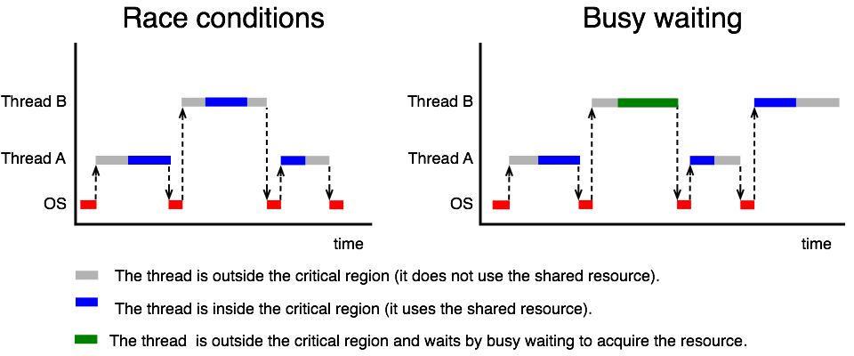

#### Proč nestačí obyčejná proměnná `lock`

Intuitivní implementace pomocí proměnné `lock` vypadá takto:

```c
int lock = 0;  /* 0 = odemčeno, 1 = zamčeno */

void thread_A(void) {
    while (TRUE) {
        while (lock == 1);  /* busy wait */
        lock = 1;           /* zamkni */
        critical_region_A();
        lock = 0;           /* odemkni */
    }
}
```

Tento kód je **chybný**. Problém je v tom, že test (`while (lock == 1)`) a nastavení (`lock = 1`) jsou dvě oddělené operace, mezi které může být vložen přepínač kontextu. Představme si, že obě vlákna otestují `lock == 0` před tím, než kterékoli z nich nastaví `lock = 1` — obě pak vstoupí do kritické sekce současně.

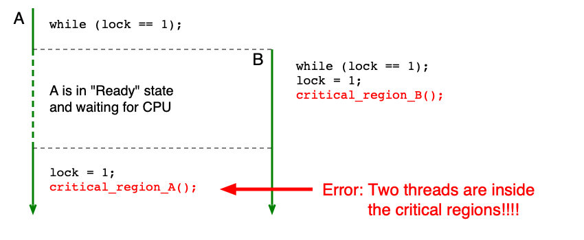

#### Instrukce TSL (Test-and-Set-Lock)

Řešení spočívá v tom, aby test a nastavení proběhly **atomicky** — jako jedna nedělitelná instrukce. K tomu slouží hypotetická instrukce **TSL** (test-and-set-lock), která:

1. Načte obsah slova z dané adresy v paměti do registru.
2. Nastaví obsah slova v paměti na nenulovou hodnotu (zamkne sekci).

Oba kroky probíhají atomicky — žádné jiné vlákno nemůže k danému slovu přistoupit v průběhu instrukce. Implementace závisí na hardwarové architektuře (např. zamčení paměťové sběrnice).

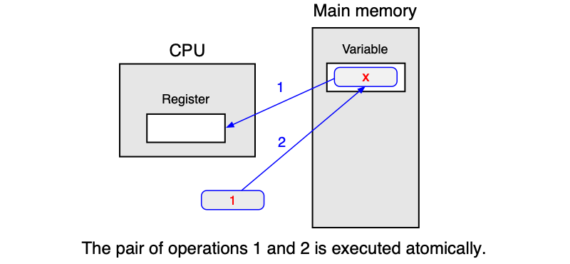

Průchod kritickou sekcí pomocí TSL v assembleru:

```text
enter_region:
    tsl REGISTER, LOCK    ; zkopíruj lock do registru a nastav lock na 1
    cmp REGISTER, #0      ; byl lock nula?
    jne enter_region      ; pokud ne, lock byl nastaven, čekej
    ret                   ; vstup do kritické sekce

leave_region:
    store LOCK, #0        ; nastav lock na 0
    ret                   ; návrat z kritické sekce
```

Reálné ISA neobsahují přímo instrukci TSL, ale nabízejí ekvivalenty:

| Architektura | Instrukce |
|---|---|
| SPARC v9 | `ldstub`, `cas`, `swap` |
| x86-64 | `xchg`, `cmpxchg` |
| RISC-V | `amoswap`, `amoadd`; nebo pár `lr`/`sc` (Load-Reserved/Store-Conditional) |

#### Vlastnosti aktivního čekání

**Výhody:**
- Minimální režie, pokud vlákno nemusí čekat nebo čeká jen velmi krátce.

**Nevýhody:**
- Čekající vlákno zatíží jedno jádro CPU na 100 % po celou dobu čekání.
- V jistých situacích může dojít k uváznutí — viz **inverzní prioritní problém**.

#### Inverzní prioritní problém (Priority Inversion)

Problém nastane za těchto podmínek:

- OS používá prioritní plánování s fixní prioritou.
- CPU má omezený počet jader.
- Vlákno A (nízká priorita) se nachází v kritické sekci.
- Vlákno B (vyšší priorita) aktivně čeká na vstup do kritické sekce.
- Všechna jádra jsou obsazena vlákny s vyšší prioritou než A.

V tomto scénáři vlákno B svým aktivním čekáním obsadí jádro a zároveň díky vyšší prioritě vytlačí vlákno A z procesoru — vlákno A tedy nemůže dokončit práci v kritické sekci a odemknout ji. Systém uvázne, přestože žádné vlákno nevolá blokující funkci.

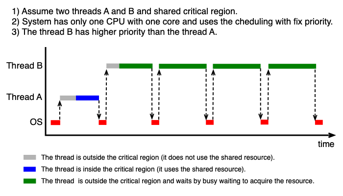

!!! tip "U zkoušky"
    Umějte popsat inverzní prioritní problém: jaké podmínky jsou nutné a proč aktivní čekání vede k uváznutí. Tento problém je důvodem, proč se aktivní čekání nepoužívá v obecných aplikacích, ale jen v jádru OS nebo na krátkých kritických sekcích.

### Blokující systémová volání

Blokující přístup je z hlediska efektivity lepší pro delší doby čekání. Místo aby vlákno točilo smyčku, systém přepne jeho stav na „Blocked" a procesor je přidělen jinému vláknu. Mechanismus si pamatuje stav kritické sekce a udržuje seznam čekajících vláken.

- **Při vstupu do zamčené sekce:** vlákno zavolá funkci, která ho zablokuje — přejde do stavu „Blocked" a přestane mu být přidělován procesor. Pasivně čeká.
- **Při vstupu do odemčené sekce:** funkce pouze si zapamatuje zamčení a vlákno vstoupí.
- **Po opuštění sekce:** vlákno probudí jedno čekající vlákno (nebo si zapamatuje, že je sekce volná).

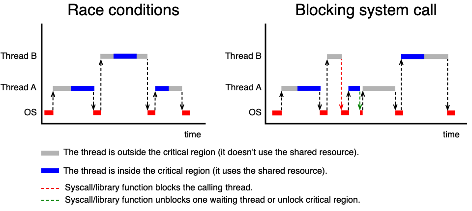

#### Zámky — Mutexy

**Mutex** (MUTual EXclusion lock) je nejzákladnější blokující synchronizační primitiv. Pamatuje si svůj stav (zamčený/odemčený) a množinu blokovaných vláken. Nad mutexem jsou definovány atomické operace:

- `mutex_lock(mutex_t *mutex)` — pokud je mutex odemčený, zamkne ho. Pokud je zamčený, zablokuje volající vlákno.
- `mutex_unlock(mutex_t *mutex)` — pokud čekají vlákna, jedno z nich probudí; jinak odemkne mutex.

```c
mutex_t mtx;

void thread_A(void) {
    while (TRUE) {
        mutex_lock(&mtx);     /* vstup do kritické sekce */
        critical_region_A();
        mutex_unlock(&mtx);   /* opuštění kritické sekce */
    }
}
```

Příklady API:

| API | Typy a funkce |
|-----|--------------|
| POSIX | `pthread_mutex_t`, `pthread_mutex_lock()`, `pthread_mutex_trylock()`, `pthread_mutex_unlock()` |
| C++ | `std::mutex`, `std::lock_guard`, `std::unique_lock` |

**Výhody:** Čekání nepředstavuje žádnou CPU zátěž.

**Nevýhody:** Blokování a odblokování vyžaduje změnu stavu vlákna v jádře OS — to je dražší operace než TSL.

!!! info "Kdy zvolit aktivní čekání vs. mutex?"
    Aktivní čekání se vyplatí jen tehdy, kdy se očekává velmi krátká doba čekání (mikrosekund) a víceprocesorový systém. Pro delší čekání vždy použijte blokující mutex — ušetříte CPU.

---

## Synchronizační problém: Producent-konzument

**Producent-konzument** (producer-consumer) je klasická synchronizační úloha modelující výměnu dat přes sdílenou paměť (frontu) s omezenou velikostí `N`. Producent vkládá data do fronty, konzument je vybírá.

Tři problémy, které musíme vyřešit:

1. Výlučný přístup při vkládání a vybírání (fronta je sdílený prostředek).
2. Pokud je fronta **prázdná**, musíme zablokovat konzumenta.
3. Pokud je fronta **plná**, musíme zablokovat producenta.

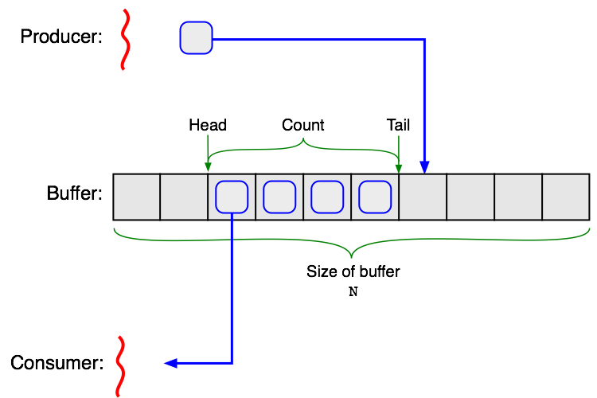

### Proč nestačí prosté wait() a signal()

Uvažme hypotetické funkce `wait()` (zablokuj vlákno) a `signal(thread)` (probuď vlákno). Naivní implementace vypadá:

```c
void producer(void) {
    item_t item;
    while (TRUE) {
        item = produce_item();
        if (count == N) wait();           /* fronta plná, usni */
        insert_item(item);
        count = count + 1;
        if (count == 1) signal(&consumer_thread);  /* probuď konzumenta */
    }
}

void consumer(void) {
    item_t item;
    while (TRUE) {
        if (count == 0) wait();           /* fronta prázdná, usni */
        remove_item(&item);
        count = count - 1;
        if (count == N - 1) signal(&producer_thread);  /* probuď producenta */
        consume_item(&item);
    }
}
```

Toto řešení je **chybné**. Přemýšlejme: fronta je prázdná (`count == 0`), konzument právě otestoval podmínku a chystá se zavolat `wait()`, ale ještě to nestihl — přepneme kontext na producenta. Ten vloží prvek, zvýší `count` na 1 a zavolá `signal()` — jenže konzument ještě nespí, takže signál se ztratí. Poté konzument zavolá `wait()` a zasekne se navždy, ačkoli fronta není prázdná.

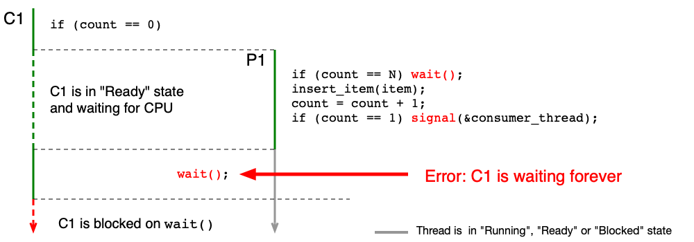

### Podmíněné proměnné

**Podmíněná proměnná (condition variable)** řeší výše popsaný problém tím, že operace „odemkni mutex a usni" je atomická — nelze ji přerušit přepínačem kontextu.

Klíčové operace:

- `cond_wait(cond_t *var, mutex_t *mutex)` — volá se se zamčeným mutexem. Atomicky odemkne mutex a zablokuje vlákno. Po probuzení je mutex opět zamčen.
- `cond_signal(cond_t *var)` — odblokuje aspoň jedno ze zablokovaných vláken.

```c
#define N 100
int     count = 0;
mutex_t mtx;
cond_t  cv_empty, cv_full;

void producer(void) {
    item_t item;
    while (TRUE) {
        item = produce_item();
        mutex_lock(&mtx);
            while (count == N) cond_wait(&cv_full, &mtx);  /* fronta plná */
            insert_item(item);
            count = count + 1;
            cond_signal(&cv_empty);  /* probuď konzumenta */
        mutex_unlock(&mtx);
    }
}

void consumer(void) {
    item_t item;
    while (TRUE) {
        mutex_lock(&mtx);
            while (count == 0) cond_wait(&cv_empty, &mtx);  /* fronta prázdná */
            remove_item(&item);
            count = count - 1;
            cond_signal(&cv_full);   /* probuď producenta */
        mutex_unlock(&mtx);
        consume_item(&item);
    }
}
```

!!! tip "U zkoušky — proč `while` místo `if`?"
    Podmínka před `cond_wait` musí být **while smyčka**, ne `if`. Důvody jsou dva:

    1. **Více producentů/konzumentů:** když se probudí více vláken najednou (např. po `cond_broadcast`), podmínka může být splněna jen pro jedno z nich. Ostatní se musí vrátit a znovu čekat.
    2. **Falešné probuzení (spurious wakeup):** POSIX Threads a WinAPI dovolují, aby se vlákno probudilo, aniž by jiné vlákno zavolalo `cond_signal()`. Po probuzení vlákno znovu zkontroluje podmínku ve `while` smyčce.

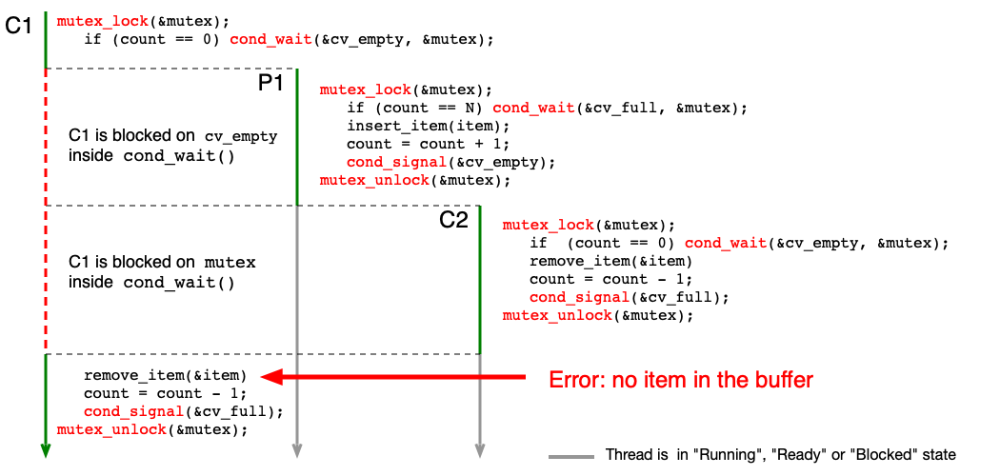

Příklady API pro podmíněné proměnné:

| API | Typy a funkce |
|-----|--------------|
| POSIX | `pthread_cond_t`, `pthread_cond_wait()`, `pthread_cond_signal()`, `pthread_cond_broadcast()` |
| C++ | `std::condition_variable` |

### Semafory

**Semafor** je zobecnění mutexu — obsahuje celočíselný čítač a frontu čekajících vláken. Zatímco mutex je binární (zamčeno/odemčeno), semafor může nabývat libovolných nezáporných hodnot.

Atomické operace nad semaforem `sem`:

- `sem_init(sem_t *sem, unsigned value)` — nastaví čítač na `value` a vyprázdní frontu.
- `sem_wait(sem_t *sem)` — pokud je čítač > 0, sníží ho o 1. Jinak zablokuje volající vlákno.
- `sem_post(sem_t *sem)` — pokud čekají vlákna, jedno probudí. Jinak zvýší čítač o 1.

!!! tip "U zkoušky — semafor jako mutex"
    Binární semafor inicializovaný na 1 se chová jako mutex. `sem_wait` odpovídá `mutex_lock`, `sem_post` odpovídá `mutex_unlock`. Semafor je ale obecnější — lze ho použít i pro signalizaci (inicializace na 0).

**Kritická sekce pomocí semaforu:**

```c
sem_t bin_sem;
sem_init(&bin_sem, 1);   /* inicializace na 1 = odemčeno */

void Thread_A(void) {
    while (TRUE) {
        sem_wait(&bin_sem);   /* vstup — zamkni */
        critical_region_A();
        sem_post(&bin_sem);   /* opuštění — odemkni */
    }
}
```

**Producent-konzument pomocí semaforů:** Používáme tři synchronizační objekty:

- `mutex` — chrání výlučný přístup k frontě.
- `empty` — semafor počítající volná místa ve frontě (inicializován na N).
- `full` — semafor počítající zaplněná místa (inicializován na 0).

```c
#define N 100
mutex_t mtx;
sem_t   empty, full;
sem_init(&empty, N);   /* N volných míst */
sem_init(&full, 0);    /* 0 plných míst */

void producer(void) {
    item_t item;
    while (TRUE) {
        item = produce_item();
        sem_wait(&empty);       /* čekej na volné místo */
        mutex_lock(&mtx);
            enter_item(item);
        mutex_unlock(&mtx);
        sem_post(&full);        /* oznam nový prvek */
    }
}

void consumer(void) {
    item_t item;
    while (TRUE) {
        sem_wait(&full);        /* čekej na prvek */
        mutex_lock(&mtx);
            remove_item(&item);
        mutex_unlock(&mtx);
        sem_post(&empty);       /* oznam volné místo */
        consume_item(&item);
    }
}
```

!!! note "Pořadí sem_wait — důležitý detail"
    Producent volá `sem_wait(&empty)` **před** `mutex_lock`. Kdybychom pořadí otočili (nejdřív `mutex_lock`, pak `sem_wait`), mohlo by dojít k deadlocku: producent drží mutex a čeká na `empty`, zatímco konzument čeká na mutex, aby mohl `sem_post(&empty)`.

Příklady API pro semafory:

| API | Funkce |
|-----|--------|
| Unix System V | `semget()`, `semctl()`, `semop()` |
| POSIX | `sem_t`, `sem_init()`, `sem_wait()`, `sem_post()` |
| C++ | Semafory nejsou standardně implementovány |

---

## Synchronizační problém: Iterační výpočty a bariéry

Při iteračních výpočtech (například výpočet n-té mocniny matice pomocí více vláken) je nutné zajistit, aby všechna vlákna dokončila i-tou iteraci dříve, než kterékoli z nich začne iteraci (i+1). K tomu slouží **bariéra (barrier)**.

Bariéra obsahuje:
- **čítač** definující sílu bariéry — počet vláken, která musí bariéru „navštívit",
- **frontu** vláken čekajících na uvolnění.

Atomické operace:

- `barrier_init(barrier_t *bar, int value)` — nastaví čítač na `value`.
- `barrier_wait(barrier_t *bar)` — sníží čítač o 1 a zablokuje vlákno. Pokud je čítač nulový (poslední vlákno), probudí všechna čekající vlákna a reset čítač.

```c
#define M 4   /* počet vláken */
#define N 10  /* počet iterací */

barrier_t bar;
barrier_init(&bar, M);

void thread_function(void) {
    int i;
    for (i = 0; i < N; i++) {
        iteration(i);
        barrier_wait(&bar);  /* počkej na ostatní vlákna */
    }
}
```

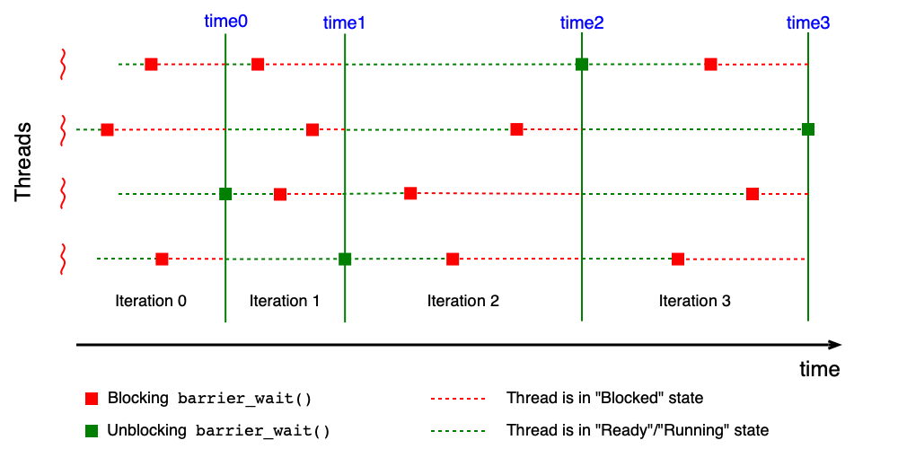

Příklady API pro bariéry:

| API | Typy a funkce |
|-----|--------------|
| POSIX | `barrier_t`, `pthread_barrier_init()`, `pthread_barrier_wait()` |
| C++ | `std::experimental::barrier` |

---

## Klasické synchronizační úlohy

Klasické synchronizační úlohy slouží jako modelové příklady pro ověření správnosti synchronizačních mechanismů. Každá úloha reprezentuje určitý typ soupeření o prostředky. Správné řešení musí být bez race conditions, deadlocku a livelocku. Optimální řešení maximalizuje paralelismus. Spravedlivé řešení zabraňuje hladovění.

---

## Večeřící filosofové

### Definice problému

**Večeřící filosofové** (Dining Philosophers) modelují situaci, kdy několik vláken soutěží o omezený počet prostředků, přičemž každé vlákno potřebuje více prostředků najednou.

Scénář: N filosofů sedí kolem kulatého stolu. Mezi každými dvěma sousedními talíři leží jedna vidlička — celkem N vidliček pro N filosofů. Hladový filosof potřebuje obě vidličky (vlevo i vpravo), aby mohl jíst. Filosof se nachází v jednom ze tří stavů:

- **přemýšlí** — nepotřebuje žádné prostředky,
- **má hlad** — snaží se získat obě vidličky,
- **jí** — drží obě vidličky a používá je.

**Cíle:**
- Správné řešení: bez race conditions, deadlocku, livelocku a hladovění.
- Optimální řešení: současně může jíst až `floor(N/2)` filosofů.

### Naivní řešení a jeho problémy

```c
#define N     5
#define LEFT  (i % N)
#define RIGHT ((i+1) % N)

void philosopher(int i) {
    while (TRUE) {
        think();
        take_fork(LEFT);   /* vezmi levou vidličku */
        take_fork(RIGHT);  /* vezmi pravou vidličku */
        eat();
        put_fork(LEFT);
        put_fork(RIGHT);
    }
}
```

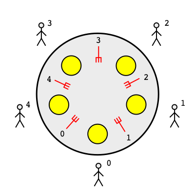

Toto naivní řešení **selže při deadlocku**: pokud všichni filosofové vezmou levou vidličku současně, budou všichni čekat na pravou vidličku — ta ale leží vlevo od souseda, který ji také drží.

Možné „vylepšení" — filosof vrátí levou vidličku, pokud pravá není k dispozici, a zkusí to znovu. Toto ale vede k **livelocku**: je možné (byť nepravděpodobné), že všichni filosofové budou synchronně brát a vracet levou vidličku donekonečna.

!!! tip "U zkoušky"
    Umějte vysvětlit, proč naivní řešení vede k deadlocku a proč vylepšení s vracením vidličky vede k livelocku. Jsou to učebnicové příklady obou jevů.

### Správné řešení pomocí mutexu

Jednoduché správné řešení: celý stůl s vidličkami považujeme za kritickou sekci chráněnou jedním mutexem.

```c
mutex_t mutex;

void philosopher(int i) {
    while (TRUE) {
        think();
        mutex_lock(&mutex);
            take_fork(LEFT);
            take_fork(RIGHT);
            eat();
            put_fork(LEFT);
            put_fork(RIGHT);
        mutex_unlock(&mutex);
    }
}
```

Toto řešení je **správné** (bez race conditions a deadlocku), ale **není optimální** — v každém okamžiku může jíst nejvýše jeden filosof, i když by mohli jíst dva sousedé, kteří nesdílejí vidličku.

### Správné optimální řešení pomocí mutexu a N semaforů

Optimální řešení vyžaduje jemnější synchronizaci. Každý filosof má vlastní semafor `s[i]` a sdílené pole stavů `state[N]`.

```c
#define N     5
#define LEFT  ((i-1+N) % N)
#define RIGHT ((i+1) % N)

typedef enum {thinking, hungry, eating} state_t;
state_t state[N];
mutex_t mutex;
sem_t   s[N];

/* inicializace */
for (i = 0; i < N; i++) { state[i] = thinking; sem_init(&s[i], 0); }

void philosopher(int i) {
    while (TRUE) {
        think();
        take_forks(i);
        eat();
        put_forks(i);
    }
}

void take_forks(int i) {
    mutex_lock(&mutex);
        state[i] = hungry;
        test(i);          /* zkus jíst */
    mutex_unlock(&mutex);
    sem_wait(&s[i]);      /* čekej, pokud nejde jíst */
}

void put_forks(int i) {
    mutex_lock(&mutex);
        state[i] = thinking;
        test(LEFT);       /* možná teď může jíst levý soused */
        test(RIGHT);      /* možná teď může jíst pravý soused */
    mutex_unlock(&mutex);
}

void test(int i) {
    if (state[i] == hungry &&
        state[LEFT] != eating &&
        state[RIGHT] != eating)
    {
        state[i] = eating;
        sem_post(&s[i]);  /* filosof i může jíst */
    }
}
```

**Jak to funguje:** Filosof, který chce jíst, nastaví svůj stav na `hungry` a zavolá `test()`. Funkce `test()` zkontroluje, zda oba sousedé nejedí — pokud ne, nastaví stav na `eating` a zavolá `sem_post`, čímž filosofa „probudí" (nebo ho hned pustí do sekce `eat()`). Po jídle filosof zavolá `put_forks()`, kde zkontroluje, zda nyní mohou jíst jeho sousedé — pokud ano, probudí je.

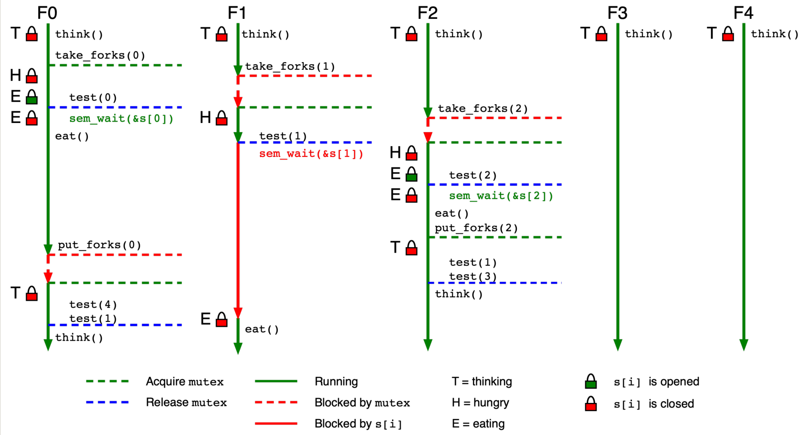

### Správné optimální řešení pomocí mutexu a N podmíněných proměnných

Alternativní implementace používá pro každého filosofa podmíněnou proměnnou `cv[i]` a pole stavů vidliček `fork[N]`.

```c
#define N     5
#define LEFT  (i % N)
#define RIGHT ((i+1) % N)

typedef enum {available, used} state_t;
state_t fork[N];
mutex_t mutex;
cond_t  cv[N];

void take_forks(int i) {
    mutex_lock(&mutex);
        while (!forks_available(i))
            cond_wait(&cv[i], &mutex);  /* čekej na obě vidličky */
        fork[LEFT] = used;
        fork[RIGHT] = used;
    mutex_unlock(&mutex);
}

void put_forks(int i) {
    mutex_lock(&mutex);
        fork[LEFT] = available;
        fork[RIGHT] = available;
        cond_signal(&cv[LEFT]);   /* probuď levého souseda */
        cond_signal(&cv[RIGHT]);  /* probuď pravého souseda */
    mutex_unlock(&mutex);
}

bool forks_available(int i) {
    return (fork[LEFT] == available && fork[RIGHT] == available);
}
```

Obě řešení (semaforové i s podmíněnými proměnnými) jsou správná a optimální.

---

## Čtenáři-písaři

### Definice problému

**Čtenáři-písaři** (Readers-Writers) modelují situaci, kdy různé typy vláken mají různé požadavky na přístup ke sdílenému prostředku (např. databázi):

- **Čtenáři (readers)** — přistupují ke sdílenému prostředku pouze pro čtení. Více čtenářů může číst současně, pokud nepíše žádný písař.
- **Písaři (writers)** — modifikují obsah sdíleného prostředku. Pouze jeden písař může zapisovat v jeden okamžik a žádný jiný vlákno (ani čtenář) nesmí přistupovat k prostředku zároveň.

**Cíle:**
- Správné řešení: bez race conditions a deadlocku.
- Optimální řešení: více čtenářů čte současně (pokud nepíše písař).
- Spravedlivé řešení: žádné vlákno není předbíháno — čtenáři ani písaři nemohou „přeskočit" čekající vlákno.

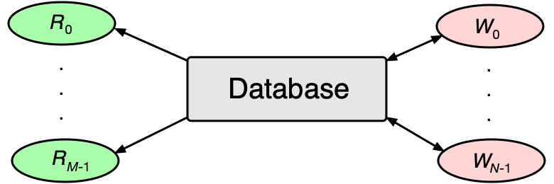

### Správné (ale neoptimální) řešení

Nejjednodušší řešení — jeden mutex chrání celý sdílený prostředek:

```c
mutex_t mutex;

void reader(void) {
    while (TRUE) {
        mutex_lock(&mutex);
            read_data();
        mutex_unlock(&mutex);
        use_data();
    }
}

void writer(void) {
    while (TRUE) {
        prepare_data();
        mutex_lock(&mutex);
            write_data();
        mutex_unlock(&mutex);
    }
}
```

Toto řešení je správné, ale neoptimální — pouze jeden čtenář čte v daný moment, přestože více čtenářů by mohlo číst bezpečně paralelně.

### Řešení s hladověním písařů

Optimální přístup umožňuje souběžné čtení více čtenářů. Používáme dvě synchronizační proměnné:

- `mutex_rc` — chrání čítač čtenářů `rc`.
- `mutex_db` — zamyká přístup k databázi (může ho zamknout pouze první čtenář, odemkne poslední).

```c
int     rc = 0;         /* počet aktivních čtenářů */
mutex_t mutex_rc;       /* chrání čítač rc */
mutex_t mutex_db;       /* chrání přístup k databázi */

void reader(void) {
    while (TRUE) {
        mutex_lock(&mutex_rc);
            rc = rc + 1;
            if (rc == 1) mutex_lock(&mutex_db);   /* první čtenář zamkne DB */
        mutex_unlock(&mutex_rc);
        read_data();
        mutex_lock(&mutex_rc);
            rc = rc - 1;
            if (rc == 0) mutex_unlock(&mutex_db); /* poslední čtenář odemkne DB */
        mutex_unlock(&mutex_rc);
        use_data();
    }
}

void writer(void) {
    while (TRUE) {
        prepare_data();
        mutex_lock(&mutex_db);
            write_data();
        mutex_unlock(&mutex_db);
    }
}
```

Toto řešení je správné a optimální (více čtenářů čte zároveň), ale **není spravedlivé** — pokud čtenáři přicházejí nepřetržitě, písař nikdy nezíská přístup k databázi (hladovění písařů).

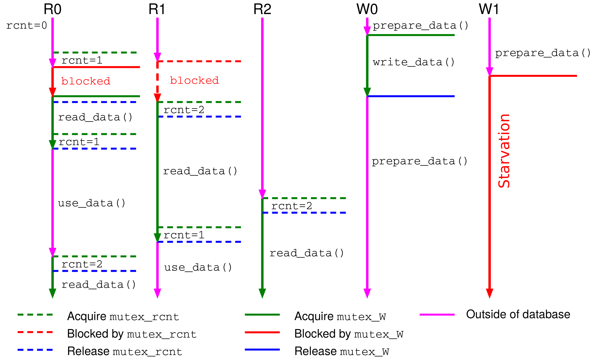

### Optimální spravedlivé řešení

Spravedlnost vyžaduje, aby vlákna přistupovala k prostředku v pořadí, v jakém začala čekat. Protože většina API (POSIX Threads, WinAPI) **negarantuje FIFO pořadí** probouzení čekajících vláken, musíme si toto pořadí udržovat sami.

Řešení udržuje frontu čekajících vláken jako zřetězený seznam položek `item_t`:

```c
typedef enum { writer, reader } type_t;

typedef struct {
    item_t *next;
    type_t  type;
    int     counter;
    cond_t  cv;
} item_t;

mutex_t mutex;
int     rc, wc, wrc, wwc;  /* počty čtoucích, zapisujících, čekajících čtenářů/písařů */
item_t  *first, *last;
```

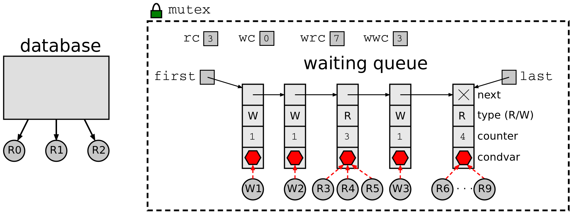

Klíčové pomocné funkce:

- `update_last_item()` — čtenář se přidá k poslední skupině čtenářů ve frontě (nebo vytvoří novou položku). Písař vždy vytváří novou položku.
- `update_first_item()` — sníží čítač první položky; pokud je nulový, položku zruší.
- `wakeup_first_item()` — probudí všechna vlákna čekající v první položce fronty (pro čtenáře volá `cond_broadcast`, pro písaře stačí `cond_signal`).

```c
void reader(void) {
    while (TRUE) {
        mutex_lock(&mutex);
            if (wc > 0 || wwc > 0) {        /* čeká písař => čekej i ty */
                wrc = wrc + 1;
                item = update_last_item(last, reader);
                while (item != first || wc > 0)
                    cond_wait(&item->cv, &mutex);
                wrc = wrc - 1;
                update_first_item(first);
            }
            rc = rc + 1;
        mutex_unlock(&mutex);
        read_data();
        mutex_lock(&mutex);
            rc = rc - 1;
            if (rc == 0) wakeup_first_item(first);  /* probuď písaře */
        mutex_unlock(&mutex);
        use_data();
    }
}
```

```c
void writer(void) {
    while (TRUE) {
        prepare_data();
        mutex_lock(&mutex);
            if (rc > 0 || wc > 0 || wrc > 0 || wwc > 0) {  /* kdokoli je tam => čekej */
                wwc = wwc + 1;
                item = update_last_item(last, writer);
                while (item != first || rc > 0 || wc > 0)
                    cond_wait(&item->cv, &mutex);
                wwc = wwc - 1;
                update_first_item(first);
            }
            wc = wc + 1;
        mutex_unlock(&mutex);
        write_data();
        mutex_lock(&mutex);
            wc = wc - 1;
            wakeup_first_item(first);  /* probuď následující čtenáře/písaře */
        mutex_unlock(&mutex);
    }
}
```

!!! tip "U zkoušky"
    Řešení čtenářů-písařů se třemi vlastnostmi (správné, optimální, spravedlivé) je typická zkouškový příklad. Umějte vysvětlit, co každá vlastnost znamená a proč jednoduché řešení s jedním mutexem nesplňuje optimalitu, a proč řešení s dvěma mutexy nesplňuje spravedlnost.

---

## Spící holiči

### Definice problému

**Spící holiči** (Sleeping Barbers) modelují situaci s N holiči, N holícími křesly a M čekacími místy pro zákazníky.

Pravidla:

- Pokud není žádný zákazník, holič sedí do holícího křesla a usne.
- Přijde-li zákazník:
  1. Holič spí (je volný) — zákazník ho probudí a nechá se ostříhat.
  2. Holič je obsazený, ale je volné čekací místo — zákazník počká.
  3. Čekárna je plná — zákazník odejde.

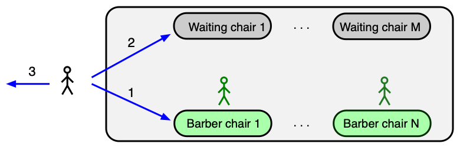

### Optimální řešení

Řešení používá jeden mutex a dva semafory:

- `customers` — semafor signalizující přítomnost zákazníků čekajících na obsloužení (inicializován na 0).
- `barbers` — semafor signalizující volné holiče (inicializován na 0).
- `wc` — počítadlo zákazníků čekajících v čekárně (chráněno mutexem).

```c
#define M 5              /* počet čekacích míst */
int     wc = 0;          /* zákazníci v čekárně */
mutex_t mutex;
sem_t   customers, barbers;
sem_init(&customers, 0);
sem_init(&barbers, 0);

void customer(void) {
    mutex_lock(&mutex);
        if (wc < M) {
            wc = wc + 1;
            sem_post(&customers);   /* oznam holiči, že čekáš */
            mutex_unlock(&mutex);
            sem_wait(&barbers);     /* čekej na volného holiče */
            have_haircut();
        } else {
            mutex_unlock(&mutex);   /* čekárna plná, odejdi */
        }
}

void barber(void) {
    while (TRUE) {
        sem_wait(&customers);   /* čekej na zákazníka */
        mutex_lock(&mutex);
            wc = wc - 1;
            sem_post(&barbers); /* oznam zákazníkovi, že jsi volný */
        mutex_unlock(&mutex);
        perform_haircut();
    }
}
```

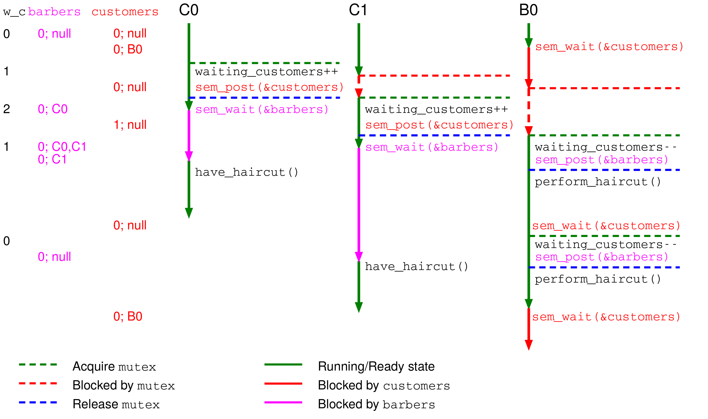

### Vlastnosti řešení

Toto řešení je **optimální** — pracuje maximum holičů, pokud je dostatek zákazníků. Nicméně **není spravedlivé**: holiči probouzejí zákazníky v libovolném pořadí, ne nutně v pořadí příchodu. Zákazníci se tedy mohou předbíhat a na některé se nemusí dostat — **hladovění (starvation)**.

Problém by bylo možné vyřešit FIFO frontou čekajících zákazníků — podobně jako u spravedlivého řešení čtenářů-písařů.

---

## Shrnutí

- Bez synchronizace hrozí **race conditions** (nedeterministické výsledky při sdíleném přístupu k datům).
- Se synchronizací hrozí **deadlock** (vzájemné čekání), **livelock** (neproduktivní aktivita) a **starvation** (dlouhodobé nepřidělení prostředků).
- **Aktivní čekání (busy waiting)** pomocí instrukce TSL je správné na úrovni hardware, ale plýtvá CPU a může vést k inverznímu prioritnímu problému.
- **Mutex** (blokující zámek) je základní primitiv pro vzájemné vyloučení — čekání nespotřebovává CPU.
- **Podmíněná proměnná** umožňuje atomicky odemknout mutex a zablokovat vlákno; podmínka musí být testována ve `while` smyčce kvůli spurious wakeup a souběžným probuzením.
- **Semafor** je zobecnění mutexu s celočíselným čítačem; binární semafor (hodnota 0/1) nahradí mutex, generální semafor slouží k signalizaci a počítání prostředků.
- **Bariéra** synchronizuje iterační výpočty: všechna vlákna musí dokončit iteraci i před tím, než pokračují na iteraci i+1.
- **Večeřící filosofové**: naivní řešení vede k deadlocku; vylepšení s vracením vidliček k livelocku; správné optimální řešení vyžaduje mutex + N semaforů (nebo podmíněných proměnných) a funkci `test()`.
- **Čtenáři-písaři**: více čtenářů může číst paralelně, pokud nepíše žádný písař; dosažení spravedlnosti (bez hladovění) vyžaduje explicitní FIFO frontu čekajících vláken.
- **Spící holiči**: řešení pomocí mutexu a dvou semaforů je optimální (pracují všichni volní holiči), ale nespravedlivé (zákazníci se mohou předbíhat).

---

## Klíčové pojmy

- **Race condition (časově závislá chyba)** — nedeterministická chyba způsobená nekontrolovaným souběžným přístupem více vláken ke sdíleným datům.
- **Deadlock (uváznutí)** — situace, kdy skupina vláken čeká na události, které může vyvolat pouze jedno z čekajících vláken; systém se zasekne.
- **Livelock** — situace, kdy vlákna aktivně mění svůj stav, ale žádné z nich nedokončí výpočet; na rozdíl od deadlocku jsou vlákna spuštěná.
- **Starvation (hladovění)** — vlákno je ve stavu Ready, ale je opakovaně předbíháno a nedostane se k prostředkům po dlouhou dobu.
- **Kritická sekce (critical section/region)** — část kódu, kde vlákno přistupuje ke sdílenému prostředku; v jednom okamžiku smí být v kritické sekci nejvýše jedno vlákno.
- **Aktivní čekání (busy waiting, spinning)** — vlákno ve smyčce opakovaně testuje podmínku vstupu do kritické sekce a přitom spotřebovává 100 % jednoho jádra CPU.
- **Instrukce TSL (Test-and-Set-Lock)** — atomická hardwarová instrukce, která načte hodnotu z paměti a nastaví ji na nenulovou hodnotu v jedné nedělitelné operaci; základ správné implementace aktivního čekání.
- **Atomická operace** — operace, která se z pohledu ostatních vláken jeví jako nedělitelná; nelze ji přerušit přepínačem kontextu ani jiným vláknem.
- **Inverzní prioritní problém (priority inversion)** — uváznutí způsobené aktivním čekáním: vlákno s vysokou prioritou čeká na vlákno s nízkou prioritou, které ale nemůže pokračovat, protože je vytlačeno z procesoru právě vysokoprioritním vláknem.
- **Mutex (MUTual EXclusion lock, vzájemné vyloučení)** — blokující synchronizační primitiv; vlákno čekající na zamčený mutex je přepnuto do stavu Blocked a nespotřebovává CPU.
- `mutex_lock` — zamkne mutex nebo zablokuje volající vlákno, pokud je mutex zamčen.
- `mutex_unlock` — odemkne mutex nebo probudí jedno čekající vlákno.
- **Podmíněná proměnná (condition variable)** — synchronizační primitiv umožňující vláknu atomicky odemknout mutex a zablokovat se; probuzení nastane po zavolání `cond_signal` nebo `cond_broadcast`.
- `cond_wait(var, mutex)` — atomicky odemkne mutex a zablokuje vlákno; po probuzení mutex opět zamkne.
- `cond_signal(var)` — probudí aspoň jedno vlákno čekající na podmíněné proměnné.
- **Spurious wakeup (falešné probuzení)** — vlákno čekající na podmíněné proměnné se může probudit bez zavolání `cond_signal`; proto musí být podmínka testována ve `while` smyčce.
- **Semafor** — synchronizační primitiv s celočíselným čítačem; `sem_wait` sníží čítač nebo zablokuje vlákno, `sem_post` zvýší čítač nebo probudí čekající vlákno.
- **Binární semafor** — semafor inicializovaný na 1, který se chová jako mutex; hodnoty nabývá pouze 0 a 1.
- **Generální (počítací) semafor** — semafor s čítačem > 1, vhodný pro počítání dostupných instancí prostředku nebo signalizaci.
- **Bariéra (barrier)** — synchronizační primitiv pro iterační výpočty; vlákna čekají, dokud požadovaný počet vláken nezavolá `barrier_wait`, poté jsou všechna uvolněna.
- **Producent-konzument (producer-consumer)** — klasická synchronizační úloha: producent vkládá data do sdílené fronty, konzument je odebírá; nutná synchronizace výlučného přístupu a signalizace plné/prázdné fronty.
- **Večeřící filosofové (Dining Philosophers)** — klasická synchronizační úloha modelující soupeření N vláken o N sdílených prostředků (vidliček), kde každé vlákno potřebuje dva sousední prostředky; optimální řešení dovoluje `floor(N/2)` vláken pracovat paralelně.
- **Čtenáři-písaři (Readers-Writers)** — klasická synchronizační úloha: více čtenářů může číst paralelně, ale písař potřebuje výlučný přístup; spravedlivé řešení vyžaduje FIFO frontu čekajících vláken.
- **Hladovění písařů** — situace v úloze čtenářů-písařů, kdy nepřetržitý proud čtenářů trvale blokuje přístup písařů k sdílenému prostředku.
- **Spící holiči (Sleeping Barbers)** — klasická synchronizační úloha: holič čeká na zákazníka (sem_wait), zákazník čeká na holiče (sem_wait); zákazník odejde, pokud je čekárna plná; řešení je optimální, ale bez FIFO nespravedlivé.
- **POSIX Threads (pthreads)** — standardní API pro práci s vlákny v Unixových systémech; poskytuje `pthread_mutex_t`, `pthread_cond_t`, `sem_t`, `barrier_t`.
- **Funkce test() (ve filosofech)** — pomocná funkce kontrolující, zda filosof může jíst (oba sousedé nejedí a filosof má hlad); pokud ano, nastaví stav na `eating` a zavolá `sem_post` na filosofův semafor.
- **Spravedlivé řešení** — synchronizační schéma, ve kterém žádné vlákno není předbíháno; čekající vlákna jsou obsloužena v pořadí, v jakém začala čekat (FIFO).
- **Optimální řešení** — synchronizační schéma maximalizující paralelismus; co nejvíce vláken pracuje souběžně, pokud to korektnost dovoluje.
