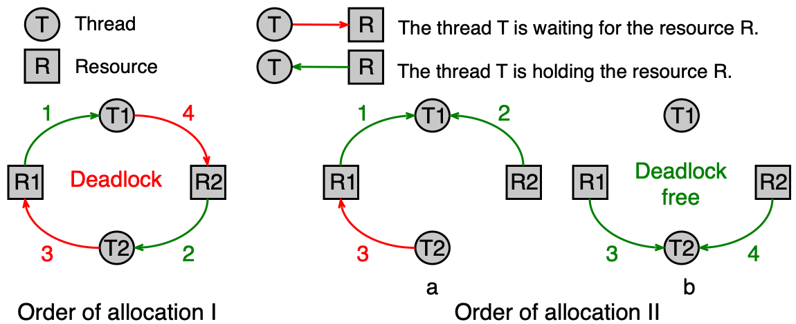
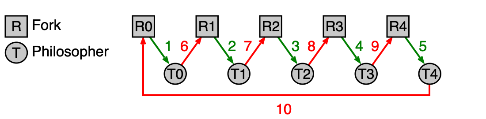
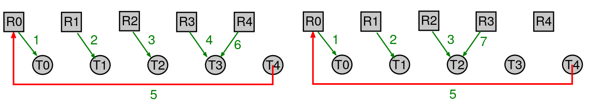
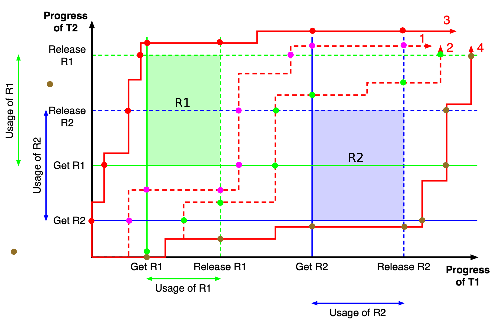
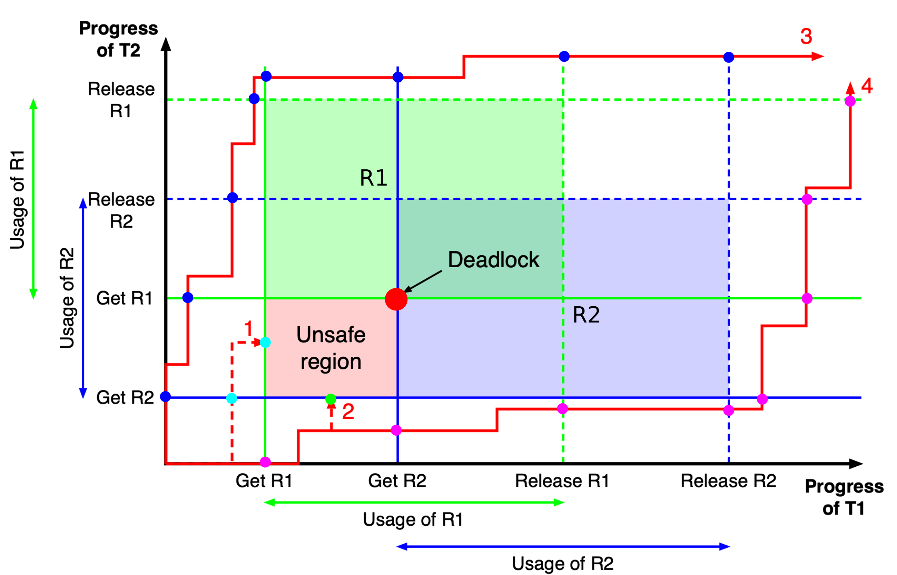

# Uváznutí (deadlock)

Tato kapitola se věnuje jednomu z nejzáludnějších problémů paralelního programování — uváznutí vláken. Vysvětlíme si, co jsou výpočetní prostředky a jak se s nimi pracuje, zavedeme alokační graf jako nástroj pro vizualizaci konfliktů, odvodíme čtyři Coffmanovy podmínky, jejichž současné splnění je nutnou podmínkou uváznutí, a podrobně probereme čtyři strategie, jak se s uváznutím vypořádat — včetně Bankéřova algoritmu, který je klíčovým tématem u zkoušky.

??? abstract "Obsah stránky"

    [TOC]

## Výpočetní prostředky

### Co je výpočetní prostředek

**Výpočetní prostředek** (resource) je jakýkoli systémový zdroj, o který mohou vlákna soupeřit. Prostředky dělíme na:

- **fyzické** — hardware přímo přítomný v počítači (fyzická paměť, tiskárna, síťová karta),
- **logické** — softwarové abstrakce (proměnná, soubor, mutex, semafor, podmínková proměnná).

Pokud je prostředek sdílen více vlákny současně bez jakékoli koordinace, vznikají **časově závislé chyby** (race conditions). Proto musíme u sdílených prostředků zajistit **výlučný přístup** — v jednom okamžiku smí prostředek využívat nejvýše jedno vlákno.

V reálných programech vlákna velmi často potřebují přistupovat k **více prostředkům najednou** (například zapsat do databáze a zároveň aktualizovat log soubor), což zvyšuje riziko uváznutí.

### Odnímatelné a neodnímatelné prostředky

Prostředky se z hlediska možnosti jejich vzetí zpět dělí na dvě kategorie:

| Typ prostředku | Anglický termín | Popis | Příklad |
|---|---|---|---|
| **Odnímatelný** | preemptable | Lze vláknu odebrat bez trvalých následků | Stránka fyzické paměti (lze odložit na disk) |
| **Neodnímatelný** | nonpreemptable | Odebrání by způsobilo chybu nebo ztrátu dat | Tiskárna (přerušení tisku uprostřed dokumentu) |

!!! warning "Většina prostředků je neodnímatelná"
    Právě proto je uváznutí tak závažný problém — u neodnímatelných prostředků nelze jednoduše "vzít zpět" to, co bylo vláknům přiděleno.

### Sekvence kroků při použití prostředku

Každé vlákno, které chce pracovat se sdíleným prostředkem, musí projít třemi kroky:

1. **Alokace** — vlákno požádá o prostředek prostřednictvím alokační funkce.
2. **Použití** — vlákno prostředek aktivně využívá.
3. **Uvolnění** — vlákno prostředek vrátí systému.

### Alokace prostředku

Pokud je požadovaný prostředek volný, je vláknu okamžitě přidělen. Pokud je však prostředek již obsazen jiným vláknem, nastane jeden ze tří scénářů:

1. **Blokování bez časového omezení** — vlákno čeká, dokud prostředek není volný (např. `mutex_lock()`, `cond_wait()`, `sem_wait()`).
2. **Blokování s časovým limitem** — vlákno čeká maximálně danou dobu (např. `mutex_try_lock()`); poté zjistí z návratové hodnoty, zda bylo úspěšné.
3. **Neblokující pokus** — vlákno se okamžitě dozví, zda byl prostředek přidělen (např. `fork()`, `malloc()`), a rozhodne samo, jak pokračovat.

### Uvolnění prostředku

Vlákna by měla alokované prostředky **uvolňovat sama**. Chování operačního systému se liší podle typu prostředku:

- Některé prostředky uvolní jádro OS automaticky při zániku procesu (např. paměť alokovaná přes `malloc()`).
- Jiné prostředky přetrvají i po zániku procesu a musí být uvolněny explicitně (např. sdílená paměť alokovaná přes `shmget()`).

!!! note "Předpoklady pro tuto kapitolu"
    V dalším výkladu budeme předpokládat, že:

    - vlákna, která nemohou získat prostředek, **čekají** (blokující alokace),
    - každé vlákno nakonec alokované prostředky po konečné době **samo uvolní**.

### Definice uváznutí

!!! warning "Uváznutí (deadlock)"
    **Uváznutí** je situace, kdy několik vláken čeká na událost nebo prostředek, který může vyvolat nebo uvolnit pouze jedno z čekajících vláken. Žádné z uvázlých vláken nemůže pokračovat — všechna čekají navzájem na sebe.

## Alokační graf

**Alokační graf** (resource allocation graph) je vizuální nástroj pro znázornění toho, které vlákno drží jaký prostředek a na co čeká. Je to **orientovaný graf se dvěma typy uzlů**:

- **uzly prostředků** (obvykle obdélníky),
- **uzly vláken** (obvykle kružnice).

Orientace hran vyjadřuje vztah:

- hrana **od prostředku k vláknu** — vlákno má prostředek **přidělen** (drží ho),
- hrana **od vlákna k prostředku** — vlákno **čeká** na přidělení daného prostředku.

Číslo u hrany může reprezentovat pořadí, ve kterém k alokaci došlo.



!!! warning "Smyčka v alokačním grafu = uváznutí"
    Každá **smyčka** (cyklus) v alokačním grafu představuje uváznutí. Vlákna tvořící smyčku čekají jedno na druhé a nemohou nikdy pokročit.

!!! note "Pořadí alokace rozhoduje"
    Uváznutí závisí na **pořadí**, v jakém vlákna alokují prostředky. Stejný kód může někdy projít bez problémů a jindy uvíznout — záleží na přesném časování.

## Coffmanovy podmínky

**Coffmanovy podmínky** jsou čtyři nutné podmínky, které musí být splněny **všechny současně**, aby mohlo dojít k uváznutí. Jsou pojmenovány po E. G. Coffmanovi, který je formuloval v roce 1971.

!!! tip "U zkoušky"
    Coffmanovy podmínky je nutné umět vyjmenovat, vysvětlit a říci, co se stane, pokud je aspoň jedna porušena. Jsou to také základ strategie prevence uváznutí.

### Podmínka 1: Vzájemné vyloučení (mutual exclusion)

Každý prostředek je v daném okamžiku buď **přidělen právě jednomu vláknu**, nebo je **volný**. Prostředek nemůže být sdílen více vlákny najednou bez výlučného přístupu.

Tato podmínka plyne přímo z povahy neodnímatelných prostředků — nelze ji obvykle porušit bez rizika vzniku race conditions.

### Podmínka 2: Neodnímatelnost (no preemption)

Prostředek, který byl **již přidělen** nějakému vláknu, mu **nemůže být násilím odebrán**. Prostředek musí vlákno uvolnit dobrovolně, až skončí s jeho použitím.

### Podmínka 3: Drž a čekej (hold and wait)

Vlákno, které **již drží** nějaké prostředky, může **žádat o další prostředky** a při tom si ty stávající ponechat. Jinými slovy: vlákno nemusí alokovat vše potřebné najednou.

### Podmínka 4: Kruhové čekání (circular wait)

Musí existovat **smyčka dvou nebo více vláken**, ve které každé vlákno čeká na prostředek přidělený dalšímu vláknu ve smyčce. Například vlákno T1 čeká na prostředek držený T2, T2 čeká na prostředek držený T3, a T3 čeká na prostředek držený T1.

!!! note "Vztah podmínek"
    První tři podmínky jsou **nutné, ale ne postačující** — mohou nastat, aniž by nastalo uváznutí. Teprve čtvrtá podmínka (kruhové čekání) **představuje samotné uváznutí**. Pokud aspoň jedna ze čtyř podmínek **není splněna**, uváznutí **nemůže nastat**.

## Strategie pro řešení uváznutí

Existují čtyři základní přístupy, jak se s problémem uváznutí vypořádat:

| Strategie | Podstata |
|---|---|
| **Pštrosí strategie** | Problém ignorujeme |
| **Prevence uváznutí** | Porušíme aspoň jednu Coffmanovu podmínku |
| **Předcházení vzniku uváznutí** | Pečlivou alokací udržujeme systém v bezpečném stavu |
| **Detekce a zotavení** | Uváznutí připustíme, detekujeme ho a odstraníme |

### Pštrosí strategie

**Pštrosí strategie** (ostrich algorithm) spočívá v tom, že problém uváznutí **jednoduše ignorujeme**. Pokud přeci jen k uváznutí dojde, vyžaduje se zásah uživatele nebo administrátora (typicky ruční ukončení zaseknutého procesu).

Tato strategie se uplatňuje za následujících podmínek:

- systém obsahuje velký počet různě se chovajících vláken a různých prostředků,
- pravděpodobnost výskytu uváznutí je relativně malá,
- náklady na implementaci sofistikovanějšího řešení by byly příliš vysoké.

V praxi ji používá **většina univerzálních operačních systémů** (MS Windows, Linuxové systémy apod.):

- Jádro OS je navrženo jako "deadlock free" (bez uváznutí).
- Na úrovni uživatelských procesů a vláken se problém řeší jen částečně — různými systémovými limity (viz unixový příkaz `ulimit -a`).

!!! warning "Fault-tolerant systémy"
    Pštrosí strategie není přijatelná pro systémy vyžadující vysokou spolehlivost (fault-tolerant systems), jako jsou řídicí systémy letadel, nemocniční přístroje nebo jaderné elektrárny.

### Prevence uváznutí

**Prevence uváznutí** (deadlock prevention) je strategie, která se snaží **porušit aspoň jednu z Coffmanových podmínek** tak, aby uváznutí principiálně nemohlo nastat. Porušení se navrhuje ve fázi návrhu nebo implementace programu.

#### Porušení podmínky vzájemného vyloučení

Pokud je prostředek používán více vlákny pro čtení i zápis, pak tuto podmínku v praxi **nelze porušit bez rizika** vzniku časově závislých chyb. Prostředky, které vyžadují výlučný přístup, jednoduše nelze sdílet.

#### Porušení podmínky neodnímatelnosti

Tento přístup je vhodný pouze tehdy, pokud lze **uložit stav prostředku** tak, aby mohl být později obnoven do původního stavu. Klasickým příkladem je sdílení jádra CPU více vlákny — přepnutí kontextu (context switch) "odejme" vláknu CPU, ale celý stav vlákna je uložen a lze ho obnovit.

#### Porušení podmínky "drž a čekej"

Pokud vlákno dopředu zná všechny prostředky, které bude potřebovat, lze všechny prostředky alokovat **najednou v jednom kroku** před jejich použitím. Vlákno buď získá vše, co potřebuje, nebo začne čekat — nikdy nenastane situace, kdy drží část prostředků a čeká na zbytek.

Nevýhodou je horší **využití prostředků** — vlákno drží prostředky, které ještě momentálně nepotřebuje, a tím znemožňuje jejich použití jinými vlákny.

#### Porušení podmínky kruhového čekání

Toto je nejpraktičtější přístup k prevenci uváznutí. Myšlenka spočívá ve **vzestupném číslování prostředků a jejich přidělování pouze v rostoucím pořadí čísel**.

Formálně: mějme množinu prostředků `R = {R1, ..., Rm}` a bijektivní číslování `F: R -> N` (každý prostředek dostane unikátní číslo). Vlákno smí požádat o prostředek `Rj` pouze tehdy, pokud pro každý prostředek `Ri`, který vlákno již drží, platí `F(Rj) > F(Ri)`.

Tím přidělování prostředků **nikdy nevytvoří smyčku** v alokačním grafu, protože pořadí alokace je vždy jednoznačně dáno číslováním.

!!! note "Omezení"
    Vhodné číslování prostředků nemusí vždy existovat — závisí na struktuře požadavků programu. Tato technika se řeší ve fázi návrhu nebo kompilace programu.

#### Příklad: Večeřící filosofové a kruhové čekání

Klasický příklad demonstruje problém pěti filosofů, kteří sedí u kulatého stolu. Každý filosof potřebuje ke konzumaci dvě vidličky (prostředky), ale mezi každými dvěma filosofy leží pouze jedna vidlička.

**Naivní řešení (s uváznutím):** Každý filosof nejprve vezme levou vidličku, pak čeká na pravou. Pokud všichni filosofové "současně" vezmou levou vidličku, každý čeká na pravou — ta však patří sousedovi, který čeká na svou pravou. Nastane kruhové čekání.



**Řešení bez uváznutí:** Vidličkám přiřadíme čísla (F: vidlička_i -> i). Každý filosof musí vidličky alokovat ve **vzestupném pořadí čísel**. Jeden z filosofů tak musí vzít nejprve "pravou" (vyšší číslo) vidličku, čímž se cyklus přeruší a k uváznutí nemůže dojít.



### Předcházení vzniku uváznutí

**Předcházení vzniku uváznutí** (deadlock avoidance) je sofistikovanější přístup, který na rozdíl od prevence **neomezuje způsob alokace staticky**. Místo toho OS při každém požadavku na prostředek **dynamicky rozhoduje**, zda přidělení prostředku nepovede k uváznutí.

#### Motivace: 2D graf průběhu dvou vláken

Pro pochopení intuice uvažujme dvě vlákna T1 a T2, která sdílejí prostředky R1 a R2. T1 alokuje R1 a R2 v tomto pořadí, T2 naopak v pořadí R2, R1.

Průběh jejich souběžného vykonávání lze znázornit **dvourozměrným grafem**: vodorovná osa odpovídá operacím T1, svislá osa operacím T2. Aktuální stav systému je bod v tomto grafu a vývoj systémem je trajektorie.

Protože R1 ani R2 nelze sdílet (vzájemné vyloučení), existují v grafu zakázané oblasti — oblasti, kde by obě vlákna používala stejný prostředek současně.



**Příklad 1** (bezpečný stav): Pokud T1 uvolní R1 dříve, než požádá o R2, nevznikne žádná nebezpečná (unsafe) oblast a všechny trajektorie 1–4 jsou bezpečné.



**Příklad 2** (nebezpečný stav): Pokud se prodlouží doba, po kterou T1 drží R1 (a požaduje R2), vznikne v grafu **nebezpečná (unsafe) oblast** — "past". Trajektorie 1 a 2, které do ní vstoupí, skončí uváznutím. Trajektorie 3 a 4, které se nebezpečné oblasti vyhnou správnou alokací, projdou bezpečně.

!!! note "Co z příkladů plyne"
    Klíčem k bezpečnému průběhu je **znalost požadavků vláken na prostředky**. Čím více informací o požadavcích OS má, tím lépe může rozhodovat:

    - **Bez znalostí požadavků** — uváznutí nelze předejít.
    - **Znalost maximálních požadavků** — uváznutí lze předejít, ale prostředky budou méně efektivně využity (některé bezpečné trajektorie nebudou povoleny).
    - **Znalost požadavků + informace o společném využívání** — uváznutí lze předejít a prostředky jsou využívány lépe (povoleny jsou i trajektorie 1–2, pokud lze dokázat bezpečnost).

#### Formální popis stavu systému

Pro formální popis stavu systému s `n` vlákny a `m` typy prostředků zavádíme následující datové struktury:

| Symbol | Název | Popis |
|---|---|---|
| `E` | **Vektor existujících prostředků** (existence vector) | `E[i]` = celkový počet prostředků typu i v systému |
| `F` | **Vektor volných prostředků** (free vector) | `F[i]` = počet volných prostředků typu i |
| `Q` | **Matice požadavků** (request matrix) | `Q[k][i]` = maximální počet prostředků typu i, které vlákno k může celkem potřebovat |
| `A` | **Matice přidělených prostředků** (allocation matrix) | `A[k][i]` = počet prostředků typu i aktuálně přidělených vláknu k |
| `M` | **Matice chybějících prostředků** (missing/need matrix) | `M = Q - A`, tj. `M[k][i]` = kolik prostředků typu i vlákno k ještě potřebuje |

Pro konzistentní stav systému musí platit:

```text
Ei = Fi + sum(A[k][i], k=1..n)    pro vsechna i = 1..m
  (vsechny prostredky jsou bud volne nebo pridelene)

Q[k][i] <= E[i]    pro vsechna k, i
  (zadne vlakno nepozaduje vice prostredku nez kolik jich v systemu existuje)

A[k][i] <= Q[k][i]    pro vsechna k, i
  (zadne vlakno si nealokuje vice nez pozadovalo)
```

#### Bezpečný stav a Bankéřův algoritmus

!!! tip "U zkoušky"
    Bankéřův algoritmus a určení bezpečného stavu jsou **nejčastější úlohy u zkoušky**. Musíte umět:

    1. Sestavit matice Q, A, M a vektory E, F.
    2. Algoritmem bezpečnosti zjistit, zda je stav bezpečný.
    3. Rozhodnout, zda přidělit nebo zamítnout konkrétní požadavek vlákna.

**Bezpečný stav** (safe state) je takový stav systému, ve kterém existuje alespoň jedna posloupnost přidělování prostředků vláknům, která garantuje postupné uspokojení potřeb všech vláken — žádné vlákno neuvázne.

**Bankéřův algoritmus** (banker's algorithm, Dijkstra 1965) funguje takto: kdykoliv vlákno požádá o prostředky, OS prostředky "zkusmo" přidělí a ověří, zda výsledný stav je stále bezpečný. Pokud ano, přidělení potvrdí. Pokud ne, vlákno bude čekat.

**Algoritmus pro zjištění bezpečnosti stavu:**

```text
1. Existuje neuspokojenou vlakno T, pro ktere plati M[T] <= F
   (tj. vsechny jeho zbyvajici pozadavky lze pokryt volnymi prostredky)?
   - ANO: oznacime T jako hotove, pridate A[T] zpet do F (vlakno skonci
          a uvolni prostredky), opakujeme bod 1.
   - NE:  pokracujeme na bod 2.

2. Byla uspokojena vsechna vlakna?
   - ANO: stav je bezpecny.
   - NE:  stav neni bezpecny (zbyvajici vlakna jsou potencialne uvazla).
```

#### Příklad: Bankéřův algoritmus — krok za krokem

!!! example "Příklad: Je stav systému bezpečný?"
    Mějme systém se 4 vlákny (T1–T4) a 3 typy prostředků (R1, R2, R3).

    **Vstupní stav:**

    | | Matice požadavků Q | | Matice přidělených prostředků A | |
    |---|---|---|---|---|
    | | R1 | R2 | R3 | | R1 | R2 | R3 |

    | Vlákno | Q[R1] | Q[R2] | Q[R3] |
    |---|---|---|---|
    | T1 | 3 | 2 | 6 |
    | T2 | 6 | 1 | 3 |
    | T3 | 3 | 1 | 4 |
    | T4 | 4 | 2 | 2 |

    | Vlákno | A[R1] | A[R2] | A[R3] |
    |---|---|---|---|
    | T1 | 1 | 0 | 0 |
    | T2 | 6 | 1 | 2 |
    | T3 | 2 | 1 | 1 |
    | T4 | 0 | 0 | 2 |

    Vektor existujících prostředků: `E = [9, 3, 6]`

    Vektor volných prostředků: `F = [0, 1, 1]`

    Matice chybějících prostředků `M = Q - A`:

    | Vlákno | M[R1] | M[R2] | M[R3] |
    |---|---|---|---|
    | T1 | 2 | 2 | 6 |
    | T2 | 0 | 0 | 1 |
    | T3 | 1 | 0 | 3 |
    | T4 | 4 | 2 | 0 |

    **Krok 1:** `F = [0, 1, 1]` — lze uspokojit T2 (potřebuje `[0, 0, 1]`)?
    Ano: `M[T2] = [0, 0, 1] <= [0, 1, 1]`. T2 označíme jako dokončené, uvolníme jeho prostředky:
    `F = F + A[T2] = [0, 1, 1] + [6, 1, 2] = [6, 2, 3]`

    **Krok 2:** `F = [6, 2, 3]` — lze uspokojit T3 (potřebuje `[1, 0, 3]`)?
    Ano: `[1, 0, 3] <= [6, 2, 3]`. T3 dokončeno, uvolníme prostředky:
    `F = [6, 2, 3] + [2, 1, 1] = [8, 3, 4]`

    Lze uspokojit T4 (potřebuje `[4, 2, 0]`)? Ano: `[4, 2, 0] <= [8, 3, 4]`. T4 dokončeno:
    `F = [8, 3, 4] + [0, 0, 2] = [8, 3, 6]`

    **Krok 3:** `F = [8, 3, 6]` — lze uspokojit T1 (potřebuje `[2, 2, 6]`)?
    Ano: `[2, 2, 6] <= [8, 3, 6]`. T1 dokončeno.

    **Výsledek:** Bezpečná posloupnost je `T2 → T3 → T4 → T1`. Systém je v **bezpečném stavu**.

## Detekce a zotavení

Pokud nemáme k dispozici informace o tom, které prostředky budou vlákna používat (nebo jak dlouho), nelze uplatnit prevenci ani předcházení uváznutí. V takovém případě se používá strategie **detekce a zotavení** (detection and recovery): uváznutí připustíme, ale pravidelně ho detekujeme a následně odstraňujeme.

### Detekce uváznutí

Algoritmus pro detekci uváznutí pracuje s aktuálním stavem systému — vektory `E` a `F`, maticí přidělených prostředků `A` a **maticí aktuálních požadavků** `Q_c` (current request matrix; na rozdíl od Bankéřova algoritmu neobsahuje maximální požadavky, ale to, co vlákna právě nyní žádají).

**Algoritmus detekce:**

```text
1. Vytvorime kopii C vektoru F (aktualne volne prostredky).
2. Na zacatku jsou vsechna vlakna neoznacena.
3. Oznacime vsechna vlakna, ktera momentalne nezadaji zadny prostredek
   (radek Q_c[T] je nulovy).
4. Existuje neoznacene vlakno T, pro ktere plati Q_c[T] <= C?
   - ANO: vlakno T oznacime, jeho alokace A[T] pridame ke C,
          opakujeme bod 4.
   - NE:  pokracujeme na bod 5.
5. Byla oznacena vsechna vlakna?
   - ANO: k uvaznutí nedoslo.
   - NE:  doslo k uvaznutí; neoznacena vlakna jsou uvazla.
```

!!! example "Příklad: Detekce uváznutí"
    Systém s 5 prostředky (R1–R5) a 4 vlákny (T1–T4):

    Matice přidělených prostředků A:

    | Vlákno | R1 | R2 | R3 | R4 | R5 |
    |---|---|---|---|---|---|
    | T1 | 0 | 1 | 0 | 0 | 1 |
    | T2 | 0 | 0 | 1 | 0 | 1 |
    | T3 | 0 | 0 | 0 | 0 | 1 |
    | T4 | 1 | 0 | 1 | 0 | 1 |

    Matice aktuálních požadavků Q_c:

    | Vlákno | R1 | R2 | R3 | R4 | R5 |
    |---|---|---|---|---|---|
    | T1 | 1 | 0 | 1 | 1 | 0 |
    | T2 | 1 | 1 | 0 | 0 | 0 |
    | T3 | 0 | 0 | 0 | 1 | 0 |
    | T4 | 0 | 0 | 0 | 0 | 0 |

    Vektor existujících prostředků: `E = [2, 1, 1, 2, 1]`
    Volné prostředky: `C = [0, 0, 0, 0, 1]`

    **Krok 1:** T4 má nulový řádek Q_c → označíme ho ihned (nežádá žádný prostředek).

    **Krok 2:** Zkusíme uspokojit zbývající vlákna z `C = [0, 0, 0, 0, 1]`:
    - T3 žádá `[0, 0, 0, 1, 0]` — **nelze** (`C[R4] = 0 < 1`).
    - T1 žádá `[1, 0, 1, 1, 0]` — nelze.
    - T2 žádá `[1, 1, 0, 0, 0]` — nelze.

    Označíme T4 a přidáme `A[T4] = [1, 0, 1, 0, 1]`: `C = [1, 0, 1, 0, 2]`.

    Opakujeme: žádné z T1, T2, T3 není možné uspokojit — T3 stále žádá `[0, 0, 0, 1, 0]` a `C[R4] = 0`.

    **Výsledek:** T4 je označené, T1, T2, T3 jsou **neoznačená → jsou uvázlá**.

### Nástroje OS pro detekci uváznutí

Standardní operační systémy poskytují několik nástrojů pro sledování stavu vláken:

- **`ps`** — zobrazení stavu procesů a vláken,
- **`gstack`**, **`gdb`** (debugger) — výpis zásobníků vláken (stack trace), které odhalí, na co vlákno čeká,
- **Valgrind** a podobné nástroje — profilování a ladění paralelních programů.

### Zotavení z uváznutí

Po detekci uváznutí je třeba ho odstranit. Existují tři základní přístupy:

**1. Ukončení všech uvázlých vláken**
Nejjednodušší řešení — typické, pokud uživatel nebo administrátor problém ručně zjistí (např. zasláním signálu `SIGKILL`). Prostředky se uvolní okamžitě.

**2. Postupné ukončování uvázlých vláken**
Uvázlá vlákna se ukončují jedno po druhém, přičemž po každém ukončení se znovu spustí detekční algoritmus. Tento postup pokračuje, dokud uváznutí trvá. Je šetrnější, ale pomalejší.

**3. Zotavení pomocí návratu a restartu (rollback and restart)**
Princip: uvázlá vlákna jsou vrácena do některého z předchozích stavů (checkpoint) a znovu spuštěna. Systém si musí pravidelně ukládat svůj stav (**checkpoint mechanismus**). Díky nedeterminismu paralelního zpracování je pravděpodobnost, že stejné uváznutí nastane znovu, relativně malá.

!!! note "Složitost zotavení"
    Zatímco **detekci** uváznutí lze implementovat relativně snadno (algoritmicky), samotné **zotavení** může být velmi složité — obzvlášť rollback, který vyžaduje netriviální infrastrukturu pro ukládání a obnovu stavu.

## Shrnutí

- **Výpočetní prostředky** (fyzické i logické) vyžadují výlučný přístup; vlákna je používají v sekvenci: alokace → použití → uvolnění.
- **Neodnímatelné prostředky** jsou kritičtější — nemohou být odebrány bez rizika poškození dat nebo stavu.
- **Alokační graf** zobrazuje, která vlákna drží nebo čekají na jaké prostředky; cyklus v grafu = uváznutí.
- **Coffmanovy čtyři podmínky** (vzájemné vyloučení, neodnímatelnost, drž a čekej, kruhové čekání) musí být splněny všechny současně, aby mohlo nastat uváznutí. Porušení jediné z nich uváznutí znemožní.
- **Pštrosí strategie** je ignorování problému — praktická pro univerzální OS, nepřijatelná pro kritické systémy.
- **Prevence** porušuje jednu z Coffmanových podmínek staticky; nejpraktičtějším přístupem je vzestupné číslování prostředků (porušení kruhového čekání).
- **Předcházení** (Bankéřův algoritmus) dynamicky rozhoduje o každém přidělení prostředku tak, aby systém nikdy nevstoupil do nebezpečného stavu.
- **Bezpečný stav** je takový, ze kterého existuje bezpečná posloupnost přidělení prostředků uspokojující všechna vlákna.
- **Detekce a zotavení** připouští uváznutí, ale pravidelně ho odhaluje algoritmem pracujícím s maticemi A a Q_c a vektorem volných prostředků C.
- **Zotavení** lze provést ukončením uvázlých vláken (jednorázově nebo postupně) nebo mechanismem rollback a restart.

## Klíčové pojmy

- **Výpočetní prostředek (resource)** — fyzický nebo logický systémový zdroj, ke kterému vlákna přistupují a jehož sdílení je třeba koordinovat.
- **Odnímatelný prostředek (preemptable resource)** — prostředek, který lze vláknu odebrat bez rizika trvalé ztráty dat (např. stránka fyzické paměti).
- **Neodnímatelný prostředek (nonpreemptable resource)** — prostředek, který nelze odebrat bez rizika poškození dat nebo stavu (např. tiskárna).
- **Alokace prostředku** — přidělení prostředku vláknu na základě jeho žádosti; pokud je prostředek obsazen, vlákno čeká nebo dostane chybu.
- **Alokační graf (resource allocation graph)** — orientovaný graf s uzly prostředků a vláken; hrana prostředek→vlákno = vlákno drží prostředek; hrana vlákno→prostředek = vlákno čeká.
- **Uváznutí (deadlock)** — situace, kdy skupina vláken čeká na události nebo prostředky, které může vyvolat pouze jedno z čekajících vláken; žádné z nich nemůže pokračovat.
- **Coffmanovy podmínky** — čtyři nutné podmínky uváznutí: vzájemné vyloučení, neodnímatelnost, drž a čekej, kruhové čekání.
- **Vzájemné vyloučení (mutual exclusion)** — prostředek je v daném okamžiku přidělen nejvýše jednomu vláknu.
- **Neodnímatelnost (no preemption)** — přidělený prostředek nelze vláknu násilím odebrat, musí ho uvolnit dobrovolně.
- **Drž a čekej (hold and wait)** — vlákno, které drží prostředky, může žádat o další, aniž by muselo stávající uvolnit.
- **Kruhové čekání (circular wait)** — cyklus vláken, kde každé čeká na prostředek držený dalším vláknem v cyklu.
- **Pštrosí strategie (ostrich algorithm)** — ignorování problému uváznutí; vhodné tam, kde je uváznutí vzácné a řešení příliš nákladné.
- **Prevence uváznutí (deadlock prevention)** — statické porušení jedné z Coffmanových podmínek ve fázi návrhu programu.
- **Vzestupné číslování prostředků** — technika prevence kruhového čekání: vlákna smí alokovat prostředky pouze v rostoucím pořadí přiřazených čísel.
- **Předcházení uváznutí (deadlock avoidance)** — dynamické rozhodování o každém přidělení prostředku tak, aby systém nikdy nevstoupil do nebezpečného stavu.
- **Bezpečný stav (safe state)** — stav systému, ve kterém existuje alespoň jedna posloupnost přidělování prostředků, která zaručí dokončení všech vláken.
- **Nebezpečný stav (unsafe state)** — stav, ze kterého může (ale nemusí) nastat uváznutí; žádná bezpečná posloupnost neexistuje.
- **Bankéřův algoritmus (banker's algorithm)** — algoritmus předcházení uváznutí od Dijkstry; před každým přidělením prostředku ověří bezpečnost výsledného stavu.
- **Vektor existujících prostředků E (existence vector)** — udává celkový počet prostředků každého typu v systému.
- **Vektor volných prostředků F (free vector)** — udává počet aktuálně volných prostředků každého typu.
- **Matice požadavků Q (request matrix)** — obsahuje maximální požadavky jednotlivých vláken na prostředky.
- **Matice přidělených prostředků A (allocation matrix)** — obsahuje aktuálně alokované prostředky pro každé vlákno.
- **Matice chybějících prostředků M / Need matrix** — M = Q - A; udává, kolik prostředků ještě každé vlákno potřebuje.
- **Matice aktuálních požadavků Q_c (current request matrix)** — používaná při detekci; obsahuje prostředky, které vlákna právě nyní aktivně požadují (ne maximum).
- **Detekce uváznutí (deadlock detection)** — pravidelné spouštění algoritmu, který na základě aktuálního stavu systému odhalí existující uváznutí.
- **Zotavení z uváznutí (deadlock recovery)** — odstranění uváznutí ukončením uvázlých vláken nebo mechanismem rollback a restart.
- **Rollback a restart** — obnova uvázlého vlákna do dříve uloženého stavu (checkpointu) a jeho opětovné spuštění.
- **Checkpoint** — pravidelně ukládaný snímek stavu systému nebo vlákna, který umožňuje obnovu při zotavení z uváznutí.
- **`ulimit -a`** — unixový příkaz zobrazující systémové limity procesů; jeden z nástrojů částečného řešení uváznutí na úrovni uživatelského prostoru.
