# Plánování procesů a vláken

Tato kapitola se věnuje tomu, jak operační systém spravuje informace o procesech a vláknech a jak rozhoduje, které vlákno poběží na procesoru v daný okamžik. Nejprve si popíšeme datové struktury, které jádro OS udržuje pro každý proces (**PCB**) a každé vlákno (**TCB**), a různé modely implementace vláken. Poté se zaměříme na samotné **plánování vláken** — jaké jsou cíle plánování, kdy se plánuje a jaké strategie existují: od jednoduchého round-robin přes prioritní plánování se statickou i dynamickou prioritou až po moderní Completely Fair Scheduler a kooperativní FCFS.

---

??? abstract "Obsah stránky"

    [TOC]

## Implementace procesů a vláken

### Tabulka procesů a Process Control Block

Jádro operačního systému si musí o každém běžícím procesu pamatovat celou řadu informací. Nejčastěji jsou tyto informace uloženy v podobě zřetězeného seznamu struktur, který se označuje jako **tabulka procesů** (process table). Jedna položka tohoto seznamu pak reprezentuje jeden konkrétní proces a historicky se nazývá **Process Control Block** (PCB).

Kolik procesů a vláken může v systému existovat? Maximální počet bývá odvozen od velikosti fyzické paměti (takto to dělají Linux, Solaris a další). Navíc z bezpečnostních důvodů bývá pro běžné uživatele nastaven samostatný limit — chrání to systém například před útočnou technikou zvanou **fork-bomba**, která rekurzivně vytváří nové procesy, dokud nevyčerpá systémové prostředky.

!!! example "Limity vláken v Linuxu"
    ```text
    # Celkový systémový limit:
    u1@linux:~> cat /proc/sys/kernel/threads-max
    15523

    # Limit pro konkrétního uživatele:
    u1@linux:~> ulimit -u
    15567

    # Nastavení nového limitu a ověření fork-bomby:
    u1@linux:~> ulimit -u 100
    u1@linux:~> f(){ f | f & } ; f
    -bash: fork: retry: Resource temporarily unavailable
    ```
    Po nastavení limitu na 100 vláken fork-bomba narazí na strop a lze ji bezpečně ukončit příkazem `pkill -u u1`.

### Obsah PCB

**PCB** obsahuje vše, co si OS musí o procesu pamatovat. Lze ho rozdělit do tří skupin:

| Skupina | Příklady položek |
|---|---|
| Identifikace procesu | PID, PPID, SID, jméno procesu |
| Bezpečnost a identita | EUID, RUID, GID, privilegia, access token |
| Alokované prostředky | přidělená fyzická paměť, tabulka deskriptorů souborů, IPC nástroje (semafory, roury, signály) |

!!! info "Kde najít strukturu PCB?"
    Strukturu PCB konkrétního OS lze zjistit z:

    - dokumentace OS nebo knih jako *Windows Internals*, *Linux Kernel Development*, *Solaris Internals*,
    - zdrojového kódu jádra (Linux: `sched.h`, Solaris: `proc.h`, `thread.h`, Windows: `winternl.h`),
    - nástrojů jako Task Manager, Process Explorer (Windows), `ps`, `top`, `lsof` (Linux/Unix),
    - debuggerů: WinDbg (Windows), `gdb` (Linux), `mdb` (Solaris),
    - pseudo-souborového systému `/proc` v unixových systémech.

!!! example "Struktura proc_t v Solarisu"
    ```c
    typedef struct proc {
        struct vnode *p_exec;      /* pointer to a.out vnode */
        struct as    *p_as;        /* process address space pointer */
        struct cred  *p_cred;      /* process credentials */
        int           p_swapcnt;   /* number of swapped out lwps */
        char          p_stat;      /* status of process */
        pid_t         p_ppid;      /* process id of parent */
        struct proc  *p_parent;    /* ptr to parent process */
        struct proc  *p_child;     /* ptr to first child process */
        /* ... signály, synchronizace, ... */
    } proc_t;
    ```
    Obsah PCB konkrétního procesu lze v Solarisu zobrazit přímo z běžícího jádra pomocí debuggeru `mdb`:
    ```text
    root@solaris:~> echo "ffffa1c0089ca088 ::print -ta proc_t" | mdb -k
    ```

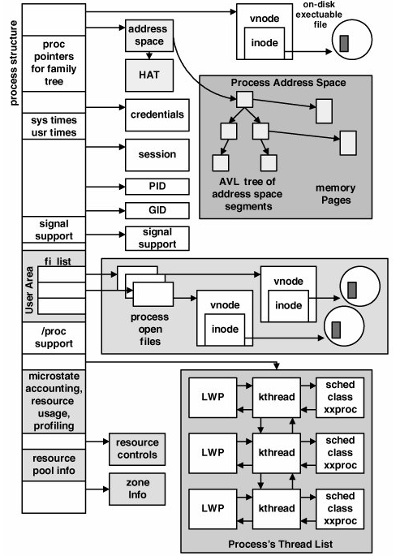

### Thread Control Block

Zatímco PCB popisuje proces jako celek, pro každé vlákno si jádro OS udržuje zvláštní datovou strukturu — **Thread Control Block** (TCB). Obsahuje:

- **identifikaci vlákna**: číslo vlákna (TID),
- **informace pro přepínání kontextu**: hodnoty viditelných registrů CPU, hodnoty řídicích a stavových registrů (čítač instrukcí, příznakový registr), ukazatel na zásobník,
- **informace pro plánování**: typ plánovacího algoritmu, priorita, aktuální stav vlákna, informace o čekajících událostech, využitý čas CPU, důvod posledního přepnutí kontextu.

!!! note "PCB vs. TCB"
    PCB je sdílený pro celý proces — obsahuje prostředky sdílené všemi vlákny (paměť, soubory). TCB je soukromý pro každé vlákno — obsahuje to, co je nutné k přepnutí vlákna na jiné jádro CPU a zpět.

### Implementace vláken

Historicky existovaly dva základní způsoby implementace vláken: v uživatelském prostoru nebo přímo v jádru OS. Moderní systémy typicky používají kombinaci nebo čistě jadernou implementaci.

#### Vlákna v uživatelském prostoru (many-to-one)

Vlákna jsou v tomto modelu spravována výhradně uživatelskou knihovnou (**run-time systém**), jádro OS o nich nemá žádné informace. Tato implementace se označuje jako model **many-to-one** — více uživatelských vláken je namapováno na jedno kernel vlákno.

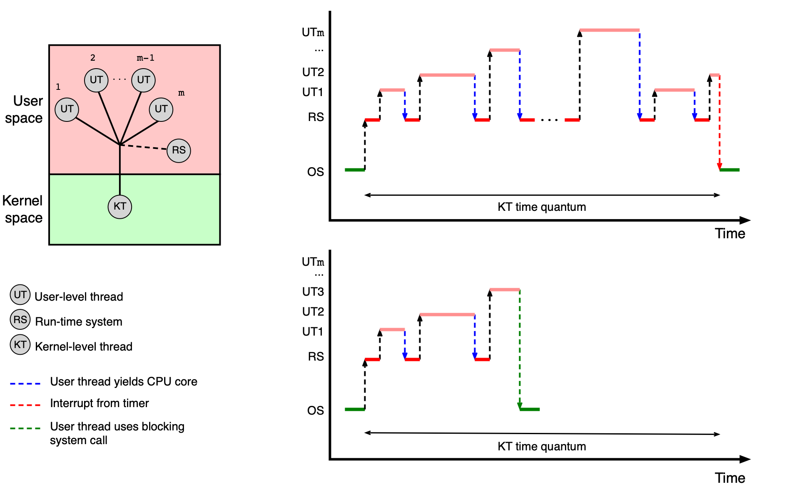

**Výhody:**
- Jednoduchá a rychlá správa (vytvoření, přepínání, synchronizace) bez vstupu do jádra OS.

**Nevýhody:**
- Všechna vlákna jednoho procesu jsou mapována na jediné jádro CPU — nelze využít více jader najednou.
- Pokud jedno vlákno zavolá blokující systémové volání, zablokují se tím pádem i všechna ostatní vlákna procesu.

Vlákna v uživatelském prostoru používají **kooperativní plánování** — po určitém čase předají vlákna řízení zpět run-time systému sama od sebe.

#### Vlákna v jádru OS (one-to-one)

Toto je typická implementace v současných operačních systémech (Linux, MS Windows, Solaris, macOS). Jádro OS přímo spravuje jeden PCB pro každý proces a jeden TCB pro každé vlákno, a poskytuje systémová volání pro jejich vytváření a správu.

Model se označuje jako **one-to-one** — každé uživatelské vlákno odpovídá právě jednomu kernel vláknu.

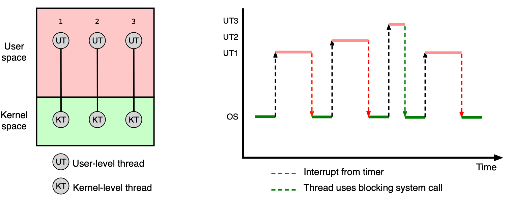

**Výhody:**
- Jádro OS zná všechna vlákna a může je rozmísťovat na různá jádra CPU.
- Blokující systémové volání zablokuje pouze volající vlákno, ostatní pokračují.

**Nevýhody:**
- Každá operace s vláknem (vytvoření, přepnutí kontextu, ukončení) vyžaduje přepnutí z user modu do kernel modu — vyšší režie.

#### Hybridní implementace (many-to-many)

Hybridní model kombinuje oba přístupy: **m** uživatelských vláken je namapováno na **n** kernel vláken (kde m ≥ n). Kombinuje výhody obou přístupů.

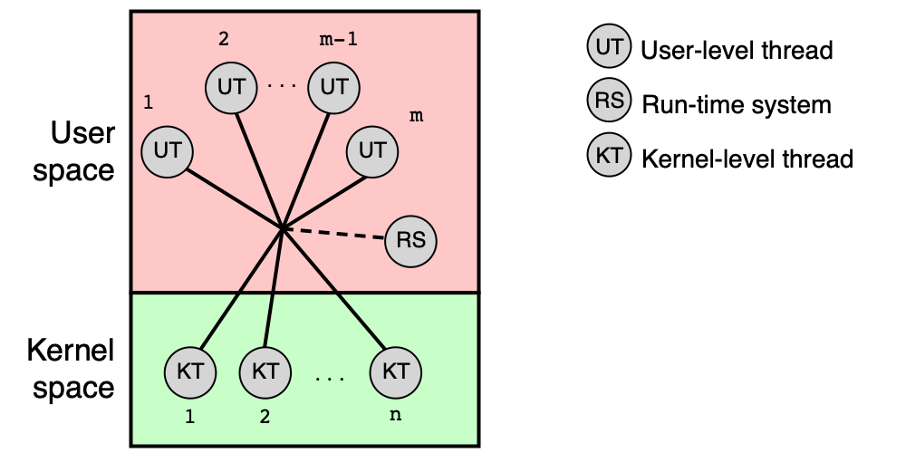

!!! note "Poznámka k terminologii"
    V současných OS jsou vlákna implementována v jádru OS (model one-to-one). Pokud dokumentace hovoří o „uživatelských vláknech implementovaných pomocí knihovny", má obvykle na mysli knihovnu implementující právě model one-to-one (např. POSIX pthreads na Linuxu), nikoliv skutečná vlákna v uživatelském prostoru. Termín „kernel vlákno" může také označovat vlákno implementující interní funkci jádra (ne vlákno uživatelského procesu).

#### Příklady implementace v konkrétních OS

**Solaris** historicky rozlišoval tři úrovně: user-level threads (ULT) v adresovém prostoru procesu, kernel threads jako základní plánované jednotky, a lightweight processes (LWP) jako mapování mezi nimi. Od Solarisu 8 (rok 2000) je podporován pouze model one-to-one. Navíc Solaris zavádí abstrakce jako **úloha** (task — množina procesů sdílejících kvóty), **projekt** (project — množina procesů sdílejících kvóty a limity v rámci OS) a **zóna** (zone — virtuální instance OS).

**MS Windows** rozlišuje **Fiber** (vlákno spravované v uživatelském prostoru) a **Thread** (základní jednotka plánovaná jádrem). Skupinu procesů sdílejících limity a kvóty pak označuje jako **Job**.

---

## Plánování vláken

Kdykoliv se uvolní jádro CPU, musí OS vybrat vhodné vlákno ve stavu **Ready** a přidělit mu procesorový čas. Tento rozhodovací mechanismus se nazývá **plánování vláken** (thread scheduling).

### Typy aplikací

Z hlediska plánování rozlišujeme tři kategorie aplikací:

| Typ aplikace | Charakteristika |
|---|---|
| **Dávkové úlohy** | Zpracovávají data ze souborů, nekomunikují s uživatelem, vyžadují hodně CPU výkonu. |
| **Interaktivní aplikace** | Reagují na události z GUI, CLI nebo sítě — důležitá je rychlá odezva. |
| **Úlohy reálného času** | Nevyžadují nutně velký CPU výkon, ale musí zareagovat na událost v garantovaném čase. |

### Cíle plánování

Cíle se liší podle toho, z čí perspektivy na plánování nahlížíme:

**Z hlediska systému:**

- **Spravedlivost** — každý uživatel/proces/vlákno dostane přiměřenou část CPU výkonu.
- **Vyváženost** — zátěž je rozložena rovnoměrně na všechny části systému.
- **Prosazení strategie** — lze uplatnit zvolenou plánovací strategii.

**Pro dávkové úlohy:**

- **Doba zpracování (turnaround time)** — čas od spuštění do ukončení úlohy.

**Pro interaktivní aplikace:**

- **Doba odezvy (response time)** — čas od zadání požadavku do první reakce.
- **Přiměřenost (proportionality)** — chování odpovídá očekávání uživatele.

**Pro úlohy reálného času:**

- **Garantování odezvy (meeting deadlines)** — zabránění ztrátě dat při zmeškání termínu.
- **Předvídatelnost** — zamezení degradaci výkonu.

### Typy vláken

OS při plánování rozlišuje tři typy vláken podle jejich chování:

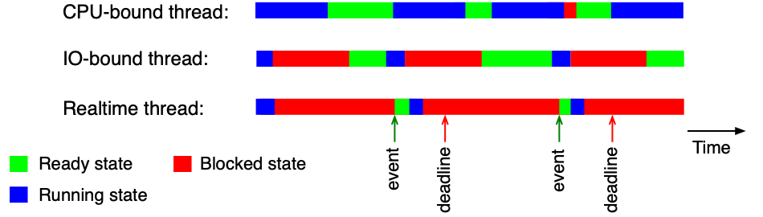

1. **Vlákna orientovaná na CPU (CPU-bound threads)** — CPU je využíváno po dlouhou dobu, málo blokujících operací. Typické pro výpočetně náročné programy.
2. **Vlákna orientovaná na V/V (I/O-bound threads)** — CPU je využíváno jen krátce, pak vlákno čeká na V/V operaci. Typické pro databázové servery, webové servery.
3. **Vlákna reálného času (Realtime threads)** — musí zareagovat na událost v daném časovém intervalu bez ohledu na ostatní.

!!! note "Dynamická klasifikace"
    Typ vlákna není pevný — CPU-bound vlákno se může chovat jako I/O-bound, změní-li svůj způsob práce. Typ reálného času je naopak daný účelem vlákna a obvykle se nemění.

### Kdy plánujeme?

Plánování nastává ve dvou situacích:

**Vlákno samo uvolní CPU:**

- vlákno dokončilo výpočet a zavolalo `exit()` nebo obdobné systémové volání,
- vlákno se dobrovolně vzdalo CPU voláním `pthread_yield()` nebo obdobné funkce,
- vlákno zavolalo blokující funkci — `read()`, `write()`, `pthread_mutex_lock()`, ...

**Nastala nějaká událost:**

- **přerušení od V/V zařízení** — dokončila se V/V operace, je třeba zareagovat,
- **přerušení od časovače** — uplynulo časové kvantum přidělené aktuálnímu vláknu.

---

## Strategie plánování

Plánovací strategie určuje pravidla, podle nichž OS rozhoduje, které vlákno poběží. Rozlišujeme dva základní přístupy.

### Plánování s odnímáním vs. kooperativní plánování

| Vlastnost | Plánování s odnímáním (preemptive) | Kooperativní plánování (cooperative) |
|---|---|---|
| Jak vlákno přichází o CPU | Po uplynutí časového kvanta — OS ho odebere násilně | Vlákno CPU samo uvolní (dokončení, blokující volání) |
| Počet přepnutí kontextu | Vyšší | Nižší |
| Využití CPU | Horší | Lepší |
| Doba odezvy | Kratší | Delší |
| Vhodné pro | Interaktivní systémy | Prověřená/kernel vlákna |

Kooperativní plánování je rizikové pro uživatelská vlákna — jedno špatně napsané vlákno může zablokovat celý systém.

---

## Round-Robin (RR)

**Round-Robin** je nejjednodušší strategie plánování s odnímáním. Funguje takto:

- Všechna vlákna ve stavu **Ready** čekají v jedné frontě FIFO.
- Každému vláknu je přiděleno jádro CPU na stejně velké **časové kvantum** (time slice).
- Po uplynutí kvanta je vlákno odebráno z CPU, jeho stav se změní zpět na Ready a vlákno je zařazeno na **konec** fronty.

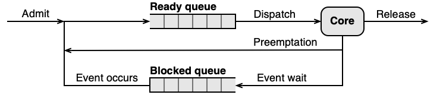

Klíčovým parametrem je velikost časového kvanta:

| Velikost kvanta | Efekt |
|---|---|
| Krátké (malé) | Kratší doba odezvy, horší využití CPU (více přepnutí kontextu) |
| Dlouhé (velké) | Lepší využití CPU, delší doba odezvy |
| Rozumný kompromis | **10–50 ms** |

!!! tip "U zkoušky"
    Pamatujte si vzorce pro RR příklady:

    - **Efektivita** = `tq / (tcs + tq) × 100 %`
    - **Doba odezvy vlákna D** (zablokovaného, čekajícího na uvolnění) = `pocet_ostatnich_vlaken × (tcs + tq)`

    kde `tcs` je doba přepnutí kontextu a `tq` je velikost časového kvanta.

!!! example "Příklad výpočtu pro RR"
    Jádro CPU sdílejí vlákna A, B, C (Ready/Running) a D (zablokované — odblokuje se těsně po přepnutí kontextu). Doba přepnutí kontextu je `tcs`, kvantum je `tq`.

    **Varianta 1:** `tcs = tq = 10 ms`

    - Efektivita: `10 / (10 + 10) × 100 = 50 %`
    - Odezva D: `3 × (10 + 10) = 60 ms`

    **Varianta 2:** `tcs = 10 ms`, `tq = 90 ms`

    - Efektivita: `90 / (10 + 90) × 100 = 90 %`
    - Odezva D: `3 × (10 + 90) = 300 ms`

    Lepší efektivita přichází za cenu horší odezvy — nutný kompromis.

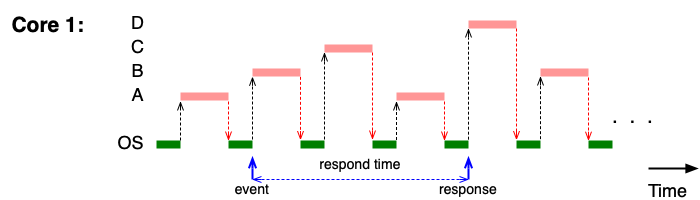

---

## Prioritní RR se statickou prioritou

**Prioritní RR se statickou prioritou** je rozšíření základního RR o prioritní fronty. Každému vláknu je při spuštění přiřazeno číslo priority (1 … N), které se **nikdy nemění**. Platí:

- Volné jádro CPU vždy dostane vlákno s nejvyšší prioritou, které stojí v čele příslušné fronty.
- Pro každou prioritní úroveň existuje vlastní FIFO fronta — uvnitř jedné priority platí RR.
- Časové kvantum může být pro různé priority různě velké.

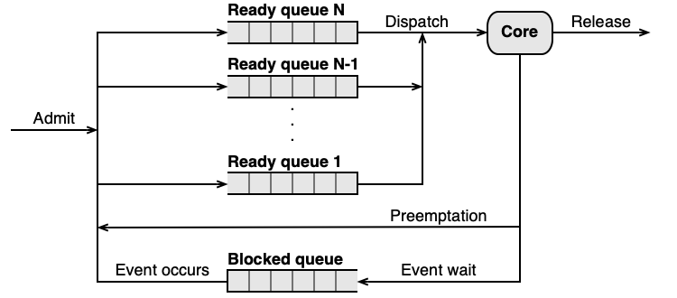

!!! warning "Hladovění při statické prioritě"
    Vlákna s nízkou prioritou mohou čekat na CPU velmi dlouho (potenciálně neomezeně), pokud jsou vždy přítomna vlákna s vyšší prioritou. Tento jev se nazývá **hladovění** (starvation).

!!! tip "U zkoušky"
    Výpočet doby ukončení vláken při prioritním RR se statickou prioritou je klíčová úloha. Postup:

    1. Seřaďte vlákna podle priority (sestupně).
    2. Vlákna s vyšší prioritou vždy předbíhají vlákna s nižší — vyšší priorita se zpracuje jako první, jedno nebo více jader.
    3. Vlákna se stejnou prioritou se střídají v RR.
    4. Vlákno s nižší prioritou začne dostávat CPU až když jsou všechna vlákna s vyšší prioritou dokončena.

!!! example "Příklad — 1 jádro CPU"
    Čtyři vlákna spuštěna ve stejný okamžik, kvantum = 100 ms, přepínání kontextu zanedbatelné:

    | Vlákno | Priorita | Požadovaný čas [min] |
    |---|---|---|
    | A | 99 | 6 |
    | B | 75 | 10 |
    | C | 75 | 4 |
    | D | 50 | 12 |

    Na **jednom jádře**: A (priorita 99) poběží jako první a skončí za 6 min. Pak B a C (oba priorita 75) se střídají v RR — C skončí za `6 + 4 = 10 min`, B za `6 + 10 = 16 min`. D (priorita 50) čeká na obě — skončí za `16 + 12 = 28 min`.

!!! example "Příklad — 2 jádra CPU"
    Na **dvou jádrech**: A (99) a B nebo C (75) mohou běžet paralelně. A skončí za 6 min. B a C se na druhém jádře střídají — C za 4 min, B za 10 min od startu. D pak dostane obě jádra: skončí za `10 + 6 = 16 min`.

### Fixní kvantum a počet přepnutí kontextu

Další nevýhoda statického RR: při fixním kvantu nezáleží na tom, kolik práce vlákno skutečně udělalo. CPU-bound vlákno, které potřebuje dobu 1000×T, bude přepnuto přesně **1000×** (dostane-li vždy celé kvantum). To může být pro výpočetně náročná vlákna zbytečná zátěž.

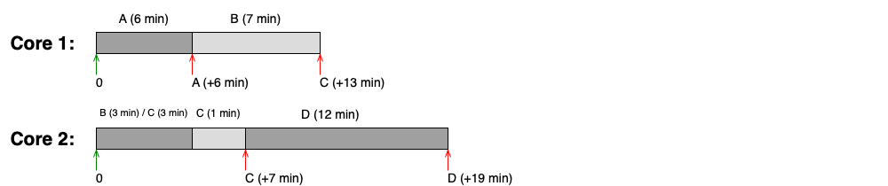

!!! info "Linux: SCHED_RR"
    Linux implementuje prioritní RR se statickou prioritou jako třídu `SCHED_RR`. Je určena pro systémy reálného času, využívá pevné kvantum (typicky 100 ms, viz `/proc/sys/kernel/sched_rr_timeslice_ms`) a vyžaduje pečlivou konfiguraci priorit — špatný návrh může vést k hladovění.

---

## Prioritní RR s dynamickou prioritou

Aby OS překonal nevýhody statické priority (hladovění, špatná odezva I/O-bound vláken, zbytečné přepínání CPU-bound vláken), zavádí **prioritní RR s dynamickou prioritou**. Priorita i velikost časového kvanta se mění za běhu vlákna.

Typická strategie:

- **Vlákno nevyužije celé kvantum** (např. zavolá blokující I/O operaci — jde o I/O-bound vlákno):
  → priorita se **zvýší** a kvantum se **sníží** (vlákno dostane CPU rychleji, ale kratší dobu).

- **Vlákno využije celé kvantum** (jde o CPU-bound vlákno):
  → priorita se **sníží** a kvantum se **zvýší** (vlákno dostane CPU méně často, ale na delší dobu).

- **Vlákno čeká příliš dlouho v Ready frontě** (hrozí hladovění):
  → priorita se **zvýší** bez ohledu na chování vlákna.

!!! note "Výchozí strategie moderních OS"
    Dynamická priorita je výchozím plánovacím mechanismem ve všech běžných operačních systémech (Linux, macOS, Windows). Konkrétní implementace se liší.

!!! tip "U zkoušky"
    Klíčový výpočet: kolik přepnutí kontextu proběhne, než CPU-bound vlákno doběhne, při zdvojování kvanta?

    Pracujeme exponenciálně: s každým přepnutím se kvantum zdvojuje. Příklad — vlákno potřebuje 100×T:
    `1 + 2 + 4 + 8 + 16 + 32 + 37 = 100` → **7 přepnutí kontextu** (poslední kvantum je zkrácené).

    Oproti fixnímu kvantu (100 přepnutí) je to dramatický pokles.

!!! example "Příklad: dynamická priorita s proměnným kvantem"
    Nastavení: startovní priorita P0, kvantum T. Pokud vlákno využije celé kvantum: priorita -1, kvantum ×2. Pokud ne: priorita +1, kvantum /2.

    CPU-bound vlákno vyžadující 100×T:

    | Běh | Kvantum | Spotřeba celkem |
    |---|---|---|
    | 1 | T | 1 |
    | 2 | 2T | 3 |
    | 3 | 4T | 7 |
    | 4 | 8T | 15 |
    | 5 | 16T | 31 |
    | 6 | 32T | 63 |
    | 7 | 37T (zbytek) | 100 |

    Celkem **7 přepnutí kontextu** místo 100 u fixního kvanta.

### Time Sharing (TS) třída v Solarisu

Solaris implementuje dynamickou prioritu pomocí třídy **TS (Time Sharing)**. Celý algoritmus je definován tabulkou, kterou lze zobrazit nebo upravit příkazem `dispadmin`. Tabulka má pro každou prioritní úroveň tyto sloupce:

| Sloupec | Význam |
|---|---|
| `PRIORITY LEVEL` | Hodnota priority |
| `ts_quantum` | Velikost časového kvanta pro danou prioritu |
| `ts_tqexp` | Nová priorita, pokud vlákno **vyčerpalo** celé kvantum |
| `ts_slpret` | Nová priorita, pokud vlákno **nevyčerpalo** kvantum (šlo spát) |
| `ts_maxwait` | Počet sekund čekání v Ready frontě, po nichž se priorita zvýší na `ts_lwait` (0 = po 1 s) |

---

## Completely Fair Scheduler (CFS)

**Completely Fair Scheduler** je moderní plánovač, který Linux používá jako výchozí strategii pro běžná vlákna. Místo prioritních FIFO front s pevnými hodnotami priority používá zcela jiný přístup: **červeno-černý strom** uspořádaný podle **virtuálního běhového času**.

### Virtuální běhový čas (vruntime)

Klíčovým pojmem CFS je **vruntime** (virtual runtime) — vážený čas, po který vlákno běželo na CPU. Jeho vlastnosti:

- Zohledňuje nejen skutečný čas, ale také **prioritu vlákna** (váhu).
- Roste **pomaleji** pro vlákna s vyšší prioritou → dostávají CPU proporcionálně víc.
- Roste **rychleji** pro vlákna s nižší prioritou → dostávají CPU méně.
- Při vytvoření vlákna/procesu se hodnota **dědí od rodiče**.
- Po probuzení z blokujícího volání se vruntime nastaví na **min_vruntime** (nejmenší aktuální vruntime neblokovaných vláken) → vlákno, které čekalo na I/O, dostane CPU brzy, ale ne příliš velké zvýhodnění.

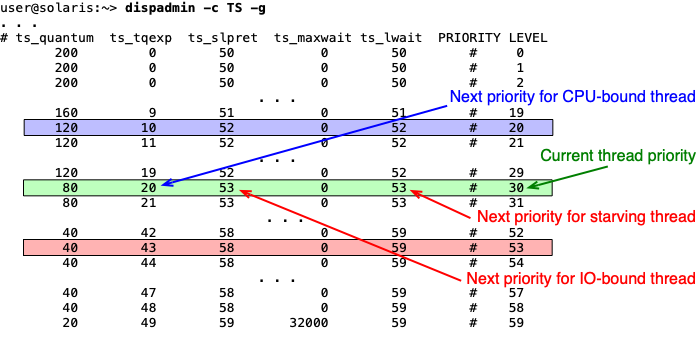

### Priorita v CFS a nice hodnota

Priorita vlákna v CFS **neslouží k určení pořadí ve frontě** jako u RR — jde o **váhu** při výpočtu vruntime. Priorita vlákna v CFS se nastavuje pomocí tzv. **nice hodnoty** (číslo v rozsahu -20 až 19):

- nice = 0 → váha = 1, vruntime roste stejnou rychlostí jako reálný čas.
- Záporná nice hodnota → vyšší váha → vruntime roste pomaleji → vlákno dostává proporcionálně víc CPU.
- Kladná nice hodnota → nižší váha → vruntime roste rychleji → vlákno dostává méně CPU.

### Mechanismus výběru vlákna

Při preempci (uplynutí kvanta nebo blokující volání) CFS:

1. Aktualizuje vruntime odloženého vlákna o čas strávený na CPU.
2. Zařadí ho zpět do červeno-černého stromu.
3. Vybere vlákno s **nejnižším vruntime** — to je vždy nejlevější uzel stromu.

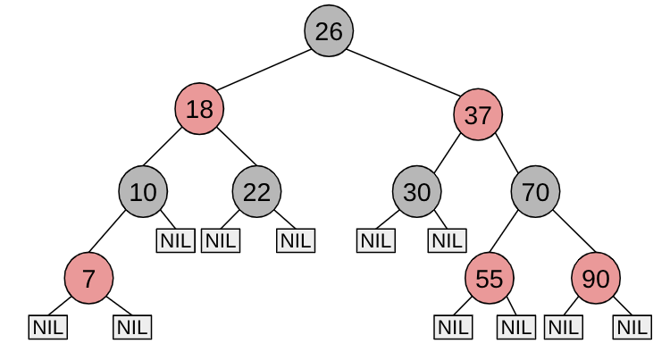

!!! info "CFS v Linuxu — datové struktury"
    ```c
    struct sched_entity {
        struct load_weight load;      /* váha (pro výpočet vruntime) */
        struct rb_node     run_node;  /* uzel v červeno-černém stromě */
        u64                vruntime;  /* virtuální běhový čas */
        u64                min_vruntime;
        /* ... */
    };

    struct cfs_rq {
        struct rb_root_cached tasks_timeline; /* červeno-černý strom */
        /* rb_leftmost = vlákno s nejmenším vruntime */
    };
    ```

!!! info "Linux — třídy využívající CFS"
    - `SCHED_OTHER` — výchozí strategie pro všechna běžná vlákna.
    - `SCHED_BATCH` — pro dlouhé výpočty bez potřeby rychlé odezvy.
    - `SCHED_IDLE` — pro vlákna, která mají běžet jen tehdy, je-li systém úplně nevytížen.

---

## Kooperativní plánování — FCFS

**First-Come-First-Served** (FCFS) je nejjednodušší forma kooperativního plánování:

- Vlákna čekají ve stavu Ready v jedné nebo více FIFO frontách.
- Když vlákno uvolní CPU (dokončení nebo blokující volání), dostane CPU první vlákno z fronty s nejvyšší prioritou.
- Vlákno, které bylo přerušeno vláknem s vyšší prioritou, se zařadí na **čelo** své fronty (FIFO princip je zachován uvnitř jedné priority).

**Vlastnosti:**

- Jednoduché na pochopení i implementaci.
- Minimalizuje počet přepnutí kontextu.
- Nevhodné pro I/O-bound vlákna — ta čekají zbytečně dlouho, až CPU-bound vlákno dokončí svůj běh.

!!! warning "FCFS není pro uživatelská vlákna"
    Jedno špatně napsané vlákno může zablokovat celý systém (nezavolá blokující funkci ani se dobrovolně nevzdá CPU). Proto je FCFS vhodné pouze pro prověřená kernel vlákna, kde je bezpečnost zaručena návrhem systému.

!!! example "Příklad: SYS třída v Solarisu"
    Solaris implementuje FCFS jako třídu **SYS** (systémová vlákna) se statickou prioritou. Tato třída je vyhrazena pro kernel — běžný uživatel do ní vlákno zařadit nemůže:
    ```text
    user@solaris:~> ps -eLo class,pri,pid,lwp,comm | grep " *SYS "
     SYS 96      0      1 sched
     SYS 98      2      1 pageout
     SYS 60      3      1 fsflush
     SYS 60      7      1 intrd
    ```
    Vlákno `fsflush` například pravidelně zapisuje změny z filesystémové cache na disk.

!!! info "Linux — SCHED_FIFO"
    Linux implementuje kooperativní plánování se statickou prioritou jako `SCHED_FIFO`. Vlákno v této třídě běží, dokud se samo nevzdá CPU nebo není přerušeno vláknem s **vyšší** prioritou. Pro vlákna stejné priority platí FCFS lokálně. Vhodné pro úlohy reálného času — vyžaduje velmi pečlivou konfiguraci priorit (hladovění je reálné riziko).

---

## Shrnutí

- Jádro OS udržuje pro každý proces strukturu **PCB** (identifikace, bezpečnost, alokované prostředky) a pro každé vlákno strukturu **TCB** (registry CPU, zásobník, plánovací informace).
- Vlákna lze implementovat v uživatelském prostoru (many-to-one), v jádru OS (one-to-one) nebo hybridně (many-to-many). Moderní OS používají výhradně one-to-one.
- **Plánování s odnímáním** přiděluje CPU na časové kvantum; po jeho uplynutí OS vlákno odebere. Vhodné pro interaktivní systémy.
- **Kooperativní plánování** nechá vlákno CPU, dokud ho samo neuvolní. Vhodné jen pro kernel vlákna.
- **Round-Robin (RR)** — jednoduchá spravedlivá strategie s odnímáním; větší kvantum = lepší efektivita ale horší odezva.
- **Prioritní RR se statickou prioritou** — vlákna s vyšší prioritou vždy předbíhají ostatní; nebezpečí hladovění.
- **Prioritní RR s dynamickou prioritou** — priorita a kvantum se mění podle chování vlákna; I/O-bound vlákna dostávají vyšší prioritu, CPU-bound dostávají větší kvantum. Řeší hladovění a snižuje počet přepnutí.
- **CFS** (Completely Fair Scheduler) — Linux výchozí plánovač; používá červeno-černý strom uspořádaný podle vruntime; vlákna s vyšší prioritou (nižší nice) mají pomalejší růst vruntime.
- **FCFS** — kooperativní FIFO plánování; minimalizuje přepínání, nevhodné pro uživatelská vlákna.
- Maximální počet procesů/vláken lze v unixových systémech zjistit/nastavit přes `/proc/sys/kernel/threads-max` a `ulimit`.

---

## Klíčové pojmy

- **PCB (Process Control Block)** — datová struktura v jádru OS uchovávající veškeré informace o jednom procesu (PID, PPID, přidělená paměť, soubory, bezpečnostní identita).
- **TCB (Thread Control Block)** — datová struktura uchovávající informace o jednom vláknu potřebné k přepínání kontextu a plánování (TID, registry CPU, zásobník, priorita, stav).
- **Tabulka procesů** — zřetězený seznam PCB struktur, který jádro OS udržuje pro všechny aktivní procesy.
- **fork-bomba** — útok, při kterém proces rekurzivně vytváří nové procesy, dokud nevyčerpá systémový limit; proti ní chrání `ulimit`.
- **Model many-to-one** — více uživatelských vláken namapováno na jedno kernel vlákno; blokující volání zablokuje celý proces.
- **Model one-to-one** — každé uživatelské vlákno odpovídá jednomu kernel vláknu; umožňuje paralelismus na více jádrech.
- **Model many-to-many** — m uživatelských vláken namapováno na n kernel vláken; hybridní přístup.
- **Plánování s odnímáním (preemptive scheduling)** — OS odebere CPU vláknu po uplynutí časového kvanta.
- **Kooperativní plánování (cooperative scheduling)** — vlákno CPU uvolní samo; OS ho nepřeruší násilně.
- **Časové kvantum (time slice)** — maximální doba, po kterou vlákno může nepřerušeně běžet na CPU; typicky 10–50 ms.
- **CPU-bound vlákno** — vlákno intenzivně využívající CPU, málo blokujících operací.
- **I/O-bound vlákno** — vlákno krátce využívající CPU, pak čeká na V/V operace.
- **Vlákno reálného času (Realtime thread)** — vlákno, které musí zareagovat na událost v garantovaném čase.
- **Round-Robin (RR)** — preemptivní strategie s jednou FIFO frontou; všechna vlákna dostávají stejné kvantum.
- **Prioritní RR se statickou prioritou** — každé vlákno má pevnou prioritu; CPU vždy dostane vlákno z nejvyšší obsazené fronty.
- **Hladovění (starvation)** — stav, kdy vlákno s nízkou prioritou nedostává CPU po neomezeně dlouhou dobu, protože jsou neustále přítomna vlákna s vyšší prioritou.
- **Prioritní RR s dynamickou prioritou** — priorita a velikost kvanta se mění podle chování vlákna; I/O-bound vlákna získávají vyšší prioritu, CPU-bound vlákna větší kvantum.
- **FCFS (First-Come-First-Served)** — kooperativní strategie; vlákno běží, dokud samo neuvolní CPU; FIFO fronta.
- **Turnaround time (doba zpracování)** — čas od spuštění úlohy do jejího dokončení; kritická metrika pro dávkové úlohy.
- **Response time (doba odezvy)** — čas od zadání požadavku do první reakce systému; kritická metrika pro interaktivní aplikace.
- **Efektivita CPU** — podíl doby, kdy CPU vykonává užitečnou práci; `tq / (tcs + tq)` pro RR.
- **CFS (Completely Fair Scheduler)** — výchozí plánovač Linuxu pro běžná vlákna; zajišťuje proporcionální přidělování CPU pomocí vruntime a červeno-černého stromu.
- **vruntime (virtual runtime)** — vážený běhový čas vlákna v CFS; roste pomaleji pro vlákna s vyšší váhou (nižší nice); vlákno s nejnižším vruntime dostane CPU jako další.
- **nice hodnota** — číslo -20 až 19 nastavující váhu vlákna v CFS; záporná hodnota = vyšší váha = více CPU; kladná = nižší váha = méně CPU.
- **min_vruntime** — nejmenší vruntime z aktuálně neblokovaných vláken; při probuzení z blokujícího volání se vruntime vlákna nastaví na tuto hodnotu.
- **Červeno-černý strom** — vyvážená datová struktura, do které CFS ukládá vlákna setříděná podle vruntime; operace vložení/odebrání v O(log n).
- **SCHED_OTHER** — výchozí třída plánování Linuxu pro běžná vlákna (používá CFS).
- **SCHED_BATCH** — třída Linuxu pro výpočetně náročné dávkové úlohy (CFS, snížená odezva).
- **SCHED_IDLE** — třída Linuxu pro vlákna běžící pouze při nulové zátěži systému.
- **SCHED_RR** — třída Linuxu pro real-time vlákna s preemptivním prioritním RR; statická priorita, pevné kvantum (100 ms).
- **SCHED_FIFO** — třída Linuxu pro real-time vlákna s kooperativním FCFS; vlákno běží bez přerušení, dokud se samo nevzdá nebo nepřijde vlákno s vyšší prioritou.
- **TS (Time Sharing) třída v Solarisu** — preemptivní plánování s dynamickou prioritou a proměnným kvantem; parametry definovány tabulkou příkazu `dispadmin`.
- **SYS třída v Solarisu** — kooperativní plánování se statickou prioritou; vyhrazeno pro kernel vlákna, přiřazuje pouze jádro OS.
- **LWP (Lightweight Process)** — v Solarisu mapování mezi user-level threads a kernel threads; od Solarisu 8 je podporován pouze model one-to-one.
- **Zóna (Solaris)** — virtuální instance OS, která využívá pouze prostředky přidělené dané zóně; obdoba kontejnerů.
- **Job (Windows)** — množina procesů sdílejících kvóty a limity (CPU, paměť, počet procesů).
- **Fiber (Windows)** — vlákno spravované výhradně v uživatelském prostoru (analogie user-level thread).
- **ulimit** — unixový příkaz pro nastavení limitů procesů/vláken na úrovni uživatele (např. `ulimit -u 100` omezí počet procesů).
- **`/proc` (Linux)** — pseudo-souborový systém existující pouze v paměti; umožňuje číst a nastavovat parametry jádra a informace o procesech.
