# Správa paměti

Tato kapitola spojuje tři přednášky věnované správě paměti v operačních systémech. Začínáme od fyzické organizace paměti a hierarchie cache, pokračujeme přes proces přeložení a sestavení programu až po logickou organizaci virtuálního adresního prostoru. Poté se věnujeme virtuální paměti se stránkováním, překladu adres pomocí MMU a TLB, a kapitolu uzavírají algoritmy pro náhradu stránek, které jsou klíčovým tématem u zkoušky.

---

??? abstract "Obsah stránky"

    [TOC]

## Fyzická organizace paměti

**Hlavní paměť** (main memory) je fyzická paměť instalovaná v počítači. Realizuje se technologií **DRAM** (Dynamic Random-Access Memory), která ke skladování bitů využívá kondenzátory. Paměťové moduly (DDR4, DDR5) se osazují přímo na základní desku. Nejmenší adresovatelnou jednotkou je byte — každý byte má svou vlastní fyzickou adresu. Procesor k paměti přistupuje instrukcemi load/store (na x86-64 je to instrukce `mov`, na RISC-V `lw` a `sw`).

Hlavní paměť je primárním úložištěm pro běžící procesy, operační systém a aktivně zpracovávaná data.

### Hierarchická organizace paměti

Výkon moderních procesorů narostl natolik, že přímý přístup do hlavní paměti (latence ~50 ns) by CPU zbytečně zdržoval. Proto má fyzická paměť **hierarchickou organizaci** — mezi CPU a hlavní pamětí leží několik úrovní **skrytých pamětí** (cache), které minimalizují průměrný čas přístupu.

| Typ paměti       | Velikost          | Čas přístupu | Kdo spravuje         |
|-----------------|-------------------|-------------|----------------------|
| Registry CPU     | 1–2 KB            | < 1 ns      | Překladač/programátor |
| L1 cache         | 32–128 KB         | ~1 ns       | HW                   |
| L2 cache         | 256 KB – 2 MB     | ~5 ns       | HW                   |
| L3 cache         | 4–64 MB           | ~10 ns      | HW                   |
| Hlavní paměť     | 4 GB – 16 TB      | ~50 ns      | OS                   |
| SSD              | 250 GB – 4 TB     | ~0,1 ms     | OS/procesy           |
| HDD              | 1 TB – 16 TB      | ~10 ms      | OS/procesy           |
| Flash paměť      | 4 GB – 4 TB       | ~100 ms     | OS/procesy           |
| Páska            | 500 GB – 16 TB    | > 1 s       | OS/procesy           |

### Skrytá paměť (cache)

Skrytá paměť leží na cestě mezi CPU a hlavní pamětí a ukládá nedávno používaná data a instrukce. Instrukce load/store přitom neví, zda čtou z cache nebo přímo z hlavní paměti — toto rozhodnutí dělá hardware transparentně.

Cache funguje na základě dvou principů:

- **Časová lokalita** (temporal locality): data, ke kterým bylo přistupováno nedávno, budou s vysokou pravděpodobností potřeba i v blízké budoucnosti.
- **Prostorová lokalita** (spatial locality): data v blízkosti aktuálně používaných dat budou brzy potřeba — cache proto při miss načítá nejen požadovaný byte, ale celou cache line (blok okolních dat).

#### Výkonnostní parametry cache

Pro popis výkonu cache se používají tyto veličiny:

- **cache hit** (`n_h`): počet přístupů, kdy data v cache byla
- **cache miss** (`n_m`): počet přístupů, kdy data v cache chyběla
- **hit ratio**: `r_h = n_h / (n_h + n_m)`
- **průměrný čas přístupu**: `t_avg = r_h * t_h + (1 - r_h) * t_m`

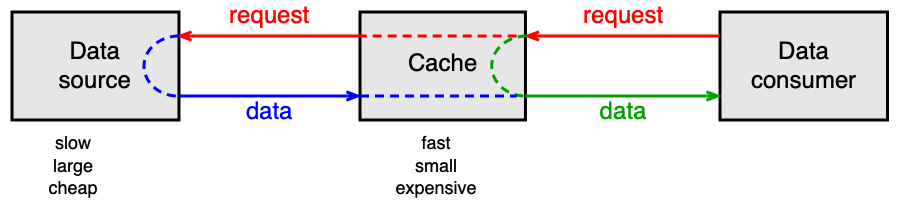

!!! example "Příklad výpočtu průměrné doby přístupu"
    Uvažujme L1 cache s `t_h = 1 ns` a hlavní paměť s `t_m = 50 ns`:

    | Hit ratio `r_h` | Průměrný čas `t_avg` |
    |----------------|----------------------|
    | 1,00            | 1 ns                 |
    | 0,91            | 5,41 ns              |
    | 0,81            | 10,31 ns             |
    | 0,00            | 50 ns                |

    Vidíme, že i malý pokles hit ratio dramaticky prodlužuje průměrný čas přístupu. Hit ratio 0,91 (91 %) znamená `t_avg` více než 5× delší než při plném hitu.

!!! info "Monitorování cache na CPU"
    Moderní procesory nabízejí hardwarové čítače pro sledování počtu cache referencí a cache missů (např. na Solarisu příkaz `cpustat -c EC_ref,EC_misses`). Tyto informace lze využít k optimalizaci přístupu k datům v aplikaci.

---

## Základní pojmy: překlad, sestavení a linkování

Než se program ocitne v paměti, prochází řetězcem zpracování. Znalost těchto kroků je nezbytná pro pochopení toho, jak vznikají virtuální adresy a jak se program zavede do paměti.

### Předzpracování a kompilace

**Preprocesor** zpracuje direktivy jako `#include` a makra (`#define`, `#ifdef`). Výsledkem je předzpracovaný zdrojový soubor. **Kompilátor** jej přeloží do assembly kódu (textový soubor s instrukcemi), ve kterém mohou zůstat nevyřešené symboly odkazující na funkce nebo data definovaná v jiném souboru.

```text
gcc -E main.c -o main.i    # jen preprocesor
gcc -O2 -S main.i -o main.s  # přeložení do assembly
```

### Sestavování — Assembling

**Assembler** převede assembly kód do **objektového souboru** (`.o`), který je již v binárním formátu. Objektový soubor ale stále obsahuje **nevyřešené symboly** (external symbols) — adresy funkcí a dat, která jsou definována jinde. Každá sekce objektového souboru začíná od adresy 0. Obsah lze prohlédnout příkazem `objdump -d main.o`, tabulku symbolů pak `objdump -t main.o`.

```text
as main.s -o main.o         # nebo: nasm -f elf64 main.asm -o main.o
```

### Linkování — Linking

**Linker** sloučí jeden nebo více objektových modulů do jednoho **spustitelného modulu** (load module). Symbolické adresy musí být nahrazeny adresami v rámci spustitelného modulu a vyřeší se (zatím možné) nevyřešené symboly.

Rozlišujeme:

**1. Statické linkování** (static linking): linker vytvoří jeden samostatný spustitelný soubor, který obsahuje vše potřebné. Program se spouští bez závislostí na externích knihovnách — ty jsou přímo součástí spustitelného souboru.

**2. Dynamické linkování** (dynamic linking): spustitelný soubor obsahuje pouze odkazy na dynamické knihovny (`.so` v Linuxu, `.dll` ve Windows). Procesy sdílejí jednu instanci každé knihovny v paměti, což šetří místo. Rozlišují se dvě varianty:
  - **Load-time dynamic linking**: symboly z dynamických knihoven se vyřeší při zavádění programu do paměti.
  - **Run-time dynamic linking**: symboly se vyřeší až při prvním volání (lazy binding — výchozí v Linuxu). Programátor může explicitně volat `dlopen()` (Unix) nebo `LoadLibraryA()` (Windows).

!!! info "Formáty souborů"
    Formát objektových i spustitelných modulů závisí na OS. V Linuxu se používá formát **ELF** (Executable and Linkable Format), ve Windows **PE/PE32+** (Portable Executable).

---

## Logická organizace paměti

### Virtuální adresní prostor (VAS)

**Virtuální adresní prostor** (VAS — Virtual Address Space) je klíčovou abstrakcí správy paměti. Každý proces dostane svůj vlastní VAS, a tak pracuje s virtuálními adresami, jako by měl celou paměť jen pro sebe. Instrukce load/store generují virtuální adresy, které jsou HW a OS automaticky překládány na fyzické.

Výhody VAS:
- **Ochrana paměti**: proces nemůže číst ani modifikovat data jiného procesu; pád jednoho procesu neovlivní ostatní.
- **Jednodušší zavádění**: program lze zavést do libovolné volné oblasti fyzické paměti bez přepočítávání adres.

Nevýhody VAS:
- Překlad adres vyžaduje hardwarovou i softwarovou podporu — zvyšuje složitost.
- Překlad adres přináší drobné časové zpoždění.

### Segmenty virtuálního adresního prostoru

VAS procesu typicky obsahuje tyto segmenty:

- **`.text`** — programový kód (instrukce)
- **`.data`** — inicializované globální proměnné
- **`.bss`** — neinicializované globální proměnné (vyplněno nulami)
- **Heap** (halda) — dynamicky alokovaná paměť (roste od nižších adres nahoru)
- **Libraries** — namapované dynamické knihovny
- **Stack** (zásobník) — lokální proměnné a rámce volání funkcí (roste od vyšších adres dolů)

Heap i Stack mění svou velikost za běhu programu — OS musí ponechat prostor pro jejich růst.

---

## Zavedení programu do paměti — Loading

Existuje pět historicky se vyvíjejících způsobů zavedení programu:

### 1. Absolutní zavedení (absolute loading)

Každá adresa v binárním programu je **absolutní fyzická adresa** — program musí být vždy zaveden od té samé adresy. Linker vypočítá fyzické adresy již při sestavení. Tento model používaly první počítače; dnes se uplatňuje v zabudovaných systémech bez OS (firmware v ROM/flash).

### 2. Přemístitelné zavedení s relokační tabulkou

Program obsahuje **relativní adresy** (vztažené k začátku programu). Loader přepočítá adresy na fyzické podle toho, kam program umístí v paměti. Informace o paměťových odkazech je uložena v **relokačním slovníku** (relocation dictionary). Tento model byl běžný v 50.–60. letech.

### 3. Přemístitelné zavedení s bázovým registrem

Program opět obsahuje relativní adresy, ale loader je nepřepočítává — program se zavede s relativními adresami a HW je překládá za běhu. K tomu slouží dvojice registrů:
- **Base register**: fyzická adresa začátku oblasti procesu v paměti
- **Limit register**: velikost oblasti (zároveň zajišťuje ochranu — přístup za limit vede k výjimce)

Tento model byl běžný v 60.–70. letech.

### 4. Dynamické zavedení za běhu se stránkováním

Program pracuje s **virtuálními adresami**. Program je rozdělen na stejně velké **stránky** (pages), které se zavádí do paměti až v okamžiku potřeby. Překlad virtuálních adres na fyzické provádí HW (MMU) ve spolupráci s OS prostřednictvím stránkovacích tabulek. Tento model se používá od 70. let a je základem moderních OS.

### 5. Dynamické zavedení se stránkováním a dynamickými knihovnami

Platí vše jako v předchozím případě, navíc se přidává podpora dynamických sdílených knihoven. Spustitelný soubor obsahuje záznamy o potřebných externích knihovnách. Dynamický linker (loader) tyto knihovny při startu procesu namapuje do VAS. Tento model používají moderní OS od konce 80. let.

---

## Zavedení programu v praxi: ELF a execve()

### Struktura ELF souboru

Spustitelný soubor ve formátu ELF obsahuje:
- **Programový kód** (instrukce)
- **Inicializovaná data** (např. `int a = 5;`, řetězcové literály)
- **Metadata** nutná pro sestavení VAS a zavedení do paměti (jaký dynamický linker použít, jaké knihovny vyžadovat)

Segmenty v ELF souboru (zobrazitelné příkazem `readelf -a -W prog.elf`):

```text
Type  Offset    VirtAddr      FileSiz  Flg
LOAD  0x000000  0x0400000     0x0000e8  R     # ELF hlavička
LOAD  0x001000  0x0401000     0x00002f  R E   # .text (kód)
LOAD  0x002000  0x0402000     0x000004  RW    # .data
```

### Průběh systémového volání execve()

Nový proces vzniká jako kopie původního pomocí `fork()`. Poté se zavolá `execve()`, která:

1. Otevře ELF soubor a přečte metadata.
2. Odstraní starý VAS procesu.
3. Vytvoří nový VAS:
   - Zavede segmenty LOAD podle ELF hlavičky (`.text`, `.data`).
   - Namapuje zásobník (stack) na vysoké virtuální adresy (obvykle 8 MB).
   - Pokud je zapnuto **ASLR** (Address Space Layout Randomization), adresy se náhodně posunou pro zvýšení bezpečnosti.
4. Nastaví registry CPU (zejména čítač instrukcí PC na Entry Point z ELF).
5. Vrátí se instrukcí `iretq` ze systémového volání a spustí proces.

### Virtual Memory Areas (VMA) v Linuxu

Linux spravuje VAS pomocí struktur **Virtual Memory Areas** (`struct vm_area_struct`). Každá VMA je souvislý blok virtuální paměti s daným účelem (`.text`, heap, zásobník, mapovaná knihovna). Každá platná virtuální adresa patří do nějaké VMA.

- **File-backed VMA**: svázána se souborem (`.text` z ELF, dynamická knihovna).
- **Anonymní VMA**: není svázána se souborem — halda, zásobník, `.bss`. Inicializuje se nulami (**demand-zero page**).

```c
struct vm_area_struct {
    struct mm_struct  *vm_mm;      // patří do tohoto adresního prostoru
    unsigned long      vm_start;   // začátek VMA
    unsigned long      vm_end;     // konec VMA (první byte za ní)
    unsigned long      vm_flags;   // R, W, X, Shared, Grow down/up...
    struct file       *vm_file;    // soubor (NULL = anonymní VMA)
    unsigned long      vm_pgoff;   // offset v souboru
    struct vm_area_struct *vm_next; // spojový seznam VMA procesu
    ...
};
```

Struktura `mm_struct` (memory descriptor) patří k deskriptoru procesu `task_struct` a udržuje ukazatel `pgd` na stránkovací tabulku procesu.

---

## Správa volné fyzické paměti: dynamické oblasti

Jeden ze starších způsobů mapování VAS do fyzické paměti je alokace jedné **souvislé oblasti** (partition) pro celý VAS procesu. Tento přístup se nazývá **dynamické oddíly** (dynamic partitioning) a používal se v mainframech 60.–70. let.

K překladu adres slouží dvojice **base** a **limit** registrů. Nevýhodou je požadavek na souvislost — po čase se fyzická paměť **fragmentuje** (mnoho malých volných oblastí, do nichž se nový proces nevejde).

### Správa volné paměti

OS musí udržovat přehled o volných oblastech hlavní paměti. K dispozici jsou dvě základní datové struktury:

#### Bitová mapa

Hlavní paměť je rozdělena na alokační jednotky stejné velikosti. Každá jednotka je reprezentována jedním bitem (0 = volná, 1 = obsazená). Alokace vyžaduje nalezení dostatečně dlouhé sekvence nul — **pomalé**. Uvolňování je naopak rychlé.

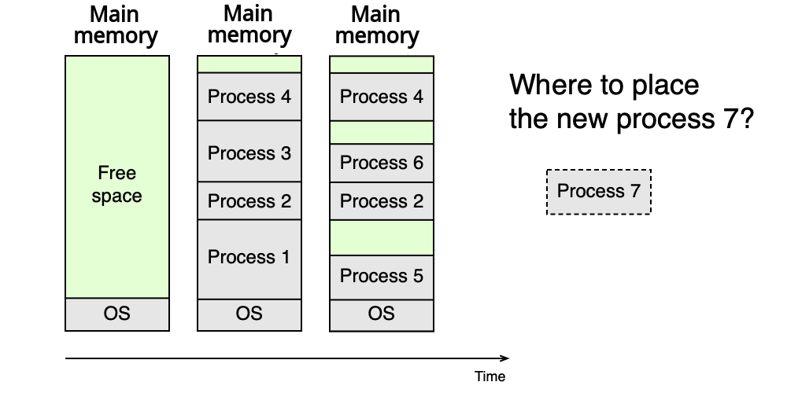

#### Zřetězené seznamy

Volné oblasti jsou uchovávány v N zřetězených seznamech `L_i`, kde každý seznam `L_i` spravuje oblasti o určitém rozsahu velikostí `(S_{i-1}, S_i]`. Alokace: vezme se první oblast z příslušného seznamu (a zbytek se vrátí zpět do vhodného seznamu) — **rychlé**. Uvolňování vyžaduje kontrolu a případné slučování sousedních volných oblastí — **pomalé**.

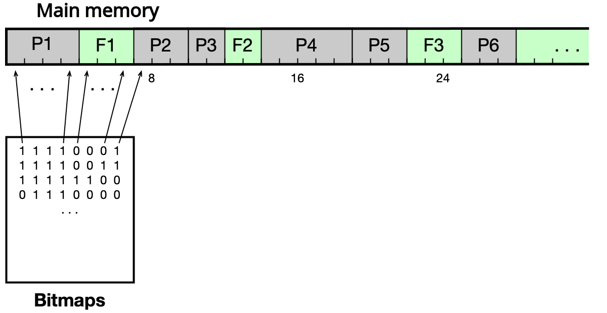

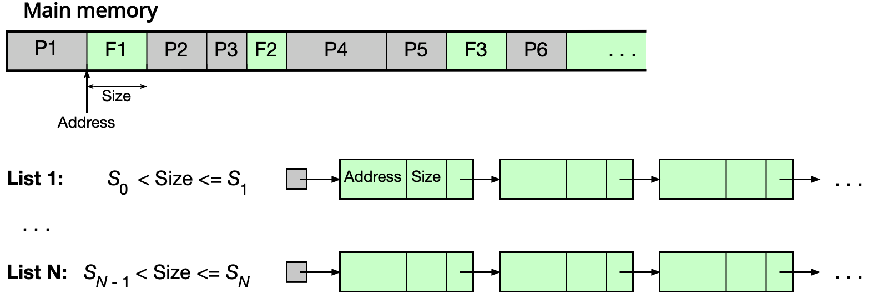

#### Buddy alokátor

Speciální varianta zřetězených seznamů, ve které všechny volné oblasti mají velikost mocniny dvou. To umožňuje **rychlé slučování** uvolněných oblastí.

**Alokace**: Pokud na počátku je celá paměť volná s velikostí `2^U` a proces požaduje `s` bajtů:
- Pokud `2^(U-1) < s ≤ 2^U`, přidělí se celá oblast `2^U`.
- Jinak se oblast rekurzivně dělí na poloviny, dokud se nenajde nejmenší `2^i` splňující `2^(i-1) < s ≤ 2^i`.

**Uvolňování**: Opačný postup — rekurzivně slučujeme „buddies" (odpovídající poloviny) dokud to jde.

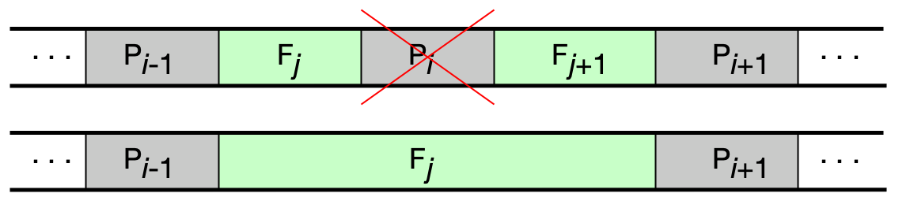

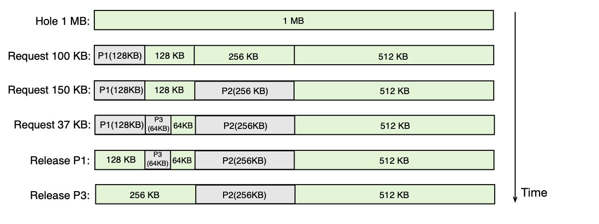

!!! example "Příklad buddy alokátoru"
    Paměť 1 MB, procesy P1 (min 100 KB), P2 (min 150 KB), P3 (min 37 KB):

    - P1 dostane 128 KB (nejmenší mocnina ≥ 100 KB)
    - P2 dostane 256 KB (nejmenší mocnina ≥ 150 KB)
    - P3 dostane 64 KB (nejmenší mocnina ≥ 37 KB)
    - Po ukončení P1 a P3 se jejich oblasti sloučí zpět (pokud jsou sousední buddies).

### Problémy dynamických oblastí a řešení

**Fragmentace**: po delším provozu je fyzická paměť rozdrobena na malé volné ostrůvky, do nichž se nový proces nevejde.

**Řešení 1 — Swapping (odkládání procesů)**: při nedostatku paměti se celý proces přesune na disk. Celý VAS musí být uložen najednou — **pomalé**.

**Řešení 2 — Stránkování**: elegantně řeší fragmentaci, umožňuje odkládat pouze části procesu a bezproblémové zvětšování VAS. Tématu stránkování se věnuje celá následující část.

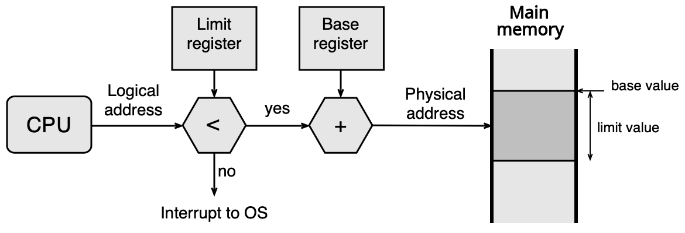

---

## Virtuální paměť a stránkování

Stránkování je dnes standardní mechanismus správy paměti ve všech moderních OS. Řeší zároveň problém fragmentace fyzické paměti i problém nedostatku paměti (odkládáním nepoužívaných stránek na disk).

### Princip stránkování

**VAS procesu** je rozdělen na stejně velké oblasti zvané **stránky** (pages). Fyzická paměť je analogicky rozdělena na stejně velké oblasti zvané **rámce** (frames). Velikost stránky/rámce závisí na architektuře CPU — typicky **4 KB** (Intel x86/x86-64), 8 KB (SPARC).

V hlavní paměti musí být přítomny pouze stránky aktuálně používané. Zbytek VAS může být na disku.

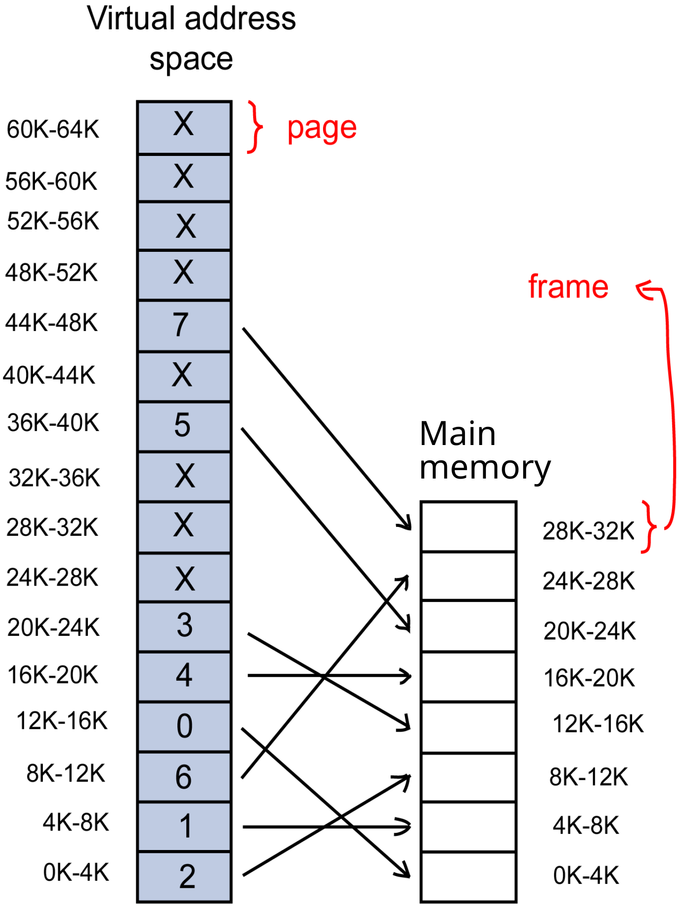

### Struktura virtuální a fyzické adresy

Virtuální adresa se skládá ze dvou částí:
- **Číslo stránky** (page number) — identifikuje stránku ve VAS
- **Offset** — pozice uvnitř stránky/rámce

```text
Virtuální adresa: [ číslo stránky | offset ]
Fyzická adresa:   [ číslo rámce   | offset ]

offset = log2(velikost_stránky)
```

Pro stránky o velikosti 4 KB = `2^12` B potřebuje offset 12 bitů. Na 32-bitovém systému zbývá 20 bitů pro číslo stránky, tedy `2^20` = 1 048 576 stránek v VAS.

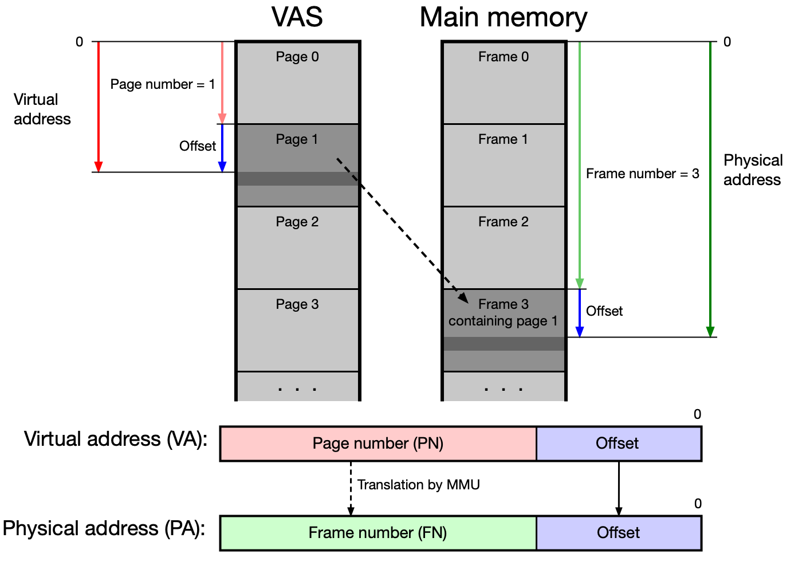

### Memory Management Unit (MMU)

Proces má iluzi, že celý jeho VAS je přítomen v hlavní paměti. Tuto iluzi a překlad adres zajišťuje hardware **Memory Management Unit (MMU)** ve spolupráci s OS.

**Výpadek stránky** (page fault): pokud MMU zjistí, že požadovaná stránka není v hlavní paměti (bit P = 0 v stránkovací tabulce), vyvolá přerušení. OS přebere řízení, najde volný rámec (nebo vybere oběť a odloží ji na disk), načte požadovanou stránku a aktualizuje stránkovací tabulku. Poté vrátí řízení procesu, který instrukci zopakuje.

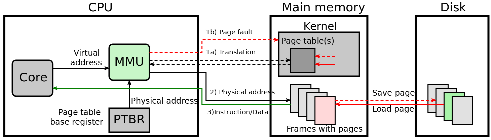

---

## Překlad virtuálních adres na fyzické — stránkovací tabulky

OS udržuje **stránkovací tabulky** (ST, anglicky Page Tables, PT), které mapují čísla stránek na čísla rámců. Existují tři základní typy.

### Jednoúrovňová stránkovací tabulka

Tabulka obsahuje pro každou stránku VAS jednu řádku (**Page Table Entry, PTE**) s těmito informacemi:

- **číslo rámce** — kam je stránka namapována v hlavní paměti
- **Present bit (P)** — zda je stránka aktuálně v hlavní paměti
- **Accessed bit (A) / Reference bit (R)** — zda se ke stránce přistupovalo
- **Dirty bit (D)** — zda byl obsah stránky modifikován (zápis)
- **Cache disable/enable (C)** — zda lze pro tuto stránku použít cache (u periferií mapovaných do paměti musí být cache zakázána)
- **Read/Write (W)** — zda lze stránku modifikovat
- **Executable (X)** — zda stránka obsahuje spustitelný kód
- **User/Supervisor (U)** — zda je stránka přístupná v uživatelském módu

**Číslo stránky** (page number) slouží jako index do tabulky. OS udržuje jednu ST pro každý proces. Adresa aktuálně aktivní ST je uložena v registru **PTBR** (Page Table Base Register), v Linuxu je to registr CR3 na x86-64.

#### Překlad adresy s jednoúrovňovou ST

```text
1. Vezmi virtuální adresu.
2. Rozlož ji na: číslo stránky (page#) | offset.
3. Pomocí page# indexuj do ST procesu → získáš číslo rámce (frame#).
4. Zkontroluj bit P (present) — pokud 0, nastane page fault.
5. Fyzická adresa = frame# | offset (offset se zachovává).
```

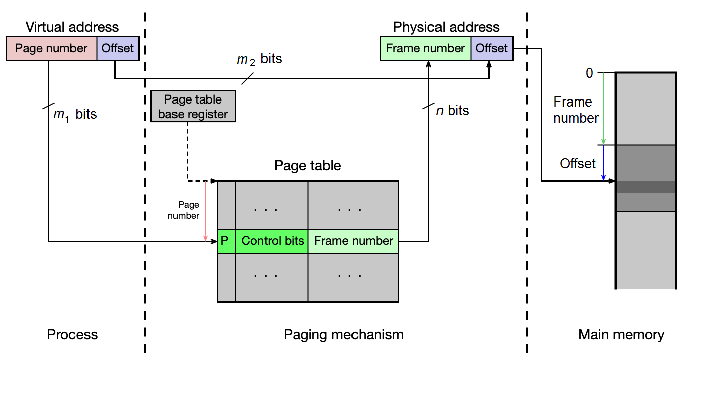

!!! example "Příklad jednoúrovňové ST (16-bit CPU, 512 B stránky)"
    Hypotetický 16-bitový CPU, 512 B stránky/rámce, 1 MB fyzická paměť (20-bit fyzická adresa). Virtuální adresa: 7 bitů číslo stránky + 9 bitů offset = 128 stránek ve VAS. ST má 128 řádků à 4 B = 512 B (vejde se do 1 rámce).

    Proces A (.text na stránkách 1–2, .data na stránce 3, glibc na stránce 32, stack na stránce 63):
    - ST je uložena v rámci 40 (PTBR = 40)
    - Stack je v rámci 41
    - .text1 je v rámci 42 atd.

    Při prvním pokusu o vykonání instrukce nastane page fault — OS načte stránku do volného rámce a aktualizuje ST.

#### Problém jednoúrovňové ST

Na 32-bitovém systému se 4 KB stránkami:
- ST má `2^20` = 1 048 576 řádek
- Každá řádka zabírá 4 B
- Jedna ST = **4 MB**
- Pro 128 procesů = **512 MB** pouze pro stránkovací tabulky!

Přestože proces reálně používá jen zlomek VAS, ST musí mít řádku pro každou stránku — plýtvání pamětí.

### Víceúrovňová stránkovací tabulka

**Víceúrovňová ST** řeší problém plýtvání pamětí tím, že tabulku hierarchicky rozdělí. Pro n-úrovňovou ST platí:

- Virtuální adresa se skládá z n indexů (pro jednotlivé úrovně) a offsetu.
- V paměti musí být vždy jen tabulka **nejvyšší úrovně** (top level).
- Tabulky nižších úrovní existují v paměti jen pro oblasti VAS, které proces skutečně používá — **šetří paměť**.
- Cena: překlad je pomalejší (nutno projít více tabulek). Proto se používá TLB.

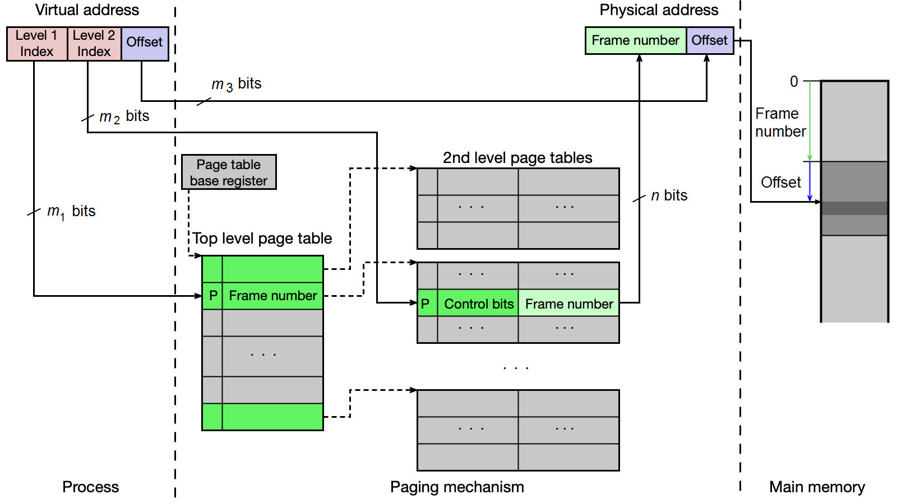

!!! tip "U zkoušky"
    Velmi časté příklady počítání velikosti stránkovacích tabulek. Pro dvouúrovňovou ST na 32-bit CPU (4 KB stránky, indexy po 10 bitech):
    - Top-level tabulka: vždy 1 × `2^10` × 4 B = 4 KB
    - Tabulky 2. úrovně: pouze pro oblasti VAS, které proces používá (každá 4 KB)
    - Pro proces s .text+.data (4 MB), heap (4 MB), stack (4 MB): 3 tabulky 2. úrovně
    - Celkem pro 128 procesů: 128 × (1+3) × 4 KB = **2 MB** (vs. 512 MB u jednoúrovňové)

#### Příklady reálných víceúrovňových ST

- **x86 (32-bit)**: 2-úrovňová ST (Page Directory + Page Table)
- **x86-64**: 4-úrovňová ST (PML4 → PDPT → PD → PT), každý index 9 bitů + 12 bitů offset = 48-bit virtuální adresa

### Invertovaná stránkovací tabulka

**Invertovaná ST** přistupuje k problému opačně: místo jednoho záznamu na stránku VAS má jeden záznam na **fyzický rámec**. Tabulka obsahuje pro každý rámec:

- číslo stránky, která je v rámci uložena
- číslo procesu, jemuž stránka patří
- řídicí bity (P, R, D, přístupová práva...)
- index zřetězení (chain) pro řešení kolizí

OS udržuje **jednu tabulku pro celý systém** — výrazná úspora paměti při mnoha procesech. Nevýhodou je pomalejší překlad: číslo stránky se pomocí hašovací funkce přepočte na index do tabulky, ale mohou nastat kolize (více stránek se mapuje na stejný řádek) — řeší se zřetězením.

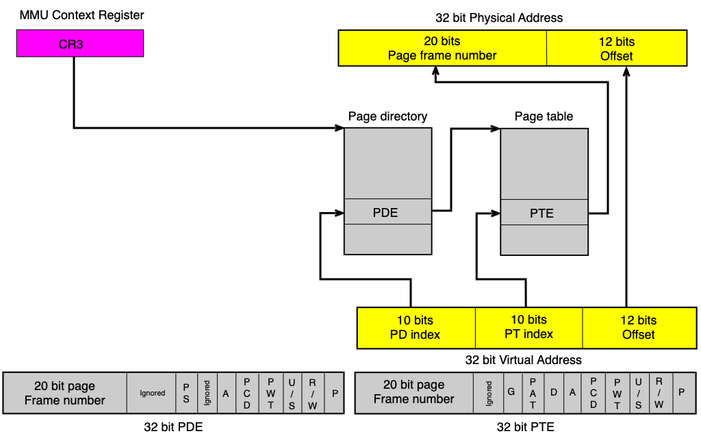

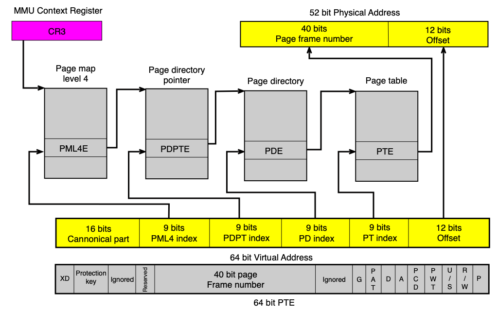

!!! info "Kde se invertovaná ST používala"
    Invertovanou ST používaly procesory PowerPC a UltraSPARC (kde se označovala TSB — Translation Storage Buffer). Kvůli pomalému hledání se i zde intenzivně využívá TLB.

!!! example "Porovnání velikostí stránkovacích tabulek"
    32-bit CPU, 4 KB stránky/rámce, 1 GB fyzická paměť, 128 procesů:

    | Typ ST           | Velikost                   |
    |-----------------|----------------------------|
    | Jednoúrovňová   | 128 × 4 MB = **512 MB**    |
    | Dvouúrovňová    | 128 × 16 KB ≈ **2 MB**     |
    | Invertovaná     | 1 × 8 MB = **8 MB**        |

### Translation Lookaside Buffer (TLB)

Každý překlad adresy by vyžadoval jeden nebo více přístupů do ST v hlavní paměti. To by překlad výrazně zpomalovalo. Proto se v CPU používá **TLB** — malá, extrémně rychlá cache přeložených adres.

TLB je implementován jako **n-cestná asociativní cache** a obsahuje záznamy o naposledy překládaných stránkách:

- **valid bit** — zda je záznam platný
- **číslo stránky** — klíč
- **číslo rámce** — výsledek překladu
- **ASID** (Address Space ID) — identifikátor adresního prostoru (umožňuje mít záznamy více procesů současně)
- **control bits** — kopie řídicích bitů z ST (P, R, D, W, X, U, G...)

```text
TLB hit:  virtuální adresa → TLB (1 cykl) → fyzická adresa
TLB miss: virtuální adresa → ST v paměti (n cyklů) → aktualizace TLB → fyzická adresa
```

**Při přepnutí kontextu** (context switch) musí OS zneplatnit záznamy TLB patřící předchozímu procesu (nebo je označit pomocí ASID tak, aby je MMU nekřížila s novým procesem).

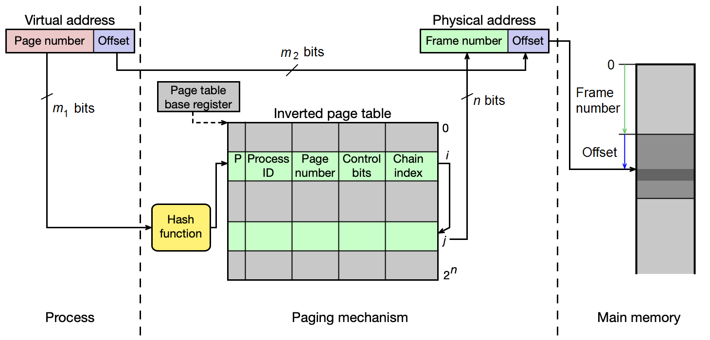

#### Průběh překladu s TLB a dvouúrovňovou ST

```text
CPU generuje virtuální adresu (page# + offset)
    ↓
MMU prohledá TLB:
    → TLB hit: vezme číslo rámce, sestaví fyzickou adresu, zkontroluje přístupová práva
    → TLB miss: prohledá top-level ST v paměti
        → záznamu nalezen: prohledá ST 2. úrovně
            → nalezeno: aktualizuje TLB, sestaví fyzickou adresu
            → nenalezeno (P=0): PAGE FAULT → OS obslouží
        → nenalezeno (P=0): PAGE FAULT → OS obslouží
```

#### Obsluha výpadku stránky (Page Fault Handler)

Když nastane page fault, OS:
1. Ověří, zda je virtuální adresa platná (patří do VAS) a přístup je oprávněný — pokud ne, **Segmentation Fault**.
2. Získá volný rámec:
   - Je-li volný rámec k dispozici → rovnou ho použije.
   - Není-li → spustí **algoritmus náhrady stránek** (viz sekce níže), vybere oběť, případně zapíše obsah oběti na disk (pokud byl dirty bit nastaven).
3. Načte požadovanou stránku:
   - Ze zdrojového souboru (ELF, soubor namapovaný přes `mmap`)
   - Ze swap souboru (byla dříve odložena)
   - Inicializuje nulami (heap, stack, .bss — demand-zero page)
4. Aktualizuje ST a TLB.
5. Vrátí řízení procesu, který instrukci zopakuje.

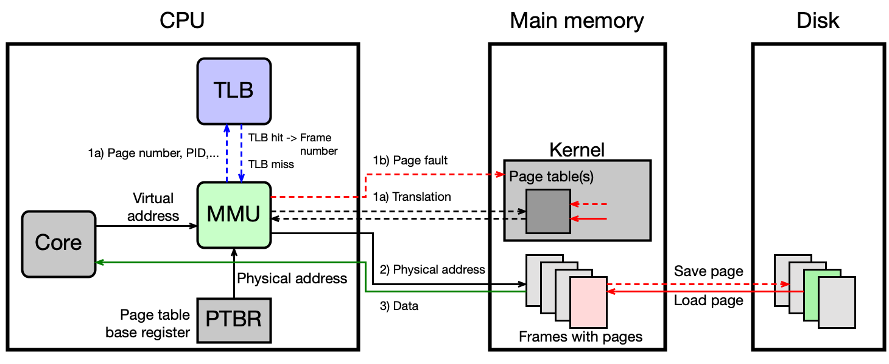

#### Volání systémového volání a adresní prostor jádra

Adresní prostor jádra OS je v starších 32-bitových systémech mapován přímo do VAS každého procesu, chráněn bitem U (User/Supervisor = 0). Při systémovém volání se tedy VAS **nepřepíná** — OS běží ve VAS procesu. Přístup k jaderné části je možný pouze v privilegovaném módu.

!!! warning "Meltdown a ochrana jádra"
    Útok **Meltdown** (2018) zneužíval spekulativní čtení z jaderné části VAS z uživatelského prostoru — ještě před ověřením oprávnění. Obrana pomocí **KPTI** (Kernel Page Table Isolation) odděluje ST jádra od ST uživatelských procesů a do uživatelské ST namapuje jen minimální nutnou část jádra. Moderní CPU tuto zranitelnost řeší hardwarově.

---

## Správa haldy (heap) v Linuxu

Dynamicky alokovaná paměť (malloc/new) pro menší alokace (pod ~128 KB) je spravována na haldě, pro větší přidělována přímo pomocí `mmap()` mimo haldu.

Konec haldy označuje proměnná **Brk** (program break). Zvětšení haldy se provede systémovým voláním `brk`. Každý alokovaný blok na haldě (**chunk**) obsahuje metadata (velikost bloku, příznak obsazenosti) a samotná data. Volné bloky jsou organizovány v zřetězených seznamech.

Knihovna **glibc** na 64-bit systému organizuje volné bloky:
- **Small bins** (32 B–1008 B): lineárně rostoucí, fixní velikosti po 16 B
- **Large bins** (1024 B a více): exponenciálně rostoucí intervaly
- **Unsorted bin**: přechodný seznam (bin 1)
- **Fast bins**: optimalizace pro rychlé alokace malých bloků

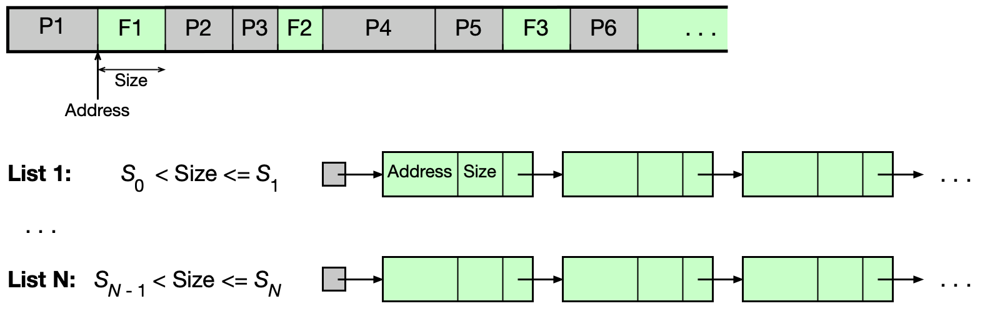

!!! warning "Pozor na přístup po free()"
    Po volání `free()` knihovna glibc zapíše do uvolněné oblasti metadata (ukazatele seznamů). Přístup k uvolněné oblasti (use-after-free) vede na čtení metadat, nikoli původních dat — viz příklad s modifikovaným polem.

### Arény v glibc (pro vícevláknové programy)

Aby se zabránilo souběhu více vláken při alokaci, glibc zavádí **arény**. Aréna obsahuje mutex, seznam binů a spravovanou paměťovou oblast.

- **Hlavní aréna**: pro hlavní vlákno, používá haldu, dynamicky roste přes `sbrk()`.
- **Sekundární arény**: pro ostatní vlákna, získávají paměť přes `mmap()`.

Aréna zůstává platná i po ukončení vlákna, které ji použilo — dokud ji drží alokovaná data. To je zásadní rozdíl od zásobníku, který je zrušen se svým vláknem.

---

## Algoritmy pro náhradu stránek

Když jsou všechny rámce obsazeny a nastane page fault, OS musí vybrat **oběť** — rámec, jehož stránka bude odstraněna z fyzické paměti. Cílem je minimalizovat počet budoucích výpadků stránek.

Postup při náhradě:
1. Vybrat oběť (algoritmem pro náhradu stránek).
2. Zkontrolovat **dirty bit** — pokud byl obsah rámce modifikován, zapsat ho na disk (do backing file nebo swap).
3. Aktualizovat ST všech procesů sdílejících tento rámec (vynulovat bit P, zapsat odkaz na disk).
4. Nahrát požadovanou stránku do uvolněného rámce.

!!! tip "U zkoušky"
    Algoritmy pro náhradu stránek jsou jedno z nejdůležitějších témat u zkoušky. Musíte umět všechny algoritmy aplikovat na konkrétní sekvenci přístupů ke stránkám a spočítat počet výpadků.

### Princip lokality

Algoritmy jsou efektivní díky tomu, že přístupy k paměti nejsou náhodné — platí **princip prostorové a časové lokality**:

- Instrukce se vykonávají převážně sekvenčně.
- Data (pole, zásobník, halda) jsou uložena blízko sebe a přistupuje se k nim opakovaně.

### Optimální algoritmus

**Princip**: Nahradí se stránka, ke které bude přistoupeno nejpozději v budoucnosti.

**Vlastnosti**:
- Generuje minimální počet výpadků stránek (lze to dokázat).
- **Nelze implementovat v praxi** — nezná budoucnost.
- Slouží jako **referenční mez** pro hodnocení reálných algoritmů.

!!! example "Příklad — Optimální algoritmus"
    Sekvence přístupů: `2, 3, 2, 1, 5, 2, 4, 5, 3, 2, 5, 2`  
    Fyzická paměť: 3 prázdné rámce a, b, c.

    ```text
    Stránka:  2  3  2  1  5  2  4  5  3  2  5  2
    Rámec a:  2     2     2     4        2
    Rámec b:     3                    3
    Rámec c:        1  5        5
    Výpadek:  *  *     *  *     *        *
    ```
    **Počet výpadků: 6** (minimum možné pro tuto sekvenci).

### NRU algoritmus (Not Recently Used)

**Princip**: Používá **R bit** (reference) a **D bit** (dirty) pro každou stránku. HW je nastavuje automaticky při každém přístupu:
- R bit = 1 při čtení nebo zápisu
- D bit = 1 při zápisu

OS **periodicky resetuje R bit** na 0, aby mohl sledovat "nedávnost" přístupu.

Stránky se dělí do 4 tříd:

| Třída | R bit | D bit | Interpretace |
|-------|-------|-------|-------------|
| 0     | 0     | 0     | nedávno nepoužitá, nečistá — nejlepší oběť |
| 1     | 0     | 1     | nedávno nepoužitá, modifikovaná |
| 2     | 1     | 0     | nedávno použitá, nečistá |
| 3     | 1     | 1     | nedávno použitá, modifikovaná — nejhorší oběť |

Algoritmus nahradí stránku z **neprázdné třídy s nejnižším číslem**.

**Vlastnosti**: jednoduchý na pochopení, rozumná implementace, relativně malý počet výpadků.

!!! example "Příklad — NRU algoritmus"
    Sekvence: `2(r), 3(r), 2(w), 1(r), 5(r), 2(r), 4(r), 5(r), 3(r), 2(w), 5(w), 2(r)`  
    OS resetuje R bit v časech 10, 20, 30, ...

    Výsledný počet výpadků: **7**.

### FIFO algoritmus (First-In First-Out)

**Princip**: OS udržuje seznam stránek v pořadí, v jakém byly načteny do paměti. Jako oběť se vybere stránka, která je v paměti **nejdéle**.

**Vlastnosti**:
- Nejjednodušší implementace (fronta).
- Nezohledňuje, kdy se ke stránce naposledy přistupovalo — může odstraňovat aktivně používané stránky.
- Relativně velký počet výpadků.

!!! example "Příklad — FIFO algoritmus"
    Sekvence: `2, 3, 2, 1, 5, 2, 4, 5, 3, 2, 5, 2` | 3 rámce.

    ```text
    Stránka:    2  3  2  1  5  2  4  5  3  2  5  2
    Rámec a:    2     2  5     5  3
    Rámec b:       3        2           2
    Rámec c:          1        4           5     2
    Začátek:    a  a  a  a  b  c  a  a  b  b  c  a
    Výpadek:    *  *     *  *  *  *     *     *  *
    ```
    **Počet výpadků: 9**.

### Clock algoritmus

**Princip**: Modifikovaný FIFO — stránky jsou uspořádány do **kruhové fronty** s ručičkou (ukazatelem). Pro každou stránku se sleduje R bit.

Při hledání oběti:
1. Podívej se na stránku, na kterou ukazuje ručička.
2. Pokud R = 1: resetuj R na 0, posuň ručičku dál.
3. Pokud R = 0: tato stránka je oběť — nahraď ji a posuň ručičku.

Stránky, ke kterým bylo nedávno přistoupeno (R = 1), dostanou „druhou šanci" — místo okamžitého vyřazení jim stačí resetovat R bit.

**Vlastnosti**: rozumná implementace, nižší počet výpadků než FIFO.

!!! example "Příklad — Clock algoritmus"
    Sekvence: `2, 3, 2, 1, 5, 2, 4, 5, 3, 2, 5, 2` | 3 rámce.

    **Počet výpadků: 8** (lepší než FIFO, horší než NRU/LRU).

**Two-handed Clock**: varianta s dvěma ručičkami (fronthand a backhand), používaná v Unixu SVR4 a jeho nástupcích. Fronthand resetuje R bit, backhand vybírá oběť (stránku s R = 0). Vzdálenost ručiček (handspread) definuje časové okno sledování přístupů.

### LRU algoritmus (Least Recently Used)

**Princip**: Nahradí se stránka, ke které se **nejdéle nepřistupovalo**.

**Vlastnosti**:
- Dobrá aproximace optimálního algoritmu.
- **Problematická implementace**: při každém přístupu je nutné zaznamenat čas přístupu a při výběru oběti porovnat časy všech stránek — nákladné.

**Implementace pomocí HW čítače**:
- Každý PTE obsahuje položku `time-of-use`.
- HW čítač se inkrementuje při každém přístupu do paměti.
- Při přístupu ke stránce se uloží aktuální hodnota čítače do PTE.
- Oběť = stránka s nejmenší hodnotou `time-of-use`.

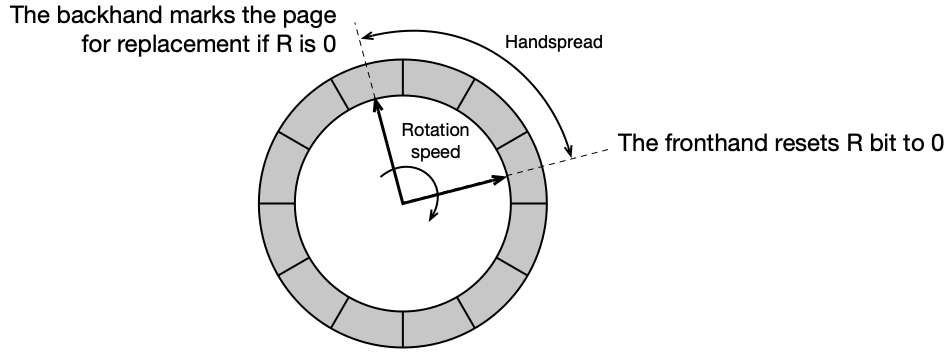

!!! example "Příklad — LRU algoritmus"
    Sekvence: `2, 3, 2, 1, 5, 2, 4, 5, 3, 2, 5, 2` | 3 rámce.

    ```text
    Stránka:   2  3  2  1  5  2  4  5  3  2  5  2
    Rámec a:   2     2          2          3
    Rámec b:      3          5          5          5
    Rámec c:             1          4          2
    Výpadek:   *  *       *  *       *       *  *
    ```
    **Počet výpadků: 7** (shodný s NRU, ale obecně LRU bývá lepší).

### Aging algoritmus

**Softwarová simulace LRU**. Pro každou stránku se udržuje:
- **R bit** — nastavuje HW při přístupu (čtení/zápis)
- **n-bitový čítač C** — inicializovaný na `11...1` při načtení stránky

OS **periodicky** pro každou stránku:
1. Posune obsah čítače C **doprava o jeden bit** (logický posun).
2. Nastaví **nejvýznamnější bit** čítače C na hodnotu R bitu.
3. Resetuje R bit na 0.

Oběť = stránka s **nejmenší hodnotou čítače C** — stránka, ke které se nejdéle nepřistupovalo, bude mít čítač s nejvíce nulami nalevo.

```text
Perioda 1: stránka přistoupena → R=1
  → shift vpravo, MSB = 1 → C = 10000000

Perioda 2: stránka nepřistoupena → R=0
  → shift vpravo, MSB = 0 → C = 01000000

Perioda 3: stránka nepřistoupena → R=0
  → shift vpravo, MSB = 0 → C = 00100000
```

**Vlastnosti**:
- Menší režie než přesné LRU.
- Nepřesné: pamatuje si jen omezenou historii (n period) a nerozlišuje pořadí přístupů v rámci jedné periody.

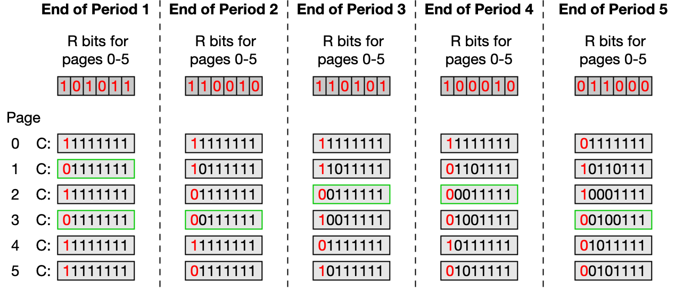

!!! example "Příklad — Aging algoritmus"
    Sekvence: `2(r), 3(r), 2(w), 1(r), 5(r), 2(r), 4(r), 5(r), 3(r), 2(w), 5(w), 2(r)`  
    OS resetuje R bit v časech 10, 20, 30. Čítač C má 3 bity.

    Výsledný počet výpadků: **9**.

!!! tip "U zkoušky — srovnání algoritmů"
    | Algoritmus  | Výpadků (v příkladu) | Implementace | Poznámka                       |
    |-------------|---------------------|-------------|-------------------------------|
    | Optimální   | 6                   | nelze       | dolní mez výpadků              |
    | NRU         | 7                   | jednoduchá  | třídy podle R a D bitů         |
    | LRU         | 7                   | složitá/HW  | nejlepší aproximace optimálního|
    | Aging       | 9                   | střední     | SW simulace LRU                |
    | Clock       | 8                   | střední     | modifikovaný FIFO + R bit      |
    | FIFO        | 9                   | nejjednodušší| nezohledňuje nedávnost přístupu|

### Linuxový algoritmus náhrady stránek

Linux používá variantu LRU algoritmu, která:
- Odděluje **anonymní stránky** (zásobník, halda) od **souborově mapovaných stránek** (odlišné vzory přístupu).
- Pro každou skupinu spravuje **dva LRU seznamy**:
  - **active list**: nedávno přistupované stránky
  - **inactive list**: kandidáti na náhradu

```bash
cat /proc/meminfo
# Active:          5095180 kB
# Inactive:        8548800 kB
# Active(anon):    4512776 kB
# Inactive(anon):  8184200 kB
# Active(file):     582404 kB
# Inactive(file):   364600 kB
```

### Aktualizace stránkovacích tabulek — reverzní mapování

Po výběru oběti musí OS aktualizovat ST **všech procesů**, které mají daný rámec namapován. Aby OS efektivně zjistil, které procesy sdílejí daný rámec, používá **reverzní mapování**:

Pro každý fyzický rámec existuje struktura `struct page` s ukazatelem `*mapping`, který ukazuje na:
- `anon_vma` pro anonymní stránky (zásobník, halda)
- `address_space` pro souborově mapované stránky

Přes tyto struktury OS dohledá všechny `vm_area_struct` sdílející daný rámec, a přes `vm_mm → pgd` pak aktualizuje odpovídající PTE ve všech stránkovacích tabulkách. Navíc musí zneplatnit záznamy TLB na všech CPU jádrech (TLB shootdown).

---

## Správa fyzické paměti — souvislé oblasti

Stránkování dovoluje přiřadit libovolné stránce libovolný rámec. Nicméně existují situace, kdy je nutné pracovat se **souvislými fyzickými oblastmi** přesahujícími velikost rámce:

- **DMA** (Direct Memory Access): I/O zařízení přenáší data přes fyzické adresy bez účasti CPU.
- Integrované grafické karty využívají část hlavní RAM jako video RAM.
- Podpora **huge pages** (2 MB, 1 GB).

Linux proto implementuje:
- **Buddy alokátor**: pro alokaci fyzické paměti v mocninách dvou násobků velikosti rámce (typicky do 4 MB).
- **CMA** (Contiguous Memory Allocator): pro velké souvislé bloky (nad 4 MB), rezervuje paměť při startu systému.
- **Slab alokátor**: pro malé objekty jádra OS — od Buddy alokátoru bere celé oblasti a interně je spravuje pro objekty pevné velikosti. Slab alokace se neevidují v LRU seznamech.

```bash
cat /proc/buddyinfo       # stav buddy alokátoru
sudo cat /proc/slabinfo   # stav slab alokátoru
```

---

## Návrh systémů se stránkováním

Správa paměti je komplexní téma přesahující samotné stránkování. Při návrhu OS je nutné vyřešit řadu dalších otázek:

### Jak sdílet paměť mezi procesy?

Se stránkováním je sdílení relativně jednoduché — více procesů může mít ve svých ST záznamy ukazující na **stejný fyzický rámec**. Typicky se sdílí:
- Spustitelné binární programy
- Dynamické knihovny (`.text` segment jako MAP_SHARED, `.data` jako MAP_PRIVATE s COW)
- Soubory mapované do paměti (`mmap`)
- Explicitně sdílená paměť (shared memory)

### Jak implementovat adresní prostor jádra?

- **Starší 32-bit procesory** (x86, SPARC V7): prostor jádra je namapován do VAS každého procesu (chráněn bitem U). Přechod do kernelu nevyžaduje přepnutí ST.
- **Moderní 64-bit procesory** (x86-64, SPARC V9): prostor jádra je zpravidla **oddělený** od VAS procesů.

### Kdy nahrát stránku do paměti?

Dvě základní strategie:

- **Stránkování na žádost** (demand paging): stránka se načte až při prvním přístupu (page fault).
- **Před-stránkování** (prepaging): při page fault se načte požadovaná stránka i několik sousedních (princip prostorové lokality) — méně přenosů z disku, ale mohou se načíst stránky, které nebudou potřeba. Většina moderních OS tuto strategii používá.

### Kolik rámců přidělit procesu?

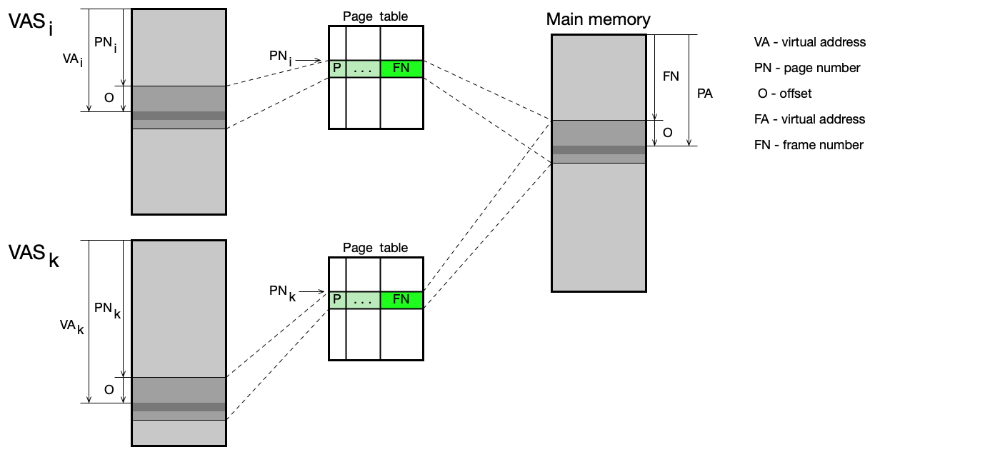

Graf ukazuje závislost počtu výpadků stránek na počtu přidělených rámců. Při příliš malém počtu rámců proces generuje mnoho výpadků. Od určité hodnoty (**Working Set**, WSi) se počet výpadků příliš nemění. Moderní OS používají **variable-allocation strategy** — přidělují rámce podle aktuálních potřeb procesu.

### Kolik procesů současně v paměti?

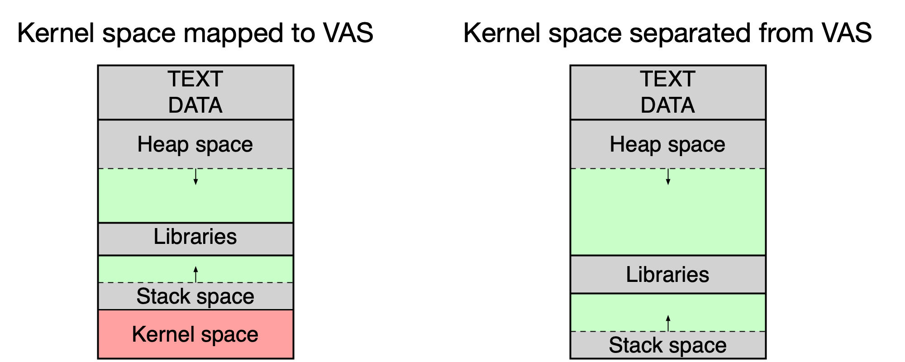

Součet Working Set všech aktivních procesů by měl být menší než velikost hlavní paměti. Pokud podmínka není splněna, procesy si vzájemně „kradou" rámce a efektivita klesá — OS je v situaci **thrashing** (paměťový kolaps).

### Co dělat, když dochází paměť?

OS si udržuje pool volných rámců. Pokud počet volných rámců klesne pod kritickou mez:

1. **Paging-out**: OS pomocí algoritmu náhrady stránek vybere oběti, odloží modifikované stránky na disk, uvolněné rámce přidá do poolu.

2. **Swapping**: pokud paging-out nestačí, OS odloží celé procesy na disk (preferují se procesy, kde žádné vlákno není ve stavu Ready/Running). Pouze anonymní stránky (halda, zásobník) se ukládají do swap prostoru — souborově mapované stránky jsou dostupné přímo ze zdrojových souborů.

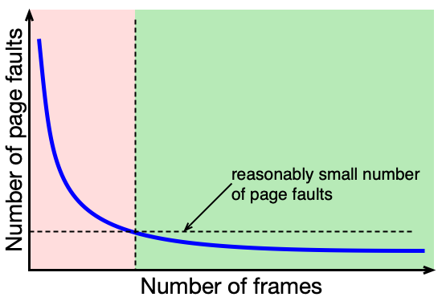

### Podpora více velikostí stránek

Moderní CPU (od ~2000) podporují více velikostí stránek současně (např. 4 KB, 2 MB, 1 GB na x86-64). Větší stránky (**huge pages**) snižují frekvenci TLB miss pro procesy pracující s velkými daty (databáze, vědecké výpočty). Linux umožňuje jejich konfiguraci.

---

## Shrnutí

- Fyzická paměť má hierarchickou organizaci s cache na více úrovních (L1–L3), přičemž průměrný čas přístupu závisí na hit ratio.
- Každý program prochází před spuštěním řetězcem: preprocesor → kompilátor → assembler → linker → loader.
- Virtuální adresní prostor (VAS) izoluje procesy od fyzické paměti a od sebe navzájem; každý proces má svůj vlastní VAS.
- Stránkování rozděluje VAS na stránky a fyzickou paměť na rámce stejné velikosti; v paměti musí být jen aktuálně potřebné stránky.
- Překlad virtuálních adres na fyzické provádí MMU pomocí stránkovacích tabulek; TLB tuto operaci výrazně zrychluje cachováním nedávných překladů.
- Jednoúrovňová ST je paměťově náročná; víceúrovňová ST šetří paměť tím, že tabulky nižších úrovní existují jen pro skutečně používané oblasti VAS; invertovaná ST má jeden záznam na fyzický rámec.
- Při výpadku stránky OS nalezne/uvolní rámec, načte chybějící stránku z disku nebo ze souboru, aktualizuje ST a TLB.
- Algoritmus NRU třídí stránky do 4 tříd podle R a D bitů; FIFO nahrazuje nejdéle načtenou stránku; Clock dává stránkám druhou šanci; LRU nahrazuje nejdéle nepoužívanou stránku (nejlepší aproximace optimálního); Aging je SW simulace LRU s periodickým bitovým posunem čítače.
- Linux spravuje haldu přes glibc s binářními seznamy (small bins, large bins) a pro vícevláknové aplikace zavádí arény.
- Buddy alokátor spravuje souvislé fyzické oblasti v mocninách dvou; Slab alokátor obstarává malé objekty jádra.
- Moderní OS přidělují rámce dynamicky podle Working Set procesu a při kritickém nedostatku paměti nejprve stránkují (paging-out), pak odkládají celé procesy (swapping).

---

## Klíčové pojmy

- **Hlavní paměť** (main memory) — fyzická DRAM paměť instalovaná v počítači; nejmenší adresovatelná jednotka je byte.
- **Hierarchie paměti** — víceúrovňová organizace paměti (registry, L1–L3 cache, hlavní paměť, disk) minimalizující průměrný čas přístupu.
- **Cache** (skrytá paměť) — rychlá mezipaměť mezi CPU a hlavní pamětí, využívající principy časové a prostorové lokality.
- **Hit ratio** (`r_h`) — podíl přístupů, při nichž jsou data nalezena v cache; klíčový parametr výkonu.
- **Průměrný čas přístupu** (`t_avg`) — vážený průměr: `t_avg = r_h * t_h + (1 - r_h) * t_m`.
- **Časová lokalita** — data nedávno použitá budou brzy potřeba znovu.
- **Prostorová lokalita** — data blízká aktuálně používaným datům budou brzy potřeba.
- **Preprocesor** — zpracovává direktivy `#include`, `#define`, `#ifdef` před kompilací.
- **Kompilátor** — překládá zdrojový kód do assembly; výstupem jsou nevyřešené symbolické adresy.
- **Assembler** — převádí assembly na binární objektový soubor (`.o`) s nevyřešenými externími symboly.
- **Objektový modul** (object module) — binární soubor s přemístitelným kódem, není přímo spustitelný.
- **Load module** (spustitelný soubor) — výstup linkeru; spustitelný binární program.
- **Statické linkování** (static linking) — linker zahrne vše potřebné přímo do spustitelného souboru.
- **Dynamické linkování** (dynamic linking) — spustitelný soubor odkazuje na sdílené knihovny; váže se za běhu.
- **Load-time dynamic linking** — dynamické symboly se vyřeší při zavedení programu.
- **Run-time dynamic linking** — dynamické symboly se vyřeší při prvním volání (lazy binding).
- **ELF** (Executable and Linkable Format) — formát objektových a spustitelných souborů v Linuxu.
- **Loader** — část OS zavádějící program do paměti; vytváří VAS na základě metadat z ELF.
- **execve()** — systémové volání nahrazující obraz procesu novým programem; vytváří nový VAS.
- **ASLR** (Address Space Layout Randomization) — náhodné posunutí adres segmentů VAS pro zvýšení bezpečnosti.
- **VAS** (Virtual Address Space) — virtuální adresní prostor; izolovaný logický prostor adres každého procesu.
- **Virtuální adresa** — adresa generovaná procesem; překládá se na fyzickou adresu MMU.
- **Fyzická adresa** — skutečná adresa v hlavní paměti.
- **VMA** (Virtual Memory Area) — `struct vm_area_struct`; souvislý blok virtuální paměti s daným účelem a přístupovými právy.
- **File-backed VMA** — VMA svázaná se souborem (`.text`, knihovny).
- **Anonymní VMA** — VMA bez souboru (halda, zásobník); inicializuje se nulami.
- **Demand-zero page** — stránka inicializovaná nulami při prvním přístupu (anonymní VMA).
- **Dynamické oddíly** (dynamic partitioning) — správa paměti alokací souvislé oblasti pro každý proces; historická metoda, trpí fragmentací.
- **Base register** — registr obsahující fyzickou adresu začátku oblasti procesu; slouží pro relokaci adres.
- **Limit register** — registr obsahující velikost oblasti procesu; slouží pro ochranu paměti.
- **Buddy alokátor** — alokátor fyzické paměti s oblastmi o velikostech mocnin dvou; umožňuje rychlé slučování.
- **Swapping** (odkládání procesů) — dočasné přesunutí celého procesu na disk při nedostatku paměti.
- **Stránkování** (paging) — mechanismus správy paměti rozdělující VAS na stránky a fyzickou paměť na rámce.
- **Stránka** (page) — pevně velká oblast VAS (typicky 4 KB).
- **Rámec** (frame) — pevně velká oblast fyzické paměti stejné velikosti jako stránka.
- **Page fault** (výpadek stránky) — přerušení nastávající při přístupu ke stránce nepřítomné v hlavní paměti.
- **Segmentation fault** — chyba nastávající při přístupu mimo platné VMA; OS ukončí proces.
- **MMU** (Memory Management Unit) — hardwarová jednotka překládající virtuální adresy na fyzické.
- **Stránkovací tabulka** (Page Table, PT) — datová struktura OS mapující čísla stránek na čísla rámců.
- **PTE** (Page Table Entry) — jeden záznam stránkovací tabulky; obsahuje číslo rámce a řídicí bity.
- **Present bit (P)** — bit v PTE; 1 = stránka je v hlavní paměti, 0 = výpadek stránky.
- **Dirty bit (D)** — bit v PTE; 1 = stránka byla modifikována a musí být zapsána na disk před odstraněním.
- **Reference bit (R) / Accessed bit (A)** — bit v PTE; nastavuje HW při přístupu; slouží algoritmům náhrady.
- **PTBR** (Page Table Base Register) — registr CPU (CR3 na x86-64) ukazující na top-level stránkovací tabulku aktivního procesu.
- **Jednoúrovňová ST** — stránkovací tabulka s jedním záznamem na každou stránku VAS; paměťově náročná.
- **Víceúrovňová ST** — hierarchická stránkovací tabulka; tabulky nižších úrovní existují jen pro používané oblasti VAS.
- **Invertovaná ST** — jeden záznam na fyzický rámec; jedna tabulka pro celý systém; pomalejší překlad.
- **TLB** (Translation Lookaside Buffer) — hardwarová cache nedávných překladů adres; dramaticky zrychluje překlad.
- **TLB miss** — překlad nebyl nalezen v TLB; nutno prohledat ST v paměti.
- **TLB shootdown** — invalidace položek TLB na všech CPU jádrech po změně mapování rámce.
- **ASID** (Address Space ID) — identifikátor VAS v TLB; umožňuje koexistenci záznamů více procesů v TLB.
- **KPTI** (Kernel Page Table Isolation) — obrana proti Meltdown; odděluje ST jádra od ST uživatelských procesů.
- **Halda** (heap) — oblast VAS pro dynamicky alokovanou paměť; spravována knihovnou (glibc v Linuxu).
- **Brk** (program break) — konec haldy; posouvá se systémovým voláním `brk`/`sbrk`.
- **Chunk** — alokační jednotka haldy v glibc; obsahuje metadata a uživatelská data.
- **Small bins / Large bins** — seznamy volných chunků v glibc; small bins pro <1 KB, large bins pro větší.
- **Aréna** (arena) — v glibc oblast paměti + mutex pro správu haldy v jednom vláknu; hlavní aréna pro hlavní vlákno, sekundární pro ostatní.
- **Algoritmus náhrady stránek** (Page Replacement Algorithm, PRA) — algoritmus OS pro výběr oběti při nedostatku rámců.
- **Optimální algoritmus** — nahradí stránku s nejpozději nastávajícím dalším přístupem; nelze implementovat, slouží jako referenční mez.
- **NRU** (Not Recently Used) — nahradí stránku z nejnižší neprázdné třídy (0–3) podle R a D bitů.
- **FIFO** (First-In First-Out) — nahradí stránku v paměti nejdéle; ignoruje nedávnost přístupu.
- **Clock algoritmus** — modifikovaný FIFO s kruhovým bufferem a „druhou šancí" pro stránky s R = 1.
- **LRU** (Least Recently Used) — nahradí stránku, ke které se nejdéle nepřistupovalo; nejlepší aproximace optimálního.
- **Aging** — softwarová simulace LRU pomocí periodicky posouvaného n-bitového čítače; menší overhead než přesné LRU.
- **Working Set (WS)** — množina stránek aktivně používaných procesem v daném časovém okně; rozumný počet rámců pro daný proces.
- **Thrashing** (paměťový kolaps) — situace, kdy procesy generují tolik výpadků stránek, že CPU tráví většinu času obsluhou page faultů.
- **Demand paging** (stránkování na žádost) — stránka se načte až při prvním přístupu k ní.
- **Prepaging** (před-stránkování) — při page fault se načtou i sousední stránky na základě prostorové lokality.
- **Paging-out** — OS odloží vybrané stránky na disk pro uvolnění rámců.
- **Swap** — diskový prostor (oddíl nebo soubor) pro ukládání anonymních stránek odložených z paměti.
- **Reverzní mapování** — mechanismus OS (přes `anon_vma`/`address_space`) pro dohledání všech procesů mapujících daný fyzický rámec.
- **Slab alokátor** — alokátor jádra OS pro malé objekty fixní velikosti; pracuje nad oblastmi od Buddy alokátoru.
- **CMA** (Contiguous Memory Allocator) — alokátor pro velké souvislé bloky fyzické paměti (nad 4 MB).
- **Huge pages** — větší stránky/rámce (2 MB, 1 GB) snižující frekvenci TLB miss pro paměťově náročné aplikace.
- **Copy-on-Write (COW)** — optimalizace při `fork()`: obě kopie sdílejí rámce do prvního zápisu; při zápisu OS vytvoří kopii rámce.
- **mmap()** — systémové volání pro mapování souboru nebo anonymní paměti do VAS procesu.
- **DMA** (Direct Memory Access) — přenos dat mezi I/O zařízením a fyzickou pamětí bez účasti CPU; vyžaduje souvislé fyzické oblasti.
