# Datová úložiště a souborové systémy

Tato kapitola pokrývá tři vzájemně provázaná témata: fyzická datová úložiště (HDD a SSD), technologie jejich sdružování a zabezpečení (RAID) a způsoby síťového připojení (DAS/NAS/SAN), následně implementaci souborových systémů na disku (rozložení dat, alokační strategie FAT a UFS/i-node, adresáře, sdílené soubory) a konečně podporu souborových systémů v jádře OS (VFS, FUSE, cache, žurnálování) a moderní přístupy (B+ stromy, ZFS, BTRFS). Student po prostudování této kapitoly pochopí, jak je informace fyzicky uložena na médiích a jak nad ní operační systém buduje abstrakci souborového systému.

---

??? abstract "Obsah stránky"

    [TOC]

## Datová úložiště

**Datové úložiště** (data storage, secondary storage, external memory) je hardware sloužící k dlouhodobému, perzistentnímu uložení informací. Na rozdíl od operační paměti (RAM) je nevolatilní — obsah přežije vypnutí napájení.

Úložný prostor se dělí na **sektory** (nejmenší adresovatelná jednotka, typicky 512 B nebo 4 KB). Sektory se dále seskupují do **diskových oblastí** (partitions, volumes), které spravuje buď OS (pomocí souborového systému) nebo přímo aplikace (databáze v proprietárním formátu).

Nejrozšířenější typy úložišť jsou:

- **HDD** (Hard Disk Drive) — magnetický pevný disk,
- **SSD** (Solid State Drive) — flash paměť,
- **RAID** (Redundant Array of Independent Disks) — pole nezávislých disků.

Úložiště lze k výpočetnímu systému připojit třemi základními způsoby: **DAS**, **NAS** nebo **SAN**.

### Srovnání technologií

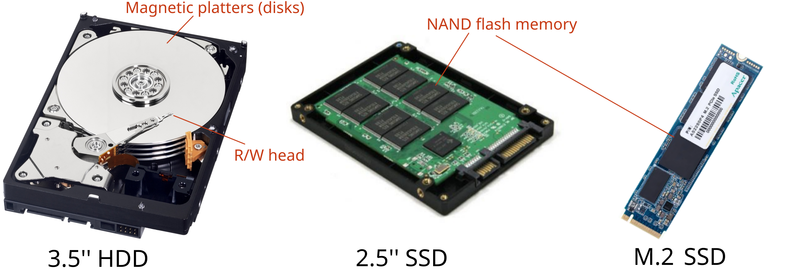

| Parametr | 3,5" HDD | 2,5" SSD (SATA) | M.2 SSD (NVMe) |
|---|---|---|---|
| Typ média | Magnetické plotny | NAND flash | NAND flash |
| Rozhraní | SATA | SATA | PCIe (NVMe) |
| Sekvenční přenos | 100–250 MB/s | ~550 MB/s | 3–12 GB/s |
| Latence přístupu | ~10 ms | ~100 µs | ~10 µs |
| Počet IOPS | stovky | desítky tisíc | statisíce–miliony |
| Pohyblivé části | ano | ne | ne |
| Cena za GB | nízká | střední | vyšší |
| Typické použití | archivy, zálohy | systémový disk | náročné aplikace |

---

## HDD (Hard Disk Drive)

**HDD** je magnetické rotační médium. Data jsou uložena pomocí změny směru magnetizace na feromagnetických plotnách, které se otáčejí konstantní rychlostí.

### Architektura HDD

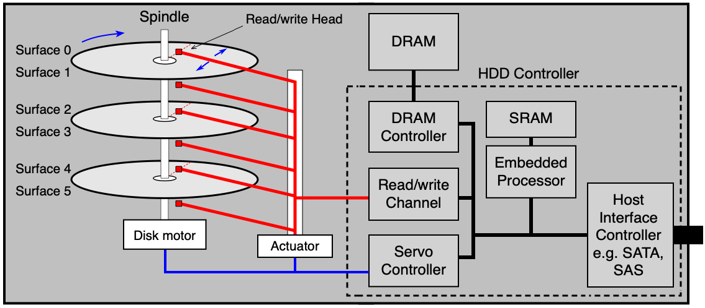

HDD se skládá z těchto klíčových součástí:

**Mechanické části:**

- Několik **ploten** (platters) tvořených feromagnetickým materiálem, každá má dva povrchy.
- **Magnetické hlavičky** (heads) pro čtení a zápis — všechny jsou vždy ve stejné vzdálenosti od středu (pohybují se synchronně).

**Elektrické části:**

- **Řadič disku** (disk controller) s procesorem, firmwarem a pomocnými obvody.
- **Vyrovnávací paměť** (buffer cache, DRAM) — dočasné uložení čtených/zapisovaných dat, může mít stovky MB.

### Princip záznamu

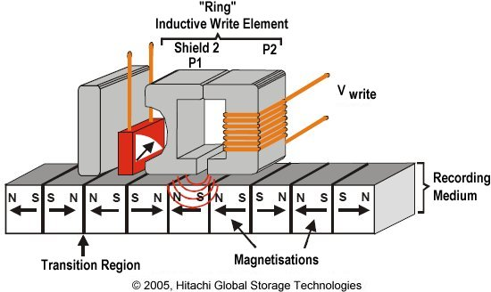

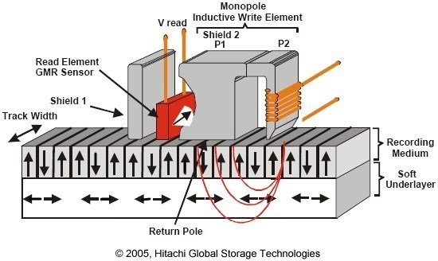

Informace je kódována **změnou směru magnetizace** mezi sousedními magnetickými doménami. Existují dvě generace technologie:

- **Longitudinal Recording** — magnetické domény orientovány rovnoběžně s povrchem plotny; starší HDD, omezená hustota záznamu.
- **Perpendicular Recording** — domény kolmo na povrch; moderní HDD, výrazně vyšší hustota. Pod záznamovou vrstvou se nachází *soft magnetic underlayer* uzavírající magnetický tok.

**Zápis** probíhá řízením směru proudu v zápisové hlavě (vytváří magnetické pole). **Čtení** probíhá indukčně — čtecí hlava registruje změnu magnetického toku.

### Geometrie disku

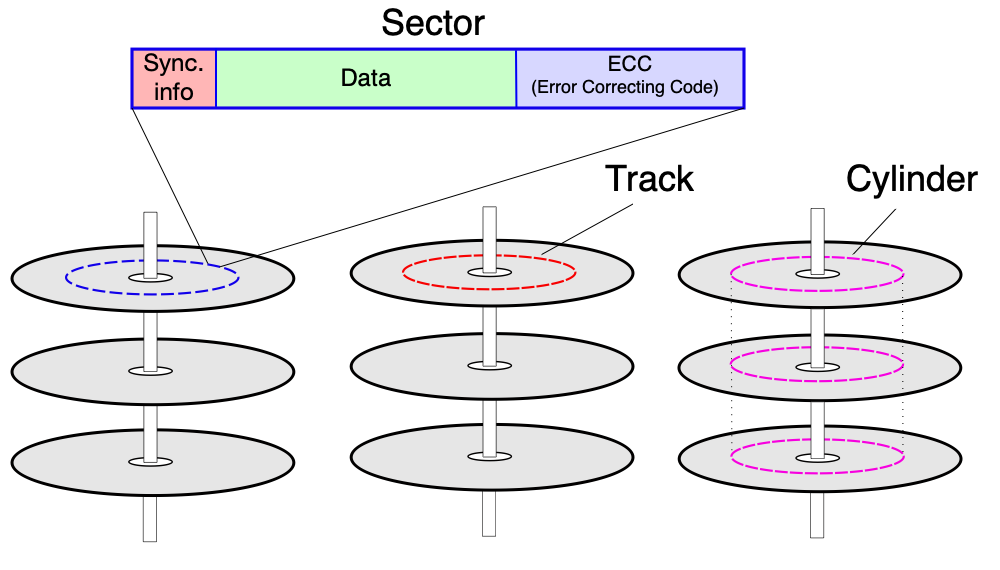

HDD pracuje s těmito geometrickými pojmy:

- **Sektor** (sector) — nejmenší adresovatelná jednotka; obsahuje synchronizační informace, data (4096 B nově, 512 B starší) a ECC (Error Correction Code).
- **Stopa** (track) — množina sektorů na jednom povrchu ve stejné vzdálenosti od středu; stopy se číslují od vnějšího okraje.
- **Cylindr** (cylinder) — množina všech stop o daném poloměru na všech površích (nad sebou ve všech povrchách).

**Adresování sektorů:**

- **CHS** (Cylinder-Head-Sector) — starší způsob, adresa je trojice [cylindr, povrch, sektor].
- **LBA** (Logical Block Addressing) — novější, sektory číslovány sekvenčně od 0 (začíná se od vnějšího okraje prvního cylindru).

**Zone Bit Recording (ZBR):** Stopy jsou rozděleny do zón. V rámci zóny je konstantní počet sektorů na stopu. Vnější zóny mají více sektorů na stopu než vnitřní (fyzicky jsou delší).

### Rychlost přístupu k datům

Čas potřebný k přečtení jednoho sektoru závisí na třech složkách:

1. **Doba vystavení** (seek time) — pohyb hlaviček nad správný cylindr; typicky 1–10 ms.
2. **Rotační zpoždění** (rotational delay) — čekání, než se správný sektor otočí pod hlavičku; průměrně polovina doby jedné otáčky; při 5 000–15 000 RPM jde o 6–2 ms.
3. **Čas přenosu dat** — samotný přenos obsahu sektoru.

!!! example "Příklad: sekvenční vs. náhodný přístup"
    Disk s parametry: 1 povrch, 10 000 RPM, sektor 512 B, 320 sektorů na stopu, průměrný seek 10 ms, seek na sousední stopu 1 ms.

    - Průměrné rotační zpoždění: `(0 + 60/10000) / 2 = 3 ms`
    - Počet stop pro 2560 sektorů: `2560 / 320 = 8 stop`
    - **Sekvenční čtení 2560 sektorů (sousední stopy):**
      - První stopa: 10 (seek) + 3 (rotace) + 6 ms (přenos celé stopy) = 19 ms
      - Každá další stopa: 1 (seek) + 3 (rotace) + 6 (přenos) = 10 ms
      - Celkem: `19 + 7 × 10 = 89 ms`
    - **Náhodný přístup k 2560 sektorům:**
      - Jeden sektor: 10 + 3 + 6/320 ≈ 13,02 ms
      - Celkem: `2560 × 13,02 ≈ 33,3 s`

    Sekvenční přístup je tedy zhruba **375× rychlejší** než náhodný! Proto je pro HDD klíčové minimalizovat pohyb hlaviček.

!!! tip "U zkoušky"
    Vzorce pro výpočet doby přístupu: `T_celkem = seek_time + rotational_delay + transfer_time`. Průměrné rotační zpoždění = polovina doby jedné otáčky = `60 / (2 × RPM)` sekund.

### Algoritmy plánování přístupu na disk

OS (nebo přímo řadič disku přes NCQ/TCQ) seřazuje frontu požadavků tak, aby minimalizoval pohyb hlaviček.

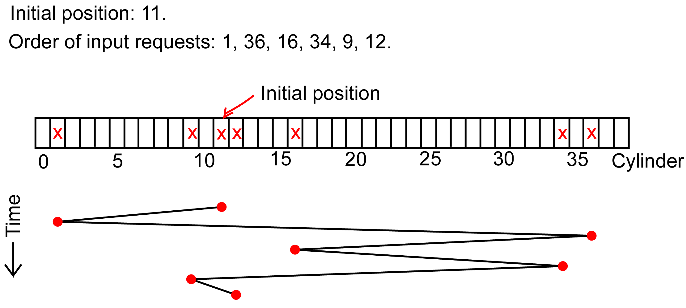

**FIFO (First-In-First-Out):** Požadavky obslouženy v pořadí příchodu. Spravedlivé, ale výkonově neoptimální.

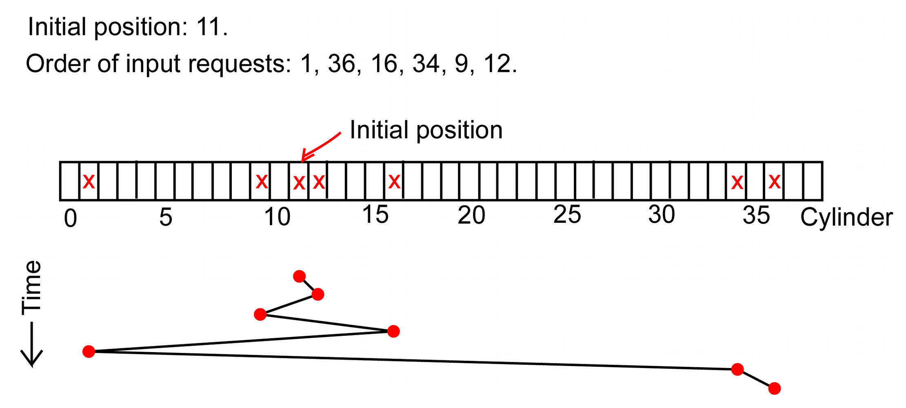

**SSTF (Shortest Service Time First):** Nejdříve obsluha požadavku nejblíže aktuální pozici hlavičky. Lepší výkon než FIFO, ale hrozí **stárnutí** (starvation) požadavků ze vzdálených cylindrů — hlavičky tendují setrvávat uprostřed disku.

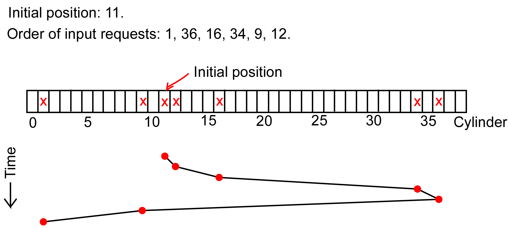

**SCAN (výtahový algoritmus / elevator algorithm):** Hlavičky se pohybují jedním směrem, obsluhují všechny požadavky, pak se otočí a obsluhují v opačném směru. Omezuje stárnutí, ale ne zcela.

**N-step SCAN:** Fronta požadavků se rozdělí na dílčí fronty délky N, každá zpracována algoritmem SCAN. Garantuje, že požadavek může být předskočen maximálně N−1 jinými. Je zobecněním: N=1 → FIFO, N→∞ → SCAN.

---

## SSD (Solid State Drive)

**SSD** neobsahuje žádné pohyblivé části, proto má konstantní (na poloze nezávislou) latenci přístupu.

**Výhody:** rychlý přístup k datům, nízká spotřeba, malé rozměry, bezhlučnost, odolnost vůči otřesům.

**Nevýhody:** menší kapacita za stejnou cenu, omezený počet zápisů, náchylnost na vyšší teploty (hrozí ztráta dat).

### Technologie NAND flash — floating gate MOSFET

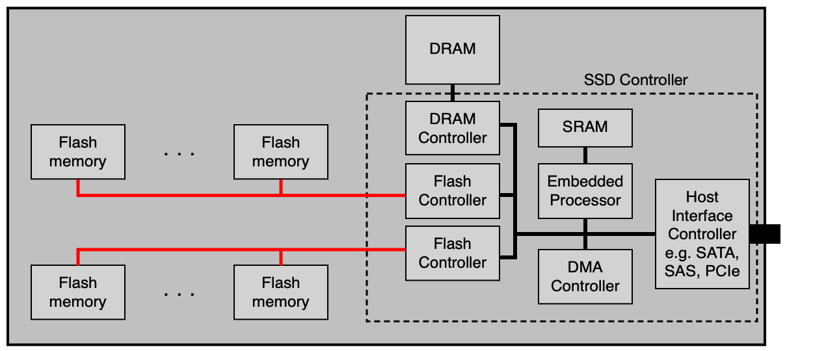

Data se ukládají do pamětových buněk tvořených speciálním tranzistorem — **floating gate MOSFET**. Jde o upravený MOSFET, který má mezi řídicí bránou (control gate) a substrátem vloženou **vodivou plovoucí bránu** (floating gate) izolovanou z obou stran. Přítomnost nebo absence elektrického náboje na plovoucí bráně představuje uloženou informaci.

- **Přítomnost náboje** = logická 0
- **Absence náboje** = logická 1

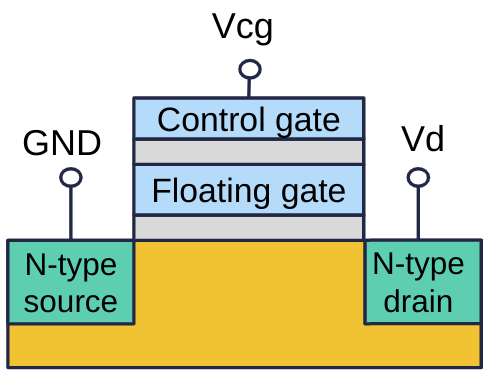

**Tři základní operace:**

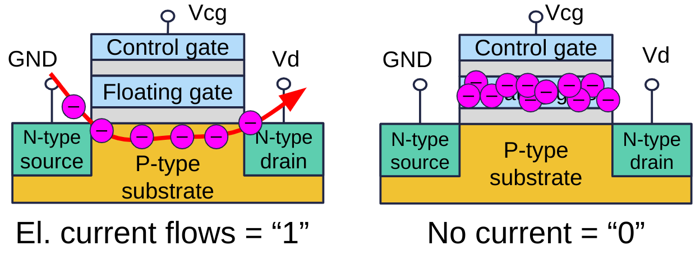

- **Čtení:** Na řídicí bránu se přivede čtecí napětí Vread (1–2 V). Pokud plovoucí brána není nabitá, tranzistor se otevře (logická 1). Pokud je nabitá, zvýší se prahové napětí a tranzistor se neotevře (logická 0).
- **Programování (zápis 0):** Přivedením vysokého zapisovacího napětí Vwrite (15–20 V) na řídicí bránu a uzemněním substrátu se náboj přenese na plovoucí bránu (kvantový tunelový jev).
- **Mazání (zápis 1):** Náboj se odstraní přivedením Vwrite na substrát a uzemněním řídicí brány.

!!! warning "Opotřebení buněk"
    Vysoké napětí Vwrite (15–20 V) při programování/mazání způsobuje opotřebení izolační vrstvy kolem plovoucí brány. To je fyzikální příčina omezeného počtu zápisů u NAND flash.

### NAND organizace a operace

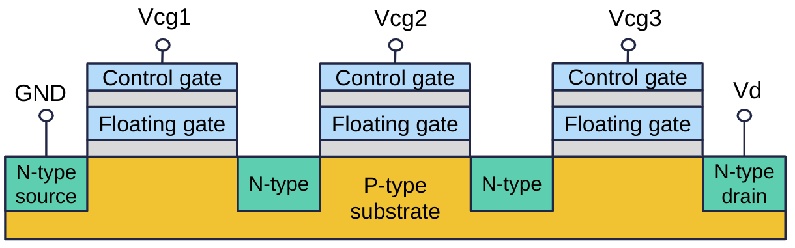

Buňky jsou zapojeny do série připomínající hradlo NAND — odtud název **NAND flash**. Při čtení konkrétní buňky se na ni přivede Vread a na ostatní Vpass (4–6 V) — napětí dostatečně vysoké k otevření tranzistoru bez ohledu na náboj plovoucí brány, ale dostatečně nízké, aby nedocházelo k přenosu náboje.

**Mazání probíhá vždy nad celým blokem najednou** — náboj se odstraňuje ze všech buněk v bloku společně (přes společný substrát), nelze mazat stránky jednotlivě.

### SLC, MLC, TLC a QLC

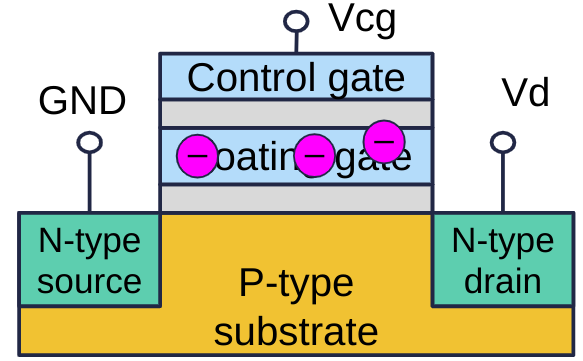

Přivedením různého množství náboje na plovoucí bránu lze nastavit různé prahové napětí — tranzistor se otevírá při různých napětích. To umožňuje ukládat do jedné buňky **více bitů**.

| Typ | Bity/buňka | Čtení/zápis (MB/s) | Počet zápisů | Spolehlivost | Použití |
|---|---|---|---|---|---|
| **SLC** | 1 | 200–500 / 20–40 | 50 000–100 000 | Velmi vysoká | Průmysl, cache |
| **MLC** | 2 | 150–400 / 10–30 | 3 000–10 000 | Vysoká | Enterprise SSD |
| **TLC** | 3 | 100–300 / 5–15 | 1 000–3 000 | Střední | Spotřební SSD |
| **QLC** | 4 | 50–200 / 2–10 | 100–1 000 | Nízká | Levné SSD |

### Organizace SSD — stránky, bloky a FTL

**Stránka** (page) — nejmenší adresovatelná jednotka pro čtení a zápis; typická velikost 4 KB, 8 KB nebo 16 KB.

**Blok** (block) — seskupení stránek, které lze najednou vymazat; mazání nelze provádět po stránkách.

SSD navenek používá **LBA** (Logical Block Addressing) pro kompatibilitu s HDD. Interně firmware spravuje mapování přes **Flash Translation Layer (FTL)**, který zajišťuje:

- **Mapování LBA → fyzické stránky/bloky** (dynamické — mapování se v čase mění),
- **Wear leveling** — rovnoměrné rozložení zápisů, aby se neopotřeboval jen jeden blok,
- **Garbage collection** — správa a uvolňování neplatných bloků,
- **Bad Block Management** — správa poškozených bloků.

### Srovnání HDD a SSD

| Parametr | HDD (SATA) | SSD (SATA) | SSD (NVMe) |
|---|---|---|---|
| Sequential Read (MB/s) | 250 | 555 | 6 800 |
| Sequential Write (MB/s) | 250 | 520 | 6 000 |
| Random Read 4 KB (IOPS) | 240 | 98 000 | 1 000 000 |
| Random Write 4 KB (IOPS) | 240 | 75 000 | 180 000 |
| Latence čtení | avg 4,16 ms | max 0,4 ms | 0,1 ms |
| Kapacita | až 24 TB | 8 TB | 8 TB |
| Cena (Kč/TB) | ~700 | ~2 000 | ~2 100 |
| Trvanlivost (offline) | > 10 let | TLC: 1–3 roky | — |

!!! note "Kdy použít HDD a kdy SSD?"
    **HDD** se hodí pro archivaci dat a méně časté používání (nízká cena za GB, dlouhá trvanlivost v napájeném stavu). **SSD** se hodí pro aktivní používání — systémové disky, databáze, aplikace citlivé na latenci. Aktivní SSD si firmware sám obnovuje data (data refresh), čímž prodlužuje životnost.

---

## RAID (Redundant Array of Independent Disks)

**RAID** je způsob sdružení více fyzických disků do jednoho logického celku. Myšlenka byla publikována v roce 1988 na Universitě Californie v Berkeley. Kromě RAID 0 jsou všechny varianty **redundantní** — část kapacity ukládá záložní informace, takže data přežijí výpadek jednoho nebo více disků.

Vlastnosti, které RAID umožňuje konfigurovat:

- kapacita logického disku,
- rychlost sekvenčního čtení/zápisu,
- počet R/W operací za sekundu (IOPS),
- spolehlivost (odolnost vůči výpadku disků).

### Softwarový vs. hardwarový RAID

**Softwarový RAID:**

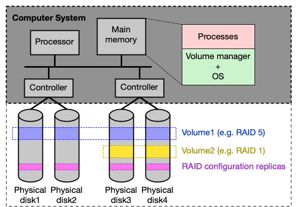

Fyzické disky jsou standardně připojeny přes sběrnice a spravovány OS. **Volume manager** (VM) zajišťuje mapování dat na disky a výpočet parity. Příklady: Logical Volume Manager (LVM v Linuxu), Veritas VM.

**Hardwarový RAID:**

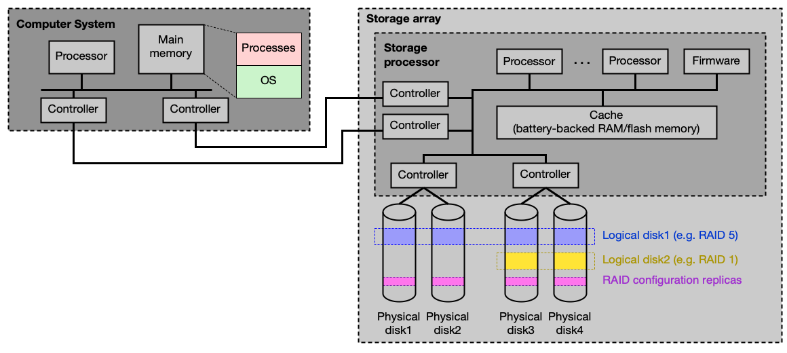

Speciální hardware obsahuje vlastní procesory, paměť s firmwarem a zálohovací paměť chráněnou proti výpadku napájení. OS vidí pouze logický disk, nikoliv fyzické disky HW RAIDu.

### RAID 0 — zřetězení (concatenation) a prokládání (striping)

**RAID 0 — zřetězení (JBOD):**

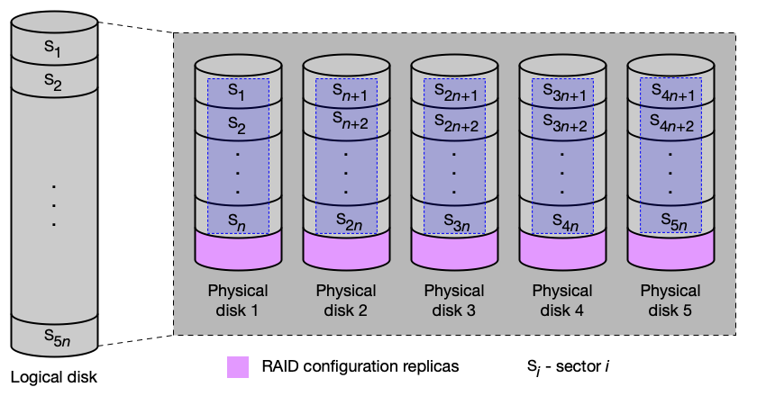

Data jsou ukládána postupně na disky: jakmile se zaplní první disk, data přecházejí na druhý atd. Redundance je 0 % — výpadek jediného disku způsobí ztrátu všech dat. Výkon je shodný s jedním diskem. Použití: prosté navýšení kapacity.

**RAID 0 — prokládání (striping):**

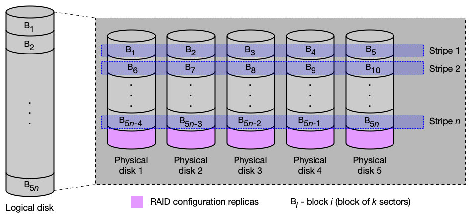

Administrátor definuje **blok** jako k sousedních sektorů. Data jsou cyklicky ukládána po blocích na jednotlivé disky (první blok na disk 1, druhý na disk 2, ..., po obejití všech disků opět na disk 1). Necht' m je počet fyzických disků:

- Redundance: 0 % — výpadek jednoho disku = ztráta všech dat.
- R/W se zrychlí až m-krát, pokud přenášíme data o velikosti m bloků.
- Počet paralelních R/W operací velikosti 1 bloku se zvýší až m-krát.

Použití: navýšení kapacity **a** výkonu.

!!! tip "U zkoušky"
    Striping zrychluje velké I/O paralelismem — m disků → m-násobná přenosová rychlost pro velká sekvenční data. Žádná ochrana dat!

### RAID 1 — zrcadlení (mirroring)

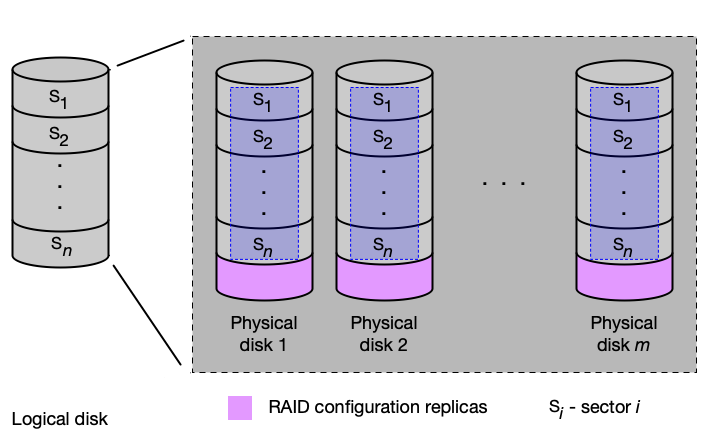

Stejná data jsou uložena na **všechny** fyzické disky (m kopií). Typicky dvě kopie, ale může být více.

Vlastnosti pro m disků:

- Redundance: `100 × (m − 1) / m` % → data přežijí výpadek m−1 disků.
- Čtení 1 bloku: stejná rychlost jako fyzický disk.
- Čtení m bloků: až m-násobné zrychlení (různé bloky z různých disků).
- Zápis: stejná rychlost jako fyzický disk (na každý disk zapsat m bloků).

Použití: zabezpečení dat.

### RAID 1+0 (RAID 10) — zrcadlení + prokládání

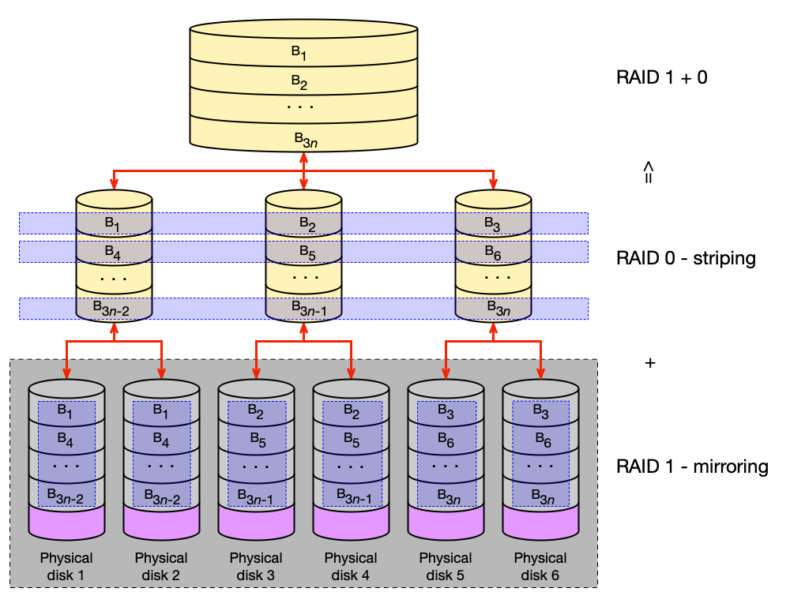

RAID 10 kombinuje výhody RAID 1 (redundance) a RAID 0 (výkon prokládání). Disky jsou nejdříve zdvojeny zrcadlením a výsledné páry jsou prokládány.

Vlastnosti pro m disků (zrcadlení po dvou):

- Redundance: 50 % → data přežijí výpadek teoreticky m/2 disků (po jednom z každého zrcadla).
- Sekvenční R/W: až (m/2)-násobné zrychlení.
- Paralelní R/W operací: až m-násobné (IOPS).
- Obnova po výpadku: úměrná kapacitě jednoho fyzického disku (rychlá).

### RAID 2, 3, 4

Tyto varianty se v praxi běžně nepoužívají:

- **RAID 2:** prokládání po bitech + Hammingův kód.
- **RAID 3:** prokládání po bajtech + parita na jednom dedikovaném disku.
- **RAID 4:** prokládání po blocích + parita na jednom disku. Parita: `P(i, j) = B_i XOR B_(i+1) XOR ... XOR B_j`. Problém: paritní disk je při větším počtu zápisů přetížen.

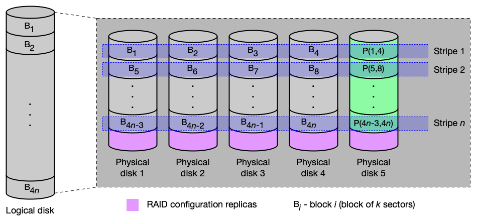

### RAID 5 — prokládání s distribuovanou paritou

**Princip:** Prokládání po blocích na m discích + parita cyklicky rozložená na všech discích (každý disk funguje střídavě jako datový i paritní).

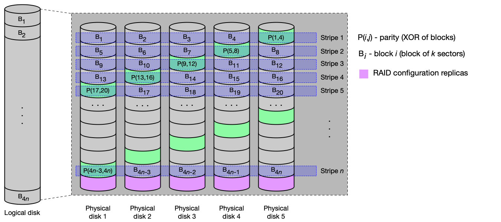

Vlastnosti:

- Redundance: `100/m` % → výpadek **jednoho** disku → data dostupná, ale degradovaný výkon.
- Čtení: zrychlení až (m−1)-násobné pro data (m−1) bloků.
- Zápis: pomalejší (zejména u SW RAID) — každý zápis dat vyžaduje i aktualizaci parity (čtení starých dat, čtení staré parity, výpočet nové parity, zápis dat, zápis parity = 4 I/O operace na 1 logický zápis).
- IOPS: až m-násobné pro nezávislé požadavky.

Použití: navýšení kapacity, zabezpečení dat a zrychlení čtení.

!!! tip "U zkoušky"
    **Výpočet parity v RAID 5:** Pro m disků (disk0 ... disk_(m-1)), kde jeden blok pruhu (stripe) nese paritu P: `P = D0 XOR D1 XOR ... XOR D_(m-2)`. Při výpadku disku `D_k` lze obnovit: `D_k = P XOR D0 XOR ... XOR D_(k-1) XOR D_(k+1) XOR ...` (XOR všech ostatních). Příklad: m=3 disky, blok pruhu D0=`0b10110`, D1=`0b01101` → P=`0b11011`. Výpadek D0 → D0=P XOR D1=`0b11011 XOR 0b01101=0b10110`.

### RAID 6 — prokládání s dvojitou distribuovanou paritou

**Princip:** Prokládání po blocích na m discích + **dvojí** parita cyklicky rozložená na všech discích (dva různé paritní výpočty, typicky XOR a Reedův-Solomonův kód).

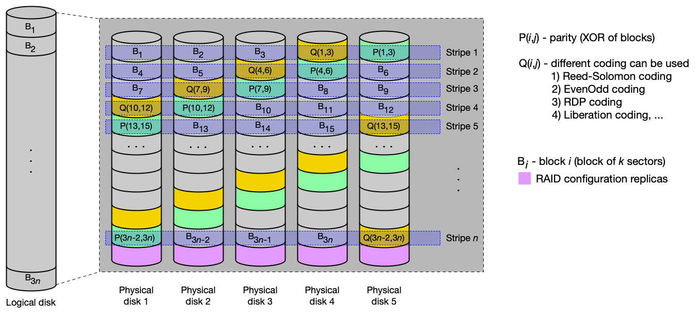

Vlastnosti:

- Redundance: `200/m` % → výpadek **dvou** disků → data dostupná.
- Čtení: zrychlení až (m−2)-násobné.
- Zápis: pomalejší než RAID 5 (výpočet dvou parit).
- IOPS čtení: až m-násobné.

Použití: navýšení kapacity, zabezpečení dat i výkonu čtení, vyšší odolnost.

### Srovnání typů RAID

| Vlastnost | RAID 0 (striping) | RAID 1 | RAID 10 | RAID 5 | RAID 6 |
|---|---|---|---|---|---|
| Min. počet disků | 2 | 2 | 4 | 3 | 4 |
| Ochrana dat | Žádná | Výpadek 1 disku | Výpadek 1 disku (ze dvojice) | Výpadek 1 disku | Výpadek 2 disků |
| Výkon čtení | Vysoký | Vysoký | Vysoký | Vysoký | Vysoký |
| Výkon zápisu | Vysoký | Střední | Střední | Nízký | Nízký |
| Výkon čtení (při výpadku) | — | Střední | Vysoký | Nízký | Nízký |
| Výkon zápisu (při výpadku) | — | Vysoký | Vysoký | Nízký | Nízký |
| Využitá kapacita | 100 % | 50 % | 50 % | 67–94 % | 50–88 % |

!!! tip "U zkoušky"
    Využitá kapacita pro m disků: RAID 5 = `(m−1)/m`, RAID 6 = `(m−2)/m`. Příklad: RAID 5 se 6 disky → `5/6 ≈ 83 %` kapacity pro data.

---

## Typy připojení datového úložiště

### DAS (Direct-Attached Storage)

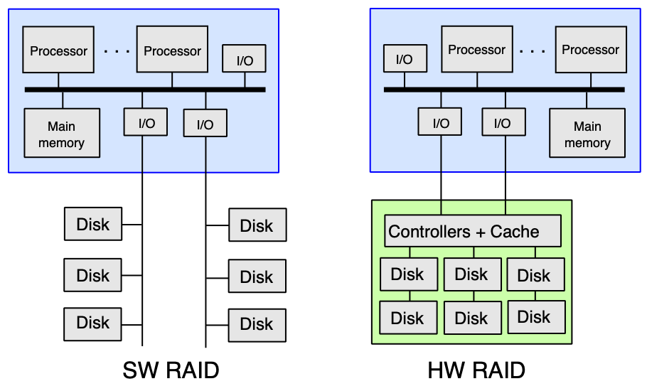

Úložiště je připojeno **přímo k systému** přes V/V porty (SATA, SAS, Ethernet, Fibre Channel). OS/aplikace přímo vidí jednotlivé sektory. Některé technologie (SCSI) umožňují **multihosting** — jedno úložiště připojit k více systémům současně.

### NAS (Network-Attached Storage)

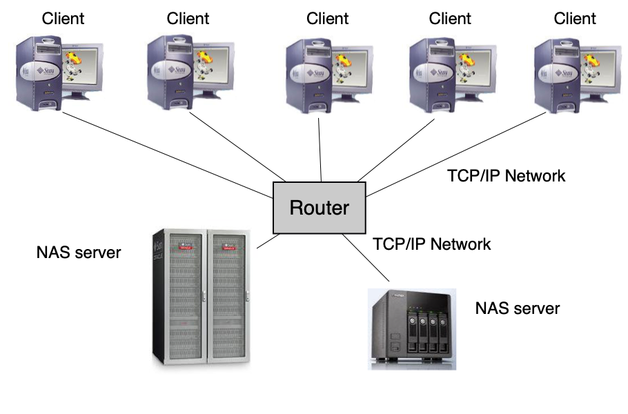

NAS je samostatný server (výpočetní systém + OS + datové úložiště). Data jsou přístupná přes síťové protokoly na úrovni **souborového systému**:

- **NFS** (Network File System) — unixový standard,
- **SMB** (Server Message Block) / Samba / CIFS — standard MS Windows.

Klient nevidí fyzické disky ani sektory — komunikuje na úrovni adresářů a souborů.

### SAN (Storage Area Network)

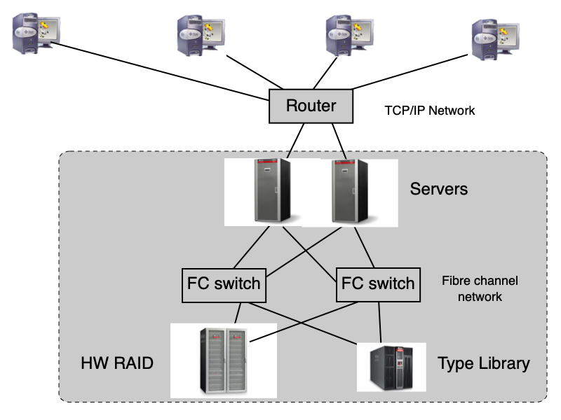

SAN je **oddělená síť** datových úložišť. OS/aplikace vidí jednotlivé sektory (jako u DAS), ale přes síť (Ethernet, Fibre Channel). Klíčové vlastnosti:

- **Multihosting** — jedno úložiště lze připojit k více systémům.
- **Multipathing** — mezi systémem a úložištěm existuje více nezávislých cest (zvyšuje propustnost i odolnost).

| | DAS | NAS | SAN |
|---|---|---|---|
| Přístup OS | sektory | soubory | sektory |
| Připojení | přímé | síť (IP) | SAN (FC/IP) |
| Multihosting | někdy | ano | ano |
| Multipathing | ne | ne | ano |

---

## Implementace souborových systémů

Souborový systém (FS) poskytuje abstrakci nad fyzickým úložištěm — přeměňuje surové sektory na hierarchii souborů a adresářů. Každý FS musí řešit: jak rozložit struktury na disku, jak spravovat volný prostor, jak alokovat obsah souboru a jak implementovat adresáře.

### FS z pohledu uživatele

**Adresáře** umožňují hierarchické uspořádání dat:

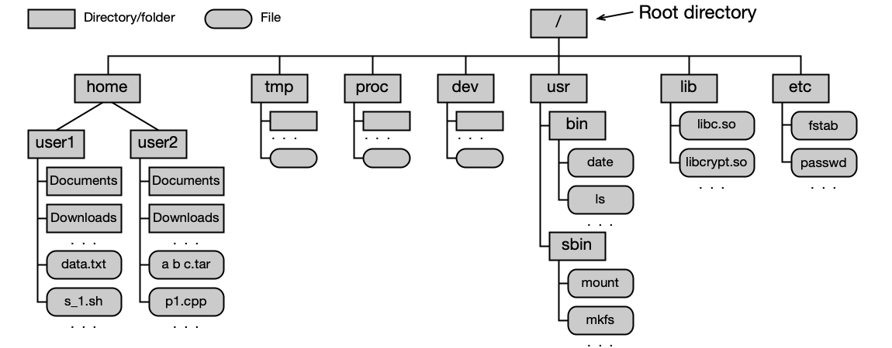

- Cesta může být **absolutní** (od kořene: `/home/user1/data.txt`) nebo **relativní** (od pracovního adresáře).
- Typické operace: `Create`, `Delete`, `Opendir`, `Closedir`, `Readdir`, `Seekdir`, `Rename`, `Link`, `Unlink`.

**Soubor** = jméno + atributy + obsah.

- **Atributy:** typ (soubor/adresář/link), vlastníci, přístupová práva (rwx, ACL, setuid-bit), časy přístupu a modifikace.
- **Obsah:** pole bajtů uložených v datových blocích FS; OS neinterpretuje obsah (výjimka: spustitelné soubory).
- Typické operace: `Create`, `Delete`, `Open`, `Close`, `Read`, `Write`, `Seek`, `stat/access`, `chmod/chown`, `Rename`.

### FS z pohledu administrátora

Disk je rozdělen na oblasti (**partitions**):

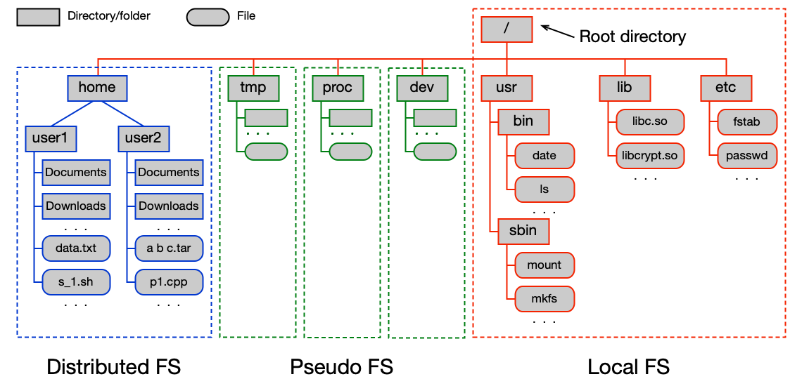

1. **Label disku** (disk label) — na začátku disku; obsahuje tabulku oblastí (partition table) a zavaděč OS. Formáty: MBR (Master Boot Record), EFI GPT (GUID Partition Table).
2. **Diskové oblasti** (partitions/slices) — každá oblast obsahuje jeden FS.

Instalace FS → vytvoření struktur (příkaz `mkfs`), připojení do stromu adresářů (`mount`), odpojení (`umount`). Strom adresářů v Unixu typicky kombinuje více FS najednou:

- do `/` lokální FS,
- do `/proc`, `/dev`, `/tmp` pseudoFS (existují pouze v RAM),
- do `/home` může být připojen distribuovaný FS (NFS).

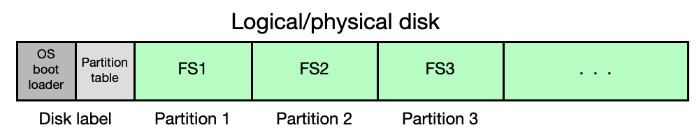

### Rozložení dat ve FS (FS layout)

Oblast disku s FS typicky obsahuje tyto části:

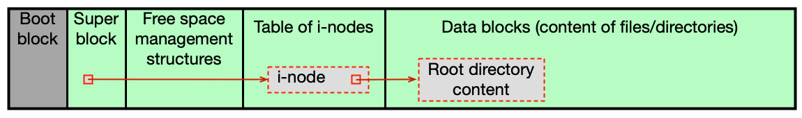

1. **Boot block** — kód zavaděče OS (nebo prázdný, pokud oblast není bootovatelná).
2. **Super block** — typ FS, velikost datových bloků, celková velikost, obsazenost, adresy klíčových struktur; uložen i v záložních kopiích.
3. **Struktury pro správu volného prostoru** — bitová mapa nebo zřetězený seznam volných bloků/i-nodů.
4. **Tabulka i-nodů** — pole i-nodů; každý soubor/adresář má svůj i-node.
5. **Datové bloky** — samotný obsah souborů a adresářů.

**Rozložení v UFS (Unix File System):**

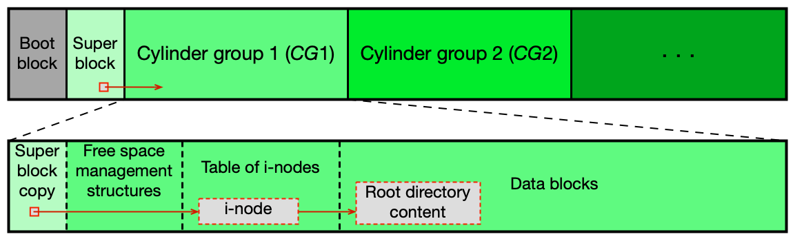

UFS rozděluje disk na **Cylinder Groups** (CG) — stejně velké skupiny cylindrů. Každá skupina má vlastní kopii klíčových struktur (zálohový superblok, bitmap, i-nody). Soubor je vždy alokován uvnitř jedné CG → hlavičky HDD se pohybují pouze v rámci CG → lepší výkon.

!!! note "Datový blok vs. sektor"
    **Sektor** je nejmenší adresovatelná jednotka fyzického úložiště (512 B nebo 4 KB). **Datový blok** (nebo cluster v MS Windows) je logická jednotka FS — typicky větší (1 KB až 2 MB). Administrátor volí velikost datového bloku při `mkfs` podle očekávaných velikostí souborů. Větší bloky = menší metadata, ale větší vnitřní fragmentace (malý soubor „zabere" celý blok).

    Příklady: UFS/Solaris 8 KB, VXFS 1/2/4/8 KB, FAT32 4–32 KB, NTFS 4 KB–2 MB.

### Správa volného prostoru

Pro správu volných datových bloků a i-nodů se používají dvě klasické struktury:

- **Bitová mapa** (bitmap) — 1 bit na blok (0 = volný, 1 = obsazený); kompaktnější, rychlé nalezení volného bloku bitovými operacemi.
- **Zřetězený seznam** (free list) — uložen přímo ve volných datových blocích; po připojení FS se načte do paměti jen část.

Bitová mapa je zpravidla výhodnější; zřetězený seznam je efektivnější při téměř zaplněném FS (nemusí se udržovat celá bitmapa).

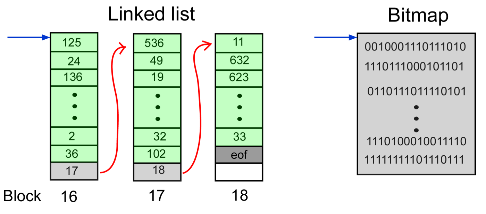

### Alokace obsahu souboru

Obsah souboru je uložen v datových blocích. FS si musí pamatovat, které bloky patří ke kterému souboru.

#### Alokace po souvislých oblastech (contiguous allocation)

Obsah souboru je uložen v jedné nebo několika **souvislých** oblastech bloků. FS si pamatuje pouze adresu prvního bloku a počet bloků.

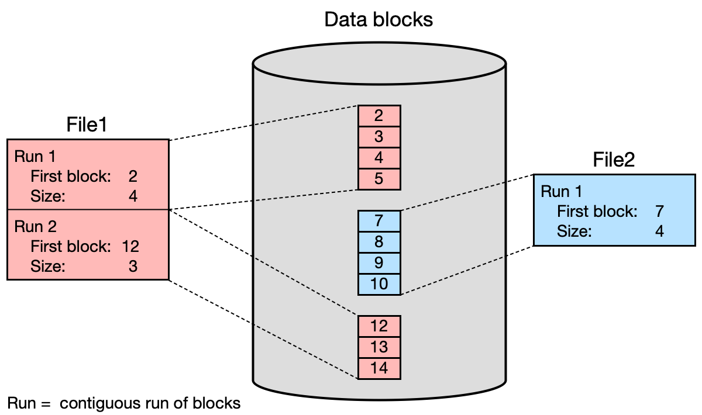

**Výhody:**
- Malá metadata (jen adresa + délka oblasti).
- Vynikající výkon při sekvenčním přístupu a velkých souborech.

**Nevýhody:**
- Fragmentace FS (volný prostor se rozpadá na malé ostrůvky → nutná defragmentace).
- Složitá alokace při změně velikosti souboru.

Příklady: **VXFS** (Veritas File System), **NTFS**.

#### Alokace po jednotlivých blocích

Obsah souboru je rozptýlen do libovolných volných bloků; FS si musí pamatovat adresy **všech** bloků.

**Výhody:**
- Bez fragmentace (každý volný blok je použitelný).
- Dobrý výkon při náhodném přístupu a malých souborech.

**Nevýhody:**
- Velká metadata (adresy všech bloků).
- Horší sekvenční výkon (I/O přerušované výpočtem adresy).

Příklady: **FAT32**, **UFS**, **Ext2/3/4**.

Pro uložení adres bloků se používají dvě struktury: **FAT** nebo **i-node**.

---

## FAT (File Allocation Table)

**FAT** je tabulka s tolik řádkami, kolik je datových bloků ve FS. Každá řádka odpovídá jednomu datovému bloku a obsahuje jednu z hodnot:

- `Free` — blok je volný,
- `adresa` — číslo následujícího bloku souboru,
- `EOF` — konec souboru (toto je poslední blok).

Pro každý soubor si adresář pamatuje pouze **adresu prvního bloku**; řetěz dalších bloků je zapsán ve FAT.

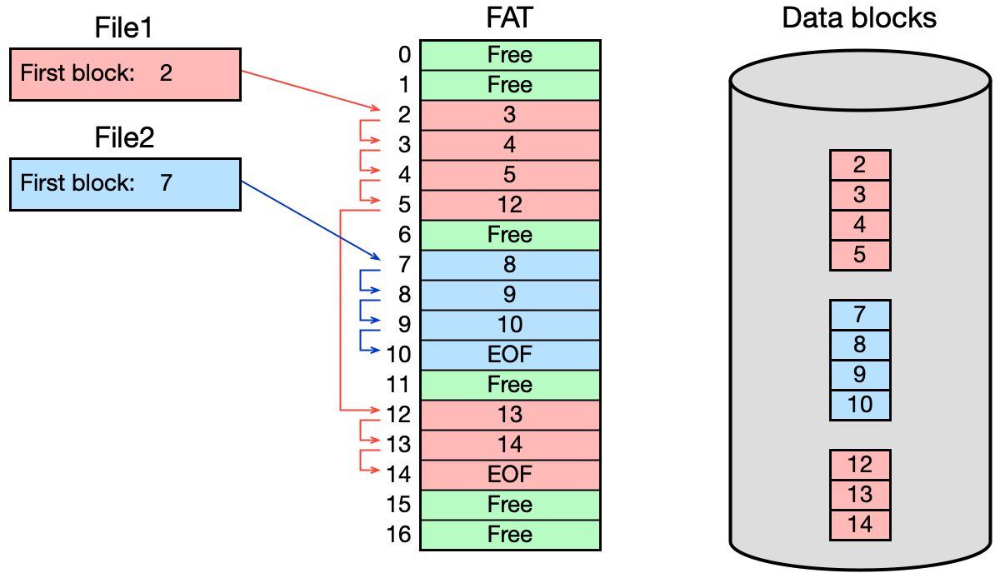

**Vlastnosti:**

- Informace o volných blocích je přímo v FAT (položka `Free`).
- Při připojení FS se do RAM načte celá FAT (nebo její část) → rychlý přístup.
- U velkých disků může být FAT velmi velká.

!!! example "Výpočet limitů FAT"
    Parametry: datový blok 1 KB, adresa 32 bitů (4 B).

    - FAT může mít až `2^32` řádek.
    - Velikost FAT: `2^32 × 4 B = 2^34 B = 16 GB`.
    - Max. velikost FS: `2^32 × 1 KB = 2^42 B = 4 TB`.
    - Max. velikost souboru: teoreticky 4 TB, ale FAT32 omezuje položku délky souboru na 32 bitů → max 4 GB.

    !!! tip "U zkoušky"
        Vzorec: max. velikost FS = `2^(počet bitů adresy) × velikost bloku`. Pozor na omezení daná jinými datovými strukturami (délka souboru, počet i-nodů...).

**Varianty FAT:** FAT12 (12 b adresa), FAT16 (16 b), FAT32 (32 b, fakticky 28 b), exFAT (64 b + bitmapa volných bloků).

### FAT: adresář a přístup k souborům

Adresář ve FAT obsahuje v každém záznamu: jméno souboru, atributy (typ, velikost), adresu prvního bloku. Pokud se záznam nevejde do jednoho řádku (dlouhé jméno, ACL), rozprostírá se do více záznamů.

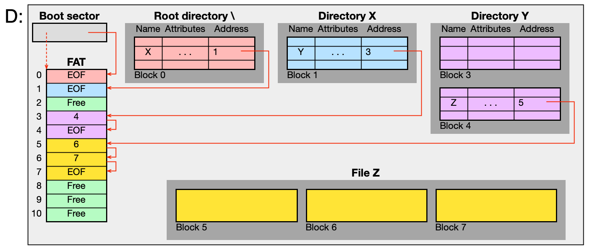

Přístup k souboru `D:\X\Y\Z`:

1. Boot sektor → umístění FAT, záložní FAT a kořenového adresáře.
2. Z FAT a kořenového adresáře dohledej podadresář `X`, pak `Y`, pak soubor `Z`.
3. Načti bloky obsahu souboru pomocí řetězu ve FAT.

---

## I-node (Index Node)

**I-node** (index node) je datová struktura **pevné velikosti** přiřazená každému souboru nebo adresáři. Obsahuje atributy souboru a adresy datových bloků.

Aby bylo možné adresovat soubory různých velikostí, i-node obsahuje tři typy adres:

- **12 přímých adres** — ukazují přímo na datové bloky s obsahem souboru.
- **1 adresa nepřímá 1. úrovně** — ukazuje na blok, v němž jsou přímé adresy.
- **1 adresa nepřímá 2. úrovně** — ukazuje na blok s adresami 1. úrovně.
- **1 adresa nepřímá 3. úrovně** — ukazuje na blok s adresami 2. úrovně.

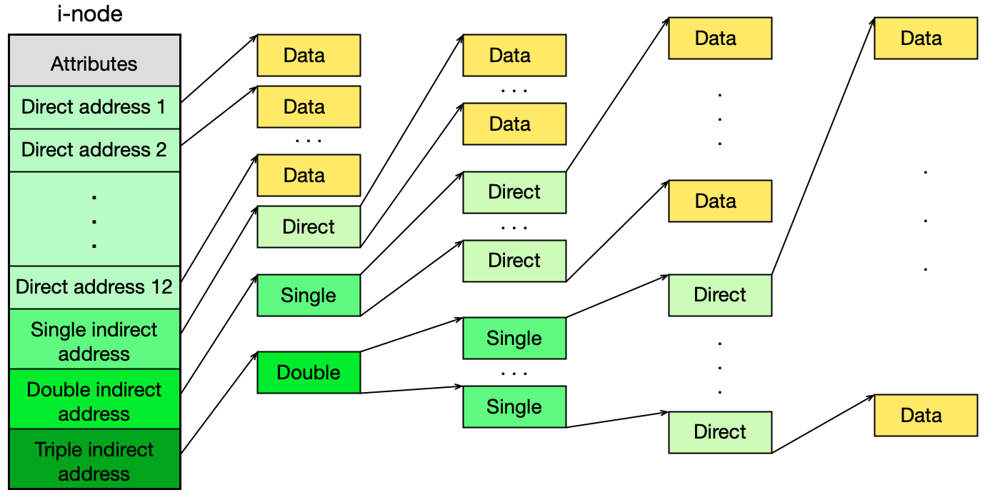

Při zápisu se postupně využívají přímé adresy, pak nepřímé 1., 2. a 3. úrovně podle toho, jak soubor roste.

!!! example "Výpočet maximální velikosti souboru přes i-node"
    Parametry: datový blok 4 KB, adresa 32 b = 4 B.

    - Počet adres v bloku: `4 KB / 4 B = 2^10 = 1024`
    - Přímé bloky: 12
    - Nepřímé 1. úrovně: `2^10` bloků
    - Nepřímé 2. úrovně: `2^10 × 2^10 = 2^20` bloků
    - Nepřímé 3. úrovně: `2^10 × 2^10 × 2^10 = 2^30` bloků
    - Celkem bloků: `(12 + 2^10 + 2^20 + 2^30) × 4 KB ≈ 2^30 × 4 KB = 4 TB`

    !!! tip "U zkoušky"
        Klíčový vzorec: počet adres v bloku = `velikost bloku / velikost adresy`. Maximální velikost souboru pak = součet datových bloků přes všechny úrovně nepřímého adresování × velikost bloku. U zkoušky bývají zadány konkrétní parametry a je třeba přesně spočítat.

**Vlastnosti i-nodů:**

- Při otevření souboru se do RAM načte pouze i-node; datové bloky až při čtení/zápisu.
- Velikost i-node je konstantní (nezávislá na velikosti souboru ani FS).
- Počet i-nodů je statický (definován při `mkfs`) — je důležité jej správně odhadnout.
- U velkých souborů s náhodným přístupem je první přístup pomalejší (nutnost projít vícero úrovní nepřímých adres); další přístupy jsou rychlé díky cache.
- Část datových bloků se spotřebuje na metadata (bloky s adresami) — mírně horší využití prostoru.

### UFS: konkrétní implementace i-nodů

**UFS** (Unix File System, také BSD Fast File System / FFS):

- Datový blok: 8 KB (Solaris).
- I-node: 128 B, obsahuje atributy + 15 adres (12 přímých + 3 nepřímé).
- Adresář: jméno souboru + číslo i-nodu (ne atributy!).

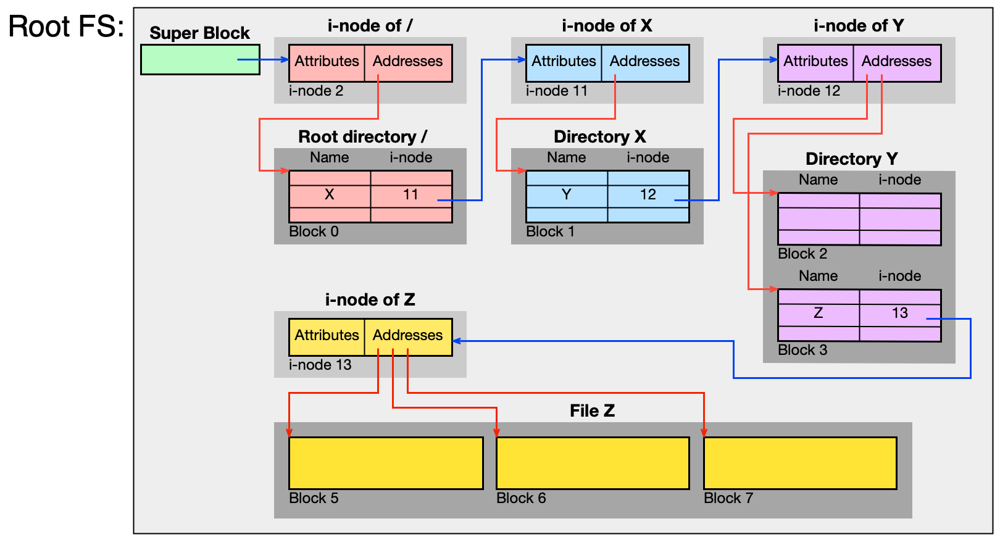

**Přístup k souboru `/X/Y/Z` v UFS:**

1. Super blok → umístění tabulky i-nodů a datových bloků.
2. I-node číslo 2 = kořenový adresář `/`.
3. Z datového bloku kořenového adresáře najdi záznam `X` → číslo i-nodu adresáře `X`.
4. Načti i-node adresáře `X` → datový blok adresáře `X` → najdi `Y` → i-node adresáře `Y`.
5. Načti i-node adresáře `Y` → datový blok `Y` → najdi `Z` → i-node souboru `Z`.
6. Načti i-node souboru `Z` → datové bloky obsahu souboru `Z`.

---

## Adresáře a sdílené soubory

### Implementace adresářů

Obsah adresáře je uložen v datových blocích, stejně jako obsah souboru. Existují dva přístupy k tomu, co adresář obsahuje:

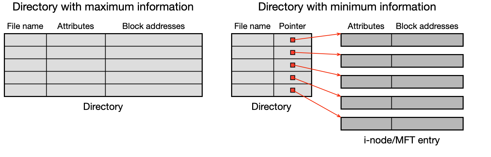

1. **Adresář obsahuje vše** (FAT32 styl) — jméno, atributy, adresu prvního bloku. Jednodušší, ale redundantní (atributy jsou "v adresáři").
2. **Adresář obsahuje minimum** (UFS/NTFS styl) — jen jméno a odkaz na i-node (nebo MFT položku). Atributy jsou v i-nodu. Čistější oddělení metadat od struktury adresáře.

### Sdílené soubory (hard link a soft link)

Někdy je vhodné, aby jeden soubor byl viditelný z více adresářů (třeba i pod různými jmény).

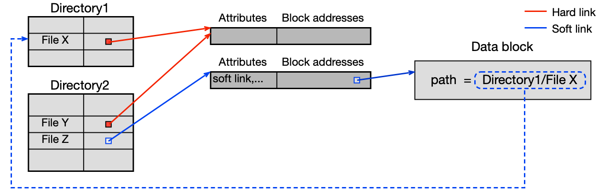

- **Hard link** — přímý odkaz na i-node (nebo MFT položku); funguje pouze u minimalistických adresářů (UFS, NTFS). Soubor existuje, dokud existuje alespoň jeden hard link. Nelze přes souborový systém (FS boundary).
- **Soft link** (symbolický link) — odkaz implementovaný jako speciální soubor obsahující cestu k cíli. Funguje přes hranice FS, ale při přejmenování/smazání cíle "visí" (dangling link).

---

## Souborové systémy v OS

Dosud jsme se věnovali implementaci FS na disku. Nyní se zaměříme na to, jak OS tyto FS začleňuje do svého jádra a jak optimalizuje přístup k nim.

### Virtual File System (VFS) a Installable FS (IFS)

**VFS** (Virtual File System) je vrstva jádra v OS unixového typu, která tvoří **rozhraní mezi procesy a konkrétními implementacemi FS**. Aplikace volají systémová volání (`open`, `read`, `write`...) přes VFS, které je přesměruje na správný ovladač FS.

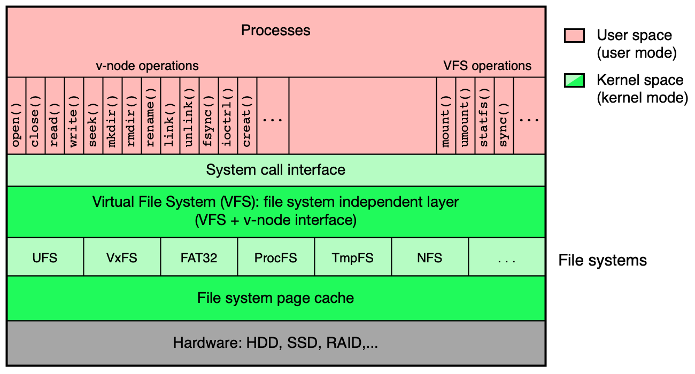

VFS definuje sadu abstraktních objektů (v-node, v-file, v-dirent...) a operací nad nimi; každý konkrétní FS implementuje tyto operace po svém. Výsledkem je, že z pohledu aplikace jsou NFS, UFS, ext4, FAT32 a BTRFS k nerozeznání.

**IFS** (Installable File System) — ekvivalent ve světě IBM OS/2 a MS Windows; API umožňující OS za běhu načíst ovladač pro nový typ FS.

### FUSE (Filesystem in Userspace)

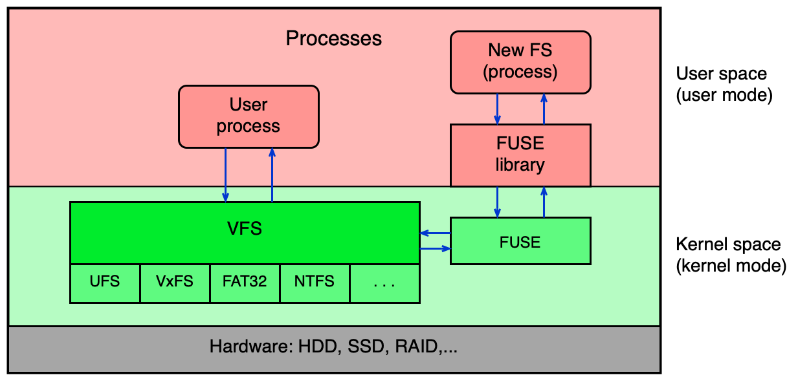

**FUSE** umožňuje implementovat FS jako **uživatelský proces** (bez zásahu do jádra). Skládá se z modulu jádra (vlastní FUSE) a uživatelské knihovny.

Nový FS je implementován jako proces, v němž si programátor definuje standardní operace (open, read, write, readdir...). Běžný uživatel pak s FS pracuje standardními nástroji.

!!! note "Využití FUSE"
    FUSE je ideální pro pseudoFS (existující jen v RAM), FS nad šifrovanými daty (EncFS), FS přes SSH (sshfs), nebo experimentální FS. Nevýhoda: vyšší latence kvůli přepínání kontextu mezi uživatelským prostorem a jádrem.

### Page cache (Block cache)

Přístup na disk je řádově pomalejší než přístup do RAM (10 ms vs. mikrosekund). OS proto využívá volnou fyzickou paměť jako **Page cache** — mezipaměť pro nedávno používané datové bloky z FS.

!!! note "Page cache v moderních OS"
    Velikost datových bloků FS bývá záměrně shodná s velikostí stránky virtuální paměti (nebo jejím násobkem/podílem). Page cache pak pracuje přímo s pamětovými stránkami (v novějším Linuxu tzv. *folios* — větší pamětové celky).

OS udržuje přehled o všech blocích v cache. Při čtení:

1. OS hledá blok v Page cache (**cache hit** → data z RAM, rychle).
2. Pokud není (**cache miss**) → načte z FS (disk I/O), uloží do cache.

Při zápisu existují dvě strategie:

- **Write-behind cache** (write-back) — modifikace se zapíše do Page cache ihned, na disk se zpožděním. Používá se u interních úložišť. Hrozí ztráta dat při výpadku napájení — OS proto periodicky flushuje (`sync()`).
- **Write-through cache** — modifikace se zapíše současně do cache i na disk. Pomalejší, ale bezpečnější. Používá se u přenosných úložišť (USB flash disky).

!!! example "Příklad Page cache"
    ```c
    int fd = open("test.txt", O_RDWR);
    read(fd, buf, 2);   // (1) cache miss → disk I/O, soubor načten do cache
    read(fd, buf, 2);   // (2) cache hit  → data z RAM, bez disk I/O
    write(fd, &x, 1);   // (3) zápis do cache; disk I/O dle strategie (write-behind/through)
    close(fd);          // u write-behind close() ještě neznamená zápis na disk!
    ```
    Zápis na disk lze vynutit funkcí `sync()`.

    V OS Solaris zobrazí příkaz `mdb -k → ::memstat` aktuální stav stránek (Kernel, ZFS Metadata, ZFS File Data, Anon, Page cache, Free...). V Linuxu `cat /proc/meminfo` → řádek `Cached`.

### DNLC (Directory Name Look-up Cache) / Dentry cache

Každý přístup k souboru `/A/B/C/D` vyžaduje projít celou cestou adresáři — v nejhorším případě čtení i-nodů a datových bloků pro každý adresář. To je drahé.

**DNLC** (Directory Name Look-up Cache v Solarisu) / **Dentry cache** (v Linuxu) je speciální cache v RAM, která uchovává jména nedávno používaných souborů/adresářů spolu s jejich v-nody.

!!! example "Vliv DNLC na výkon"
    Po restartu (prázdná DNLC): `ls -l A/B/C/D/E/F/G/H/I/J/K/L` trvá ~15 ms. Po druhém spuštění (DNLC naplněna): ~2 ms. Zrychlení 7,5× jen díky cache adresářů.

### Block Read Ahead (přednačítání bloků)

Přednačítání je dalším způsobem optimalizace. OS předpokládá **prostorovou lokalitu** — pokud čteme blok N, brzy budeme číst i blok N+1, N+2, ...

Při I/O požadavku na konkrétní blok OS načte **zároveň i několik následujících bloků**. Tím se výrazně zlepšuje výkon sekvenčního čtení (snižuje počet I/O operací) a efektivněji se využívá šířka pásma RAID polí.

!!! example "Read Ahead v UFS"
    UFS v Solarisu: parametr `maxcontig` určuje, kolik bloků se načítá v jedné operaci (výchozí 32, lze zvýšit na 128 příkazem `tunefs`). Blok UFS = 8 KB → při `maxcontig = 128` se načítá 1 MB najednou.

### Žurnálování (Journaling)

Operace jako vytvoření souboru se skládají z **více kroků**: aktualizace bitmapy volných bloků, zápis do adresáře, aktualizace i-nodu, zápis dat. Pokud dojde k pádu systému uprostřed tohoto sledu, FS se ocitne v **nekonzistentním stavu**.

**Žurnálovaný FS** (Journaling FS) řeší tento problém:

1. Před provedením změn zapíše FS **záznam do žurnálu** (journal area, zvláštní oblast na disku).
2. Teprve po úspěšném zápisu záznamu provede skutečné změny ve FS.
3. Po úspěšném dokončení změn odstraní záznam z žurnálu.
4. Při pádu systému: po obnově se přehrají záznamy z žurnálu → FS vrácen do konzistentního stavu.

Z výkonových důvodů se do žurnálu typicky ukládají pouze **metadata** (nikoliv obsah datových bloků) — to je dostatečné pro zachování konzistence struktury FS.

!!! note "Kde leží žurnál?"
    Žurnál nemusí být na stejném disku jako FS — může být na rychlejším SSD, což zlepšuje výkon operací vyžadujících zápis do žurnálu.

Žurnálování implementuje většina moderních FS: **UFS**, **Ext3/4**, **NTFS**, **JFS**, **XFS**...

---

## Moderní souborové systémy

Klasické FS (UFS, Ext2/3/4, FAT32, NTFS) vznikly v 80.–90. letech. S vývojem úložišť (RAID, SSD), narůstající kapacitou a výkonem CPU začaly vznikat moderní FS: **ZFS**, **BTRFS**, **APFS**.

Jejich klíčové vlastnosti:

- Implementace pomocí **B stromů / B+ stromů**.
- Integrace SW RAIDu a FS do jedné vrstvy.
- **Integrita dat** — Copy-on-Write transakční model, kontrolní součty dat i metadat.
- Efektivní snapshoty a klony.
- Šifrování a komprese dat.
- Jednodušší administrace.

### B stromy a B+ stromy

**B strom řádu n** je vyvážený strom s těmito vlastnostmi:

- **Kořen:** 2 až n potomků (pokud není listem), 0 až n−1 položek.
- **Vnitřní uzel:** `ceil(n/2)` až n potomků, `ceil(n/2)−1` až n−1 položek.
- **List:** `ceil(n/2)−1` až n−1 položek; všechny cesty od kořene k listům jsou stejně dlouhé.
- Data v uzlu: `p0, [k1, d1], p1, [k2, d2], p2, ...` kde ki jsou klíče, di data a pi ukazatele na podstromy. Pro klíče v podstromu pod pi platí: vše < k_(i+1) a vše > ki.

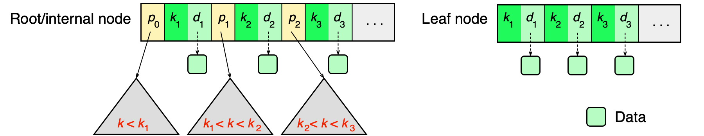

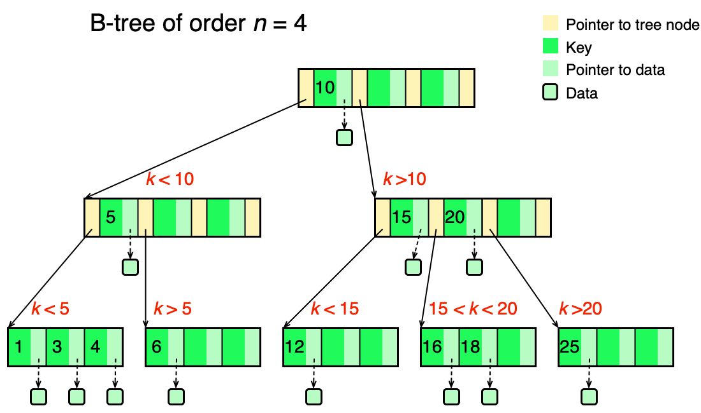

**B+ strom** — varianta, kde kořen a vnitřní uzly obsahují **pouze klíče a ukazatele** (bez dat); data jsou uložena **výhradně v listech**. Listy jsou navíc navzájem propojeny ukazateli na sourozence → efektivní sekvenční průchod.

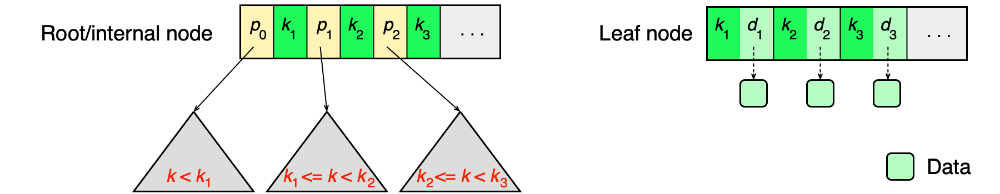

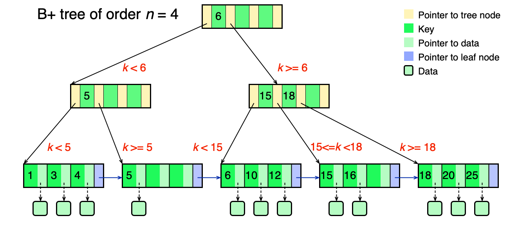

**Vlastnosti B/B+ stromů pro FS:**

- Vložení/smazání/vyhledání: O(log N).
- Každý uzel obsahuje více klíčů → uzel se vejde do jednoho cache bloku (L1/L2/L3) nebo do jedné stránky RAM, nebo do jednoho sektoru/datového bloku na disku.
- Uzly s klíči lze načíst do paměti; data zůstávají na disku (relevantní pro velké FS).

!!! example "B+ stromy pro implementaci adresářů"
    Velký adresář s tisíci soubory lze uložit jako B+ strom indexovaný jménem souboru. Vyhledání souboru je O(log N) místo lineárního průchodu. Tuto strategii používají moderní FS (NTFS, XFS, BTRFS).

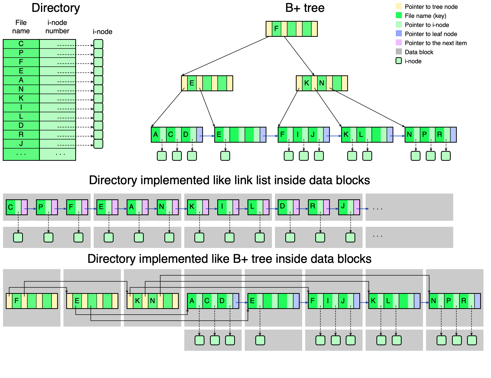

### Moderní FS: RAID + FS jako jeden celek

**Klasický přístup:** SW RAID a FS jsou dvě nezávislé vrstvy — nejdřív Volume Manager vytvoří logický disk, pak se na něj nainstaluje FS.

**Moderní přístup:** SW RAID a FS jsou sloučeny do jedné SW vrstvy:

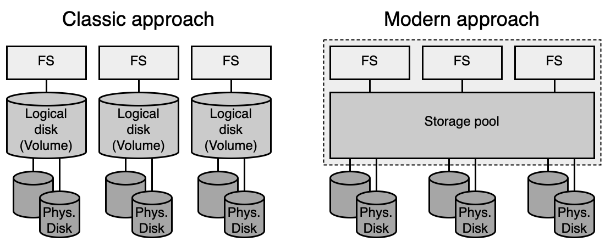

- Fyzické disky se zařadí do **poolu** (s vlastnostmi konkrétního RAIDu).
- V rámci poolu se vytváří jednotlivé FS (sdílejí kapacitu poolu).
- Výhody: efektivnější sdílení kapacity, jednodušší administrace (zvětšení/zmenšení FS bez složitých operací).

### Integrita dat a Copy-on-Write (COW)

**Klasický přístup:** Při modifikaci dat se původní obsah přepíše na místě. Operace probíhá ve více krocích → při pádu uprostřed → nekonzistence.

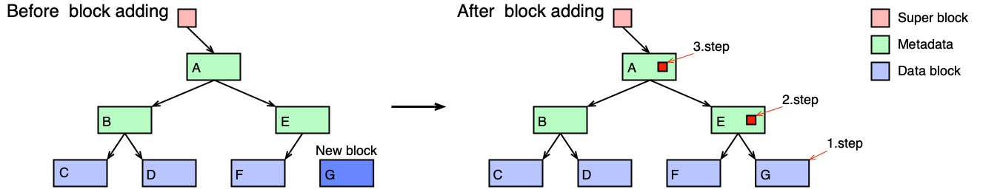

**Copy-On-Write (COW):** Původní bloky se nikdy nepřepisují. Místo toho se:

1. Zapíší nová data do nových bloků.
2. Aktualizují se rodičovská metadata (adresy bloků).
3. Atomicky se přepíše ukazatel v Super bloku.

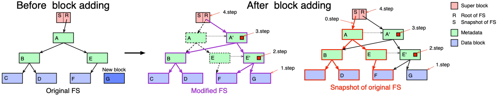

COW zaručuje, že FS je **vždy konzistentní** — při pádu systému superblok stále ukazuje na starý, konzistentní strom dat. Nová data jsou dosažitelná až po atomickém přepisu superbloku.

COW je zároveň základem pro efektivní **snapshoty** — snapshot je jen uložení starého ukazatele superbloku.

### Typy poškození dat a ochrana

Moderní FS rozlišují několik typů poškození:

1. **Bit corruption** — obsah sektoru/bloku byl fyzicky porušen (elektromagnetické záření...).
2. **Lost writes** — operace write nebyla provedena, ale disk potvrdil úspěch.
3. **Misdirected writes** — data zapsána do špatného bloku.
4. **Torn writes** — data zapsána jen částečně, ale potvrzena jako úplná.

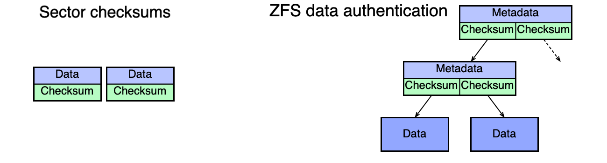

**Klasický přístup:** Spoléhá pouze na ECC v sektoru — detekuje/opravuje pouze typ 1 (bit corruption). Kontrolní součet je uložen spolu s daty → při misdirected write je kontrolní součet "správný" (ale data jsou na špatném místě).

**ZFS data authentication:** Kontrolní součty jsou uloženy v **rodičovských metadatech** (Merkle strom — hash stromu). Kontrolní součet bloku B je uložen v rodiči, nikoli v bloku samotném. Tím lze detekovat a opravit všechny typy 1–4.

### Automatická oprava dat (Self-healing)

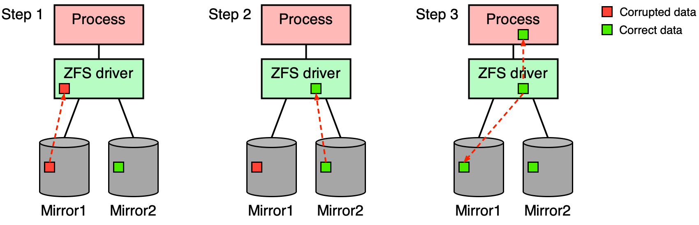

Díky kombinaci kontrolních součtů (detekce) a redundance v RAIDu (obnova) lze nejen detekovat, ale i automaticky opravit poškozená data:

1. ZFS načte datový blok z prvního zrcadla → kontrolní součet nesouhlasí → blok poškozený.
2. ZFS načte blok z druhého zrcadla → kontrolní součet souhlasí → blok správný.
3. ZFS předá správná data procesu **a zároveň opraví poškozený blok** na prvním zrcadle.

!!! tip "U zkoušky"
    ZFS = Copy-On-Write + Merkle strom kontrolních součtů + integrace RAIDu. Výsledek: neustálá konzistence, detekce a oprava všech typů poškození dat, efektivní snapshoty.

---

## Shrnutí

- **HDD** ukládá data magneticky na rotující plotny; rychlost přístupu závisí na seek time, rotačním zpoždění a čase přenosu. Sekvenční přístup je řádově rychlejší než náhodný.
- **SSD** používá NAND flash s floating gate tranzistory; nemá pohyblivé části, konstantní latenci; omezený počet zápisů (závislý na typu SLC/MLC/TLC/QLC).
- **RAID** sdružuje fyzické disky pro navýšení kapacity, výkonu nebo spolehlivosti. RAID 5 distribuuje paritu, RAID 6 dvojitou paritu; RAID 10 kombinuje zrcadlení a prokládání.
- **DAS** připojuje úložiště přímo, **NAS** sdílí na úrovni FS přes síť, **SAN** poskytuje sektorový přístup přes dedikovanou síť.
- FS layout typicky obsahuje: boot block, super block, struktury volného prostoru, tabulku i-nodů, datové bloky.
- **FAT** ukládá řetěz bloků souboru v globální tabulce; jednoduchá, ale limitovaná u velkých disků.
- **I-node** ukládá atributy souboru a adresy bloků (přímé + 1/2/3-úrovňové nepřímé) ve fixní datové struktuře; základ UFS, Ext2/3/4.
- **VFS** tvoří abstraktní rozhraní nad konkrétními FS v Unixu; **FUSE** umožňuje implementaci FS v uživatelském prostoru.
- **Page cache** uchovává nedávno čtené/zapisované bloky v RAM; strategie write-behind (interní FS) vs. write-through (přenosná média).
- **DNLC/Dentry cache** cachuje výsledky překladu adresářových cest.
- **Block Read Ahead** přednačítá sousední bloky na základě prostorové lokality.
- **Žurnálování** chrání FS před nekonzistencí zápisem záznamu změn před jejich provedením.
- **B/B+ stromy** s O(log N) operacemi jsou základem moderních FS pro indexování adresářů a metadat.
- **ZFS/BTRFS** integrují SW RAID a FS, používají Copy-on-Write a Merkle stromy kontrolních součtů pro trvalou konzistenci a self-healing.

---

## Klíčové pojmy

- **Sektor** — nejmenší fyzicky adresovatelná jednotka datového úložiště (512 B nebo 4 KB); obsahuje data + ECC.
- **Datový blok (cluster)** — logická jednotka FS, skupinování sektorů; typicky 1–64 KB dle FS a konfigurace.
- **HDD (Hard Disk Drive)** — magnetické rotační úložiště; data kódována změnou směru magnetizace na feromagnetických plotnách.
- **Perpendicular Recording** — moderní technika záznamu HDD s magnetickými doménami orientovanými kolmo k povrchu plotny; umožňuje vyšší hustotu záznamu.
- **Seek time** — čas potřebný k přesunutí hlaviček HDD nad správný cylindr (1–10 ms).
- **Rotational delay** — průměrné rotační zpoždění HDD = polovina doby jedné otáčky; při 10 000 RPM ≈ 3 ms.
- **CHS (Cylinder-Head-Sector)** — starší způsob adresování sektorů HDD podle geometrie disku.
- **LBA (Logical Block Addressing)** — novější lineární adresování sektorů (od 0 sekvenčně).
- **Zone Bit Recording (ZBR)** — technika umožňující více sektorů na stopě ve vnějších zónách disku.
- **FIFO / SSTF / SCAN / N-step SCAN** — algoritmy plánování přístupu na disk; liší se výkonem a spravedlností.
- **NCQ (Native Command Queuing)** — technologie reorderingu příkazů v řadiči SATA disku.
- **SSD (Solid State Drive)** — úložiště na bázi NAND flash paměti bez pohyblivých částí.
- **Floating gate MOSFET** — typ tranzistoru s plovoucí bránou; základ NAND flash buňky.
- **SLC / MLC / TLC / QLC** — typy NAND flash buněk ukládající 1/2/3/4 bity; liší se rychlostí, trvanlivostí a spolehlivostí.
- **NAND flash** — organizace flash buněk v sérii analogické hradlu NAND; mazání probíhá po blocích.
- **Stránka (NAND)** — nejmenší jednotka pro čtení/zápis v NAND flash (4–16 KB).
- **Blok (NAND)** — skupina stránek; nejmenší jednotka pro mazání v NAND flash.
- **FTL (Flash Translation Layer)** — firmware SSD překládající LBA adresy na fyzické NAND stránky/bloky.
- **Wear leveling** — technika rovnoměrného rozložení zápisů na buňky NAND flash pro prodloužení životnosti.
- **Garbage collection (SSD)** — proces uvolňování neplatných bloků a jejich přípravy pro zápis.
- **RAID (Redundant Array of Independent Disks)** — sdružení fyzických disků pro kapacitu, výkon a/nebo redundanci.
- **RAID 0 (striping)** — prokládání dat po blocích na více disky; žádná redundance, maximální výkon.
- **RAID 1 (mirroring)** — zrcadlení dat na všechny disky; redundance (m−1)/m, čtení rychlejší.
- **RAID 10 (RAID 1+0)** — kombinace zrcadlení a prokládání; redundance 50 %, vysoký výkon.
- **RAID 5** — prokládání + distribuovaná parita; odolnost vůči výpadku 1 disku, využití `(m−1)/m`.
- **RAID 6** — prokládání + dvojitá distribuovaná parita; odolnost vůči výpadku 2 disků, využití `(m−2)/m`.
- **Softwarový RAID** — RAID implementovaný Volume Managerem v OS (LVM, Veritas VM).
- **Hardwarový RAID** — RAID implementovaný dedikovaným HW řadičem s vlastním procesorem a firmwarem.
- **DAS (Direct-Attached Storage)** — úložiště přímo připojené k systému; OS vidí sektory.
- **NAS (Network-Attached Storage)** — síťové úložiště sdílené přes NFS/SMB; OS vidí soubory.
- **SAN (Storage Area Network)** — dedikovaná síť úložišť; OS vidí sektory přes síť; podporuje multihosting a multipathing.
- **NFS (Network File System)** — síťový protokol pro sdílení FS v unixových systémech.
- **SMB/CIFS/Samba** — síťový protokol pro sdílení FS v prostředí MS Windows.
- **Multihosting** — jedno úložiště připojeno k více systémům současně.
- **Multipathing** — více nezávislých síťových cest mezi systémem a úložištěm.
- **FS layout** — rozložení dat ve FS: boot block, super block, struktury volného prostoru, tabulka i-nodů, datové bloky.
- **Boot block** — oblast FS s kódem zavaděče OS nebo prázdná.
- **Super block** — metadata FS: typ, velikost bloků, obsazenost, adresy klíčových struktur.
- **Cylinder Group (CG)** — oblast UFS reprezentující skupinu cylindrů; obsahuje vlastní zálohu superbloku a dalších struktur.
- **FAT (File Allocation Table)** — tabulka adres bloků souboru; řádky obsahují Free/adresu/EOF.
- **FAT12/16/32/exFAT** — varianty FAT lišící se šířkou adresního pole (12/16/32/64 bitů).
- **I-node (index node)** — datová struktura pevné velikosti obsahující atributy souboru a adresy datových bloků (přímé + 1/2/3-úrovňové nepřímé).
- **Přímá adresa** — adresa v i-nodu ukazující přímo na datový blok s obsahem souboru.
- **Nepřímá adresa N. úrovně** — adresa ukazující na blok obsahující adresy N−1. úrovně.
- **UFS (Unix File System / BSD FFS)** — klasický unixový FS s i-nody a cylinder groups; inspiroval Ext2/3/4 a HFS+.
- **Hard link** — přímý odkaz na i-node (nebo MFT položku) z adresáře; soubor existuje, dokud je alespoň jeden.
- **Soft link (symbolický link)** — speciální soubor obsahující cestu k cíli; funguje přes hranice FS.
- **VFS (Virtual File System)** — abstraktní vrstva jádra unixového OS oddělující aplikace od konkrétních implementací FS.
- **IFS (Installable File System)** — API v OS/2 a MS Windows pro dynamické načítání ovladačů FS.
- **FUSE (Filesystem in Userspace)** — rozhraní umožňující implementaci FS jako uživatelského procesu bez zásahu do jádra.
- **Page cache** — mezipaměť v RAM pro nedávno použité datové bloky FS; pracuje se stránkami virtuální paměti.
- **Write-behind cache (write-back)** — zápisová strategie: zápis do cache ihned, na disk se zpožděním.
- **Write-through cache** — zápisová strategie: zápis do cache i na disk současně; bezpečnější, pomalejší.
- **DNLC (Directory Name Look-up Cache)** — cache v RAM pro jména adresářů/souborů a jejich v-nody; alias Dentry cache v Linuxu.
- **V-node (virtual node)** — abstraktní reprezentace souboru/adresáře v rámci VFS.
- **Block Read Ahead** — přednačítání sousedních datových bloků FS do Page cache na základě principu prostorové lokality.
- **Žurnálovaný FS (Journaling FS)** — FS zapisující záznamy o změnách do žurnálu před jejich provedením; chrání před nekonzistencí při pádu systému.
- **Žurnál (journal)** — speciální oblast na disku (nebo externím SSD) pro záznamy o chystaných změnách FS.
- **B strom řádu n** — vyvážený strom, kde každý vnitřní uzel má ceil(n/2)–n potomků; O(log N) operace.
- **B+ strom** — varianta B stromu, kde vnitřní uzly obsahují pouze klíče, data jsou jen v listech; listy propojeny ukazateli na sourozence.
- **ZFS (Zettabyte File System)** — moderní FS integrující SW RAID, COW, Merkle strom kontrolních součtů, snapshoty a deduplikaci.
- **BTRFS (B-tree File System)** — moderní linuxový FS s podobnými vlastnostmi jako ZFS.
- **Copy-on-Write (COW)** — technika, kdy se při modifikaci dat nepřepisují původní bloky, ale vytváří se nové; garantuje trvalou konzistenci FS.
- **Merkle strom** — strom kontrolních součtů, kde každý uzel obsahuje hash svých potomků; použito v ZFS pro detekci všech typů poškození dat.
- **Self-healing data** — schopnost FS detekovat poškozená data (přes kontrolní součty) a automaticky je opravit (přes redundanci v RAIDu).
- **Snapshot** — zmrazená kopie stavu FS v daném okamžiku; v COW FS implementovaný jako uložený ukazatel na starý kořen stromu (téměř nulová cena).
- **Pool (storage pool)** — sdružení fyzických disků do jednoho logického celku v moderních FS; jednotlivé FS sdílejí kapacitu poolu.
- **Bit corruption** — fyzické poškození obsahu sektoru nebo datového bloku.
- **Lost write** — disková operace write nebyla provedena, ale disk potvrdil úspěch.
- **Misdirected write** — data zapsána do nesprávného bloku.
- **Torn write** — data zapsána pouze částečně, přestože byl oznámen úspěch.
- **ECC (Error Correction Code)** — kód pro detekci a opravu chyb uložený v sektoru disku.
- **fsck** — nástroj pro kontrolu a opravu nekonzistentního souborového systému v unixových OS.
- **mount / umount** — příkazy pro připojení / odpojení FS do stromu adresářů.
- **mkfs** — příkaz pro vytvoření (formátování) souborového systému.
